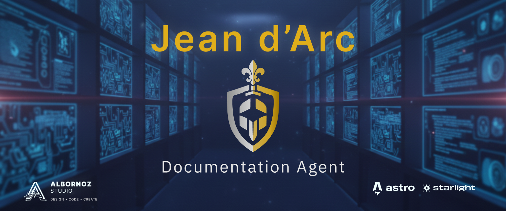

# 📚 Project Jean d'Arc

**"La Sabiduría" del Ecosistema Contable.**

[](https://astro.build)
[](https://starlight.astro.build/)
[](.github/copilot-instructions.md)

---

Este repositorio contiene la **documentación centralizada, guías de arquitectura y manuales de usuario** para el Sistema Contable compuesto por **Sevastopol** (Frontend) y **Nostromo** (Core Backend).

Construido sobre **Astro Starlight**, Jean d'Arc sirve como la fuente de verdad única para desarrolladores y usuarios finales.

## 🤖 Agente Jean d'Arc

> *"El Bibliotecario y Arquitecto de Información"*

Este proyecto es gestionado por el **Agente Jean d'Arc**, una inteligencia especializada encargada de mantener la consistencia, el orden y la veracidad de la documentación.

**Responsabilidades:**

- **Bibliotecario Técnico**: Organiza y estructura el conocimiento.
- **Arquitecto de Información**: Define cómo se relacionan los datos y documentos.
- **Guardián de la Verdad**: Asegura que la documentación refleje la realidad del código.

[Ver Instrucciones del Agente](.github/copilot-instructions.md)

---

## 🎯 Objetivo

En un sistema complejo con múltiples módulos (Contabilidad, Remuneraciones, Inventario) y una arquitectura distribuida (Islands + API REST), la información dispersa es un riesgo. **Jean d'Arc** resuelve esto centralizando:

- **📘 Documentación Técnica**: Diagramas ER, flujos de datos (ETLs), y contratos de API.
- **🎨 Guías de Estilo**: Sistema de Diseño Atómico, uso de componentes UI.
- **📖 Manuales de Usuario**: Guías paso a paso para operar el sistema contable.
- **🚀 Onboarding**: Cómo levantar el entorno de desarrollo (Sevastopol + Nostromo).

## 🛠️ Stack Tecnológico

| Componente | Tecnología | Propósito |
| --- | --- | --- |
| **Core** | [Astro](https://astro.build/) | Framework web de alto rendimiento |
| **Theme** | [Starlight](https://starlight.astro.build/) | Tema optimizado para documentación técnica |
| **Estilos** | [Tailwind CSS](https://tailwindcss.com/) | Estilizado rápido y consistente |
| **Diagramas** | [Mermaid](https://mermaid.js.org/) | Diagramas como código |

## 📂 Estructura del Conocimiento

```text
src/content/docs/
├── intro/              # Visión general del proyecto
├── arquitectura/       # Decisiones técnicas (Islands, FastAPI, DB Schema)
├── accounting/         # Documentación del Dominio Contable (Nostromo)
├── api/                # Referencia de API (Orchestrator)
├── seguridad/          # Políticas y Hardening
└── guias/              # Manuales de usuario final
```

## 🚀 Inicio Rápido

Para correr la documentación localmente:

```bash
# 1. Instalar dependencias
npm install

# 2. Iniciar servidor de desarrollo
npm run dev
```

Visita `http://localhost:4321` para ver la documentación.

---

<div align="center">
  <sub>Parte del ecosistema <b>Albornoz Accounting System</b>.</sub>
</div>
