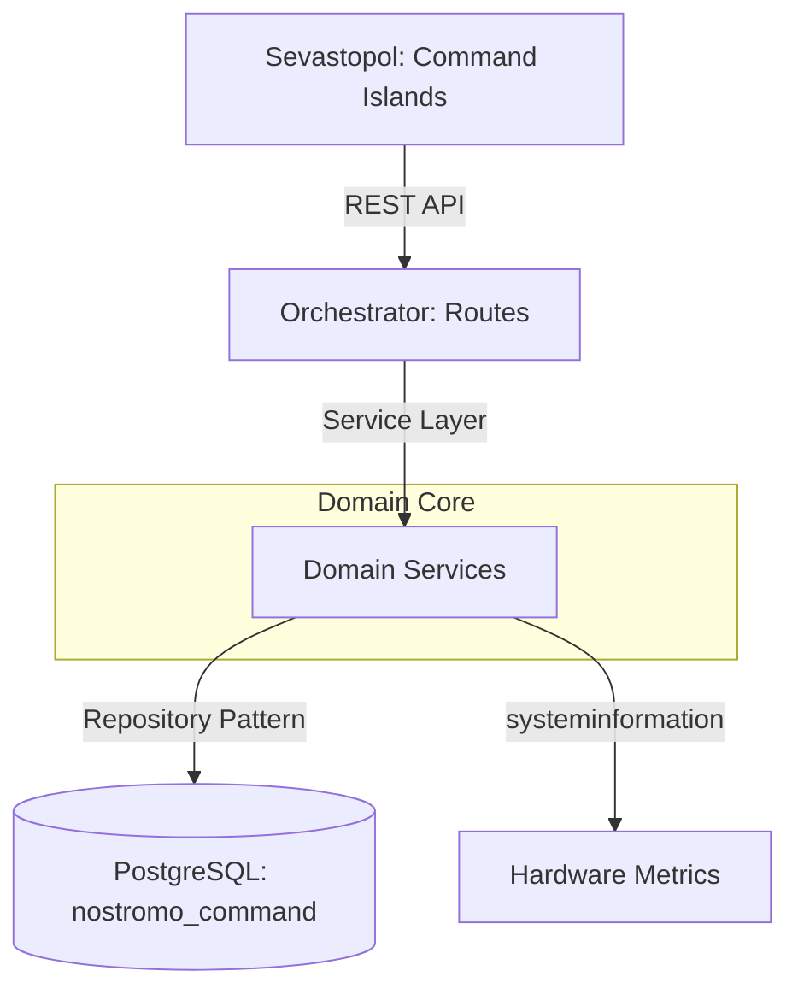
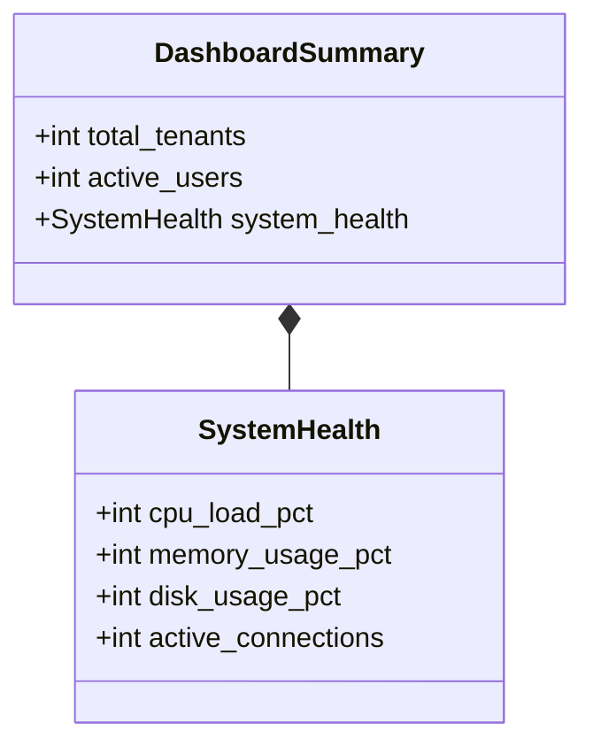

El módulo **Command** (o "Command Center") es el núcleo administrativo de la plataforma Nostromo. Permite la gestión centralizada de Tenants (inquilinos), sesiones de usuario en tiempo real y monitoreo de la salud del sistema.

Su objetivo es proveer a los **Super Administradores** de herramientas para operar la plataforma SaaS de manera eficiente.

## Arquitectura

El módulo Command conecta la capa de datos (`nostromo_command`) con el Orchestrator y Sevastopol, siguiendo un patrón de Diseño Guiado por el Dominio (DDD).



## Funcionalidades Principales

### 1. Gestión de Tenants

Administración del ciclo de vida de las empresas (tenants) registradas en la plataforma.

- **Creación**: Provisionamiento de nuevos tenants y sus bases de datos asociadas.
- **Listado**: Vista general de todos los tenants y su estado.
- **Detalle**: Información de contacto, RUT y configuración.

Ver implementación en [TenantService.ts](../../Accounting/orchestrator/src/domain/command/TenantService.ts).

### 2. Monitoreo de Sesiones (Active Sessions)

Sistema de vigilancia en tiempo real de usuarios conectados.

**Características:**

- Visualización de usuarios activos y sus roles.
- Rastreo de IP y User-Agent.
- **Kill Switch**: Capacidad de terminar forzosamente una sesión sospechosa o colgada.

#### Endpoint: `DELETE /api/sessions/:id`

Permite desconectar a un usuario inmediatamente.

```bash
curl -X DELETE "http://localhost:8000/api/sessions/550e8400-e29b-41d4-a716-446655440000" \
     -H "Cookie: sid=..."
```

:::caution
Esta acción es irreversible y el usuario perderá cualquier trabajo no guardado.
:::

Ver implementación en [SessionService.ts](../../Accounting/orchestrator/src/domain/command/SessionService.ts).

### 3. Salud del Sistema (Monitoring)

Dashboard de métricas vitales del servidor e infraestructura. Combina datos de base de datos con telemetría del servidor (CPU, RAM, Disco).

**Métricas Monitoreadas:**

- **CPU Load**: Carga actual del procesador.
- **Memory Usage**: RAM activa vs total.
- **Disk Usage**: Espacio utilizado en el disco principal.
- **DB Stats**: Usuarios activos, errores en las últimas 24h.



## Base de Datos

El módulo se apoya en el esquema `command`, `auth` y `monitoring` de la base de datos `nostromo_command`.

### Vistas Clave

| Vista | Descripción | Origen |
| :--- | :--- | :--- |
| `auth.v_active_sessions` | Sesiones válidas no expiradas | `auth.user_sessions` |
| `monitoring.v_dashboard_summary` | Resumen de alto nivel | `tenants`, `users`, `logs` |

## Frontend

En **Sevastopol**, estas funciones se consumen a través de "Islands" especializadas ubicadas en `src/components/islands/admin`:

- `TenantsViewIsland.tsx`
- `SessionsViewIsland.tsx`
- `MonitoringViewIsland.tsx`

Estas islas se integran en el **View Router** del panel de administración.
