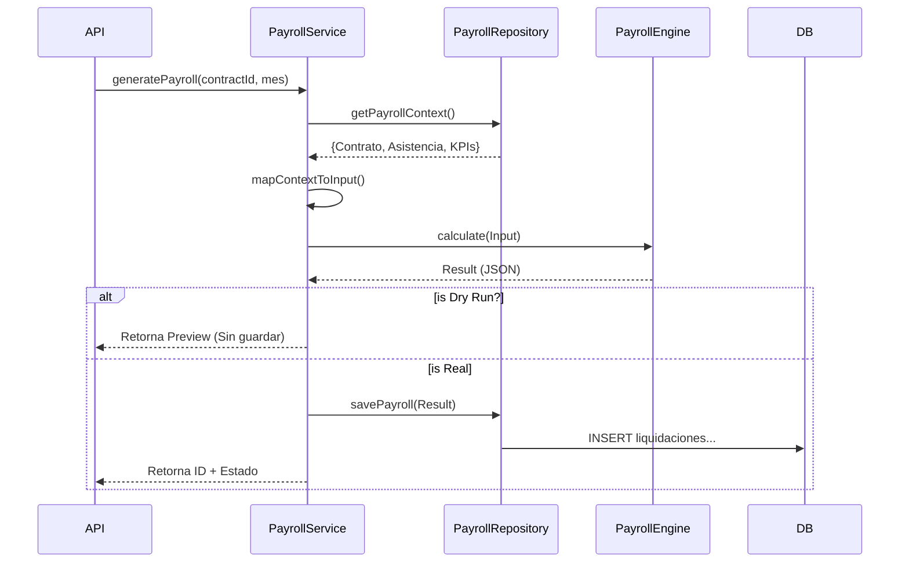

import { Steps, Aside } from "@astrojs/starlight/components";

El proceso de **Generación de Liquidaciones** es el evento mensual principal del sistema. Transforma los datos contractuales y de asistencia en documentos legales de pago persistidos.

## Arquitectura del Proceso

El `PayrollService` orquesta la generación siguiendo un ciclo **Fetch → Calculate → Persist**.

<Steps>
  1. **Fetch (Obtención de Contexto)**: El `PayrollRepository` ejecuta queries
  paralelas para obtener: - Contrato Vigente y Empleado. - Resumen de Asistencia
  del Mes. - Indicadores Económicos (UF, UTM) y Tasas (AFP, Impuesto). 2.
  **Calculate (Motor Puro)**: Se transforman los datos a un `PayrollInput`
  normalizado y se invoca al [PayrollEngine](./motor-calculo) (Sin efectos
  secundarios). 3. **Persist (Persistencia)**: Si no es un *Dry Run*, el
  resultado se guarda transaccionalmente: - Se crea cabecera en
  `remuneraciones.liquidaciones`. - Se insertan detalles en
  `remuneraciones.liquidaciones_detalle`.

</Steps>

<Aside type="caution" title="Idempotencia">
  El proceso está diseñado para ser **re-ejecutable**. Si se regenera una
  liquidación para un mes abierto, el sistema: 1. Detecta la liquidación
  existente. 2. Elimina los registros anteriores (Soft Delete o Hard Delete
  según configuración). 3. Inserta la nueva versión calculada.
</Aside>

## Flujo de Código

## Referencia de Código

| Componente      | Archivo                | Responsabilidad                                                                     |
| :-------------- | :--------------------- | :---------------------------------------------------------------------------------- | --------------------- |
| **Orquestador** | `PayrollService.ts`    | [Ver Código](../../Accounting/orchestrator/src/domain/payroll/PayrollService.ts)    | Coordina I/O y Motor. |
| **Repositorio** | `PayrollRepository.ts` | [Ver Código](../../Accounting/orchestrator/src/domain/payroll/PayrollRepository.ts) | Queries SQL masivas.  |
