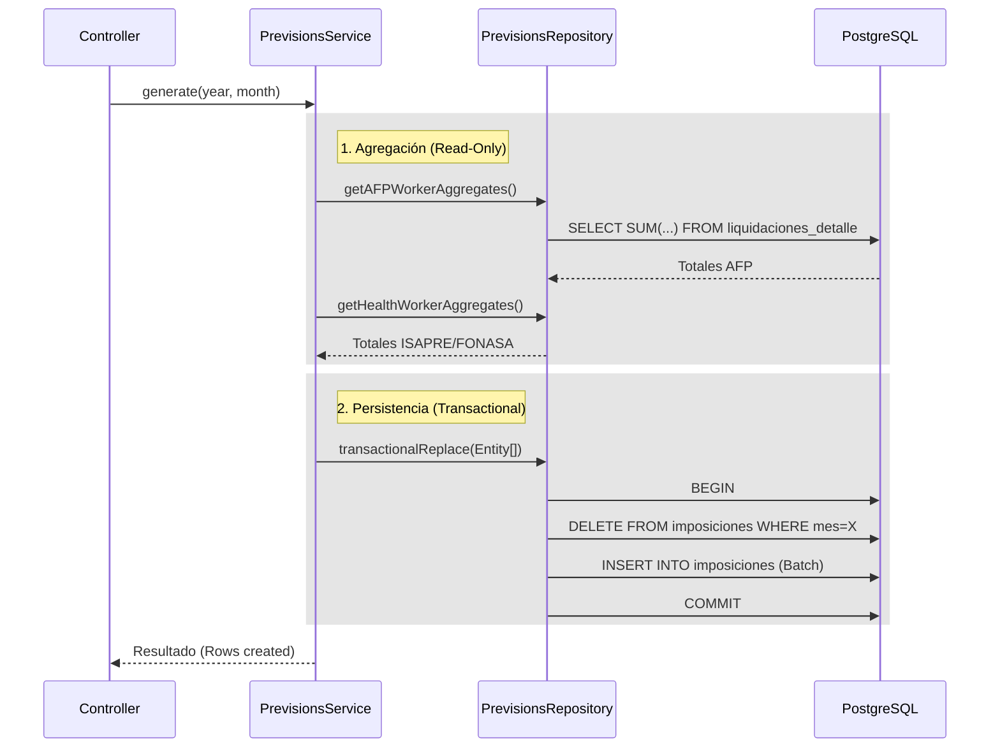

import { Steps, Tabs, TabItem } from "@astrojs/starlight/components";

El proceso de **Generación de Imposiciones** es una etapa posterior al cálculo de remuneraciones. Su objetivo es consolidar los montos individuales calculados en las liquidaciones y agruparlos por institución.

> **Migración 2025-12**: Lógica migrada a **Servicio de Dominio en Orchestrator** (`PrevisionsService`).

## Lógica de Consolidación

La consolidación se realiza en 6 bloques principales. Solo se consideran liquidaciones en estado `CALCULADA`, `APROBADA` o `PAGADA`.

<Tabs>
  <TabItem label="Trabajador (Descuentos)">
    <Steps>
    1. **AFP Obligatorio**: 
       Agrupa por AFP el total descontado (10% + Comisión). Concepto `DESC-001`.
    
    2. **Salud**:
       - Agrupa por ISAPRE (Concepto `DESC-002`).
       - Si no tiene Isapre, consolida todo bajo `FONASA`.
    
    3. **Seguro de Cesantía**:
       Agrupa el 0.6% de cargo trabajador bajo la entidad AFP (visual) o AFC.
    </Steps>
  </TabItem>
  
  <TabItem label="Empleador (Aportes)">
    <Steps>
    1. **SIS y Mutual**:
       - SIS (`APT-003`) se paga a las AFP.
       - Mutual (`APT-004`) a la Mutual de Seguridad correspondiente.
    
    2. **Cesantía Empleador**:
       El 2.4% o 3.0% (`APT-002`) se consolida para pago a AFC.
    </Steps>
  </TabItem>

  <TabItem label="Fisco (SII)">
    <Steps>
    1. **Impuesto Único**:
       Total del tributo (`DESC-004`) para F29.
    
    2. **Retención Honorarios**:
       Suma de retenciones de boletas procesadas para F29.
    </Steps>
  </TabItem>
</Tabs>

## Arquitectura del Proceso

El proceso es **Idempotente** y transaccional.

