El `AttendanceService` es el componente responsable de gestionar el registro de tiempos, ausencias y la generación de grillas de asistencia para el cálculo de remuneraciones.

## Responsabilidades

1. **Generación de Grilla Mensual**: Crea automáticamente los registros de asistencia para un período contractual, respetando días laborales y feriados.
2. **Registro de Novedades**: Gestiona la inserción manual de atrasos, horas extra y ausencias.
3. **Cálculo de Horas**: Determina horas trabajadas y horas extra diarias basándose en la jornada asignada.
4. **Persistencia Transaccional**: Asegura que las actualizaciones masivas sean atómicas.

## Arquitectura

Siguiendo el principio **"Logic in Code, Data in SQL"**, la lógica reside en TypeScript y la persistencia en PostgreSQL:

| Capa | Componente | Responsabilidad |
| --- | --- | --- |
| **API** | `attendance.ts` | Validación de entrada, Auth y transformación HTTP. |
| **Domain Service** | `AttendanceService.ts` | Orquestación, cálculo de fechas y transacciones (`BEGIN/COMMIT`). |
| **Repository** | `AttendanceRepository.ts` | Queries complejas (CTEs), UPSERT masivo y lectura eficiente. |
| **Database** | `remuneraciones.asistencia` | Almacenamiento validado por FKs (sin triggers de negocio). |

## Lógica de Generación (Batch Upsert)

El corazón del sistema es la operación **Upsert Masivo**. A diferencia de iterar filas en Node.js, utilizamos una "Gran Query" con CTEs (Common Table Expressions) para maximizar el rendimiento.

### Flujo de Datos

```mermaid
sequenceDiagram
    participant API as Controller
    participant SVC as Service
    participant REP as Repository
    participant DB as PostgreSQL

    API->>SVC: saveMonthlyAttendance(empleado, mes, rows[])
    SVC->>DB: BEGIN Transaction
    
    note right of SVC: 1. Prepara payload JSON
    SVC->>REP: upsertAttendanceBatch(client, rows)
    
    rect rgb(30, 40, 50)
    note right of REP: 2. Ejecución SQL Compleja (CTE)
    REP->>DB: WITH data AS (Values...)
    REP->>DB: SELECT * FROM jornadas JOIN contratos...
    REP->>DB: CROSS JOIN generate_series(mes...)
    REP->>DB: INSERT ... ON CONFLICT DO UPDATE
    end
    
    REP-->>SVC: Retorna filas afectadas
    
    alt Error
        SVC->>DB: ROLLBACK
    else Success
        SVC->>DB: COMMIT
    end
    
    SVC-->>API: Result OK
```



### Reglas de Negocio Implementadas

1. **Precedencia de contrato**: Solo se generan días dentro de la vigencia del contrato (`fecha_inicio` a `fecha_fin`).
2. **Jornada Automática**: El sistema infiere el `jornada_id` activo para cada día generado.
3. **Immutabilidad de Cierres**: (Futuro) No permite editar asistencia si el mes ya tiene liquidación cerrada.

## Modelo de Datos de Asistencia

Cada registro en `remuneraciones.asistencia` representa un día calendario.

```typescript
interface AttendanceRecord {
  fecha: string;            // YYYY-MM-DD
  tipo_dia: 'LABORAL' | 'LIBRE' | 'FERIADO';
  estado_asistencia: 'PRESENTE' | 'AUSENTE' | 'VACACIONES' | 'LICENCIA';
  
  // Tiempos
  hora_entrada?: string;    // HH:MM
  hora_salida?: string;     // HH:MM
  horas_trabajadas?: number; // Calculado
  horas_extras?: number;    // Calculado (50% o 100%)
  
  observaciones?: string;
}
```

:::tip[Cálculo de Horas Extra]
Aunque el `AttendanceRecord` tiene campos para horas trabajadas, el cálculo oficial para el pago (norma chilena) se realiza posteriormente en el `PayrollEngine` agregando estos registros. El repositorio solo almacena el dato crudo diario.
:::

## Integración con Payroll

El `PayrollEngine` consume esta información para calcular:

1. **Días Trabajados**: Suma de días con estado `PRESENTE`.
2. **Días Ausencia**: Suma de días `AUSENTE` (no justificados).
3. **Horas Extra**: Sumatoria de `horas_extras` al 50% y 100%.

> La fuente de verdad para el pago es siempre la tabla `asistencia`, no el contrato teórico.
