import { Tabs, TabItem } from "@astrojs/starlight/components";

El `AttendanceService` es el componente responsable de gestionar el registro de tiempos, ausencias y la generación de grillas de asistencia para el cálculo de remuneraciones.

## Responsabilidades

1. **Generación de Grilla Mensual**: Crea automáticamente los registros de asistencia para un período contractual, respetando días laborales y feriados.
2. **Registro de Novedades**: Gestiona la inserción manual de atrasos, horas extra y ausencias.
3. **Cálculo de Horas**: Determina horas trabajadas y horas extra diarias basándose en la jornada asignada.

## Arquitectura

Siguiendo el principio **"Logic in Code, Data in SQL"**, la lógica reside en TypeScript y la persistencia en PostgreSQL:

<Tabs>
  <TabItem label="Interface (TypeScript)">
  El modelo de datos refleja el día calendario de asistencia.
  ```typescript
  // src/domain/attendance/types.ts
  interface AttendanceRecord {
    fecha: string;            // YYYY-MM-DD
    tipo_dia: 'LABORAL' | 'LIBRE' | 'FERIADO';
    estado_asistencia: 'PRESENTE' | 'AUSENTE' | 'VACACIONES' | 'LICENCIA';
    
    // Tiempos
    hora_entrada?: string;    // HH:MM
    hora_salida?: string;     // HH:MM
    horas_trabajadas?: number; // Calculado
    horas_extras?: number;    // Calculado (50% o 100%)
    
    observaciones?: string;
  }
  ```
  </TabItem>

  <TabItem label="Repository (SQL Pattern)">
  La persistencia utiliza CTEs para operaciones en lote eficientes.
  ```sql
  -- Pseudocódigo de AttendanceRepository.upsertBatch
  WITH data_to_insert AS (
      SELECT * FROM jsonb_to_recordset($1) AS x(...)
  ),
  contract_validation AS (
      -- Validar que la fecha esté dentro de la vigencia
      SELECT d.* FROM data_to_insert d
      JOIN contratos c ON c.id = d.contrato_id
      WHERE d.fecha BETWEEN c.fecha_inicio AND c.fecha_fin
  )
  INSERT INTO remuneraciones.asistencia
  SELECT * FROM contract_validation
  ON CONFLICT (contrato_id, fecha) DO UPDATE ...
  ```
  </TabItem>
</Tabs>

## Lógica de Generación (Batch Upsert)

El corazón del sistema es la operación **Upsert Masivo**. A diferencia de iterar filas en Node.js, utilizamos una "Gran Query" con CTEs (Common Table Expressions) para maximizar el rendimiento.

### Flujo de Datos

```mermaid
sequenceDiagram
    participant API as Controller
    participant SVC as Service
    participant REP as Repository
    participant DB as PostgreSQL

    API->>SVC: saveMonthlyAttendance(empleado, mes, rows[])
    SVC->>DB: BEGIN Transaction

    note right of SVC: 1. Prepara payload JSON
    SVC->>REP: upsertAttendanceBatch(client, rows)

    rect rgb(30, 40, 50)
    note right of REP: 2. Ejecución SQL Compleja (CTE)
    REP->>DB: WITH data AS (Values...)
    REP->>DB: INSERT ... ON CONFLICT DO UPDATE
    end

    REP-->>SVC: Retorna filas afectadas

    alt Error
        SVC->>DB: ROLLBACK
    else Success
        SVC->>DB: COMMIT
    end

    SVC-->>API: Result OK
```



## Integración con Payroll

El `PayrollEngine` consume esta información para calcular:

1. **Días Trabajados**: Suma de días con estado `PRESENTE`.
2. **Días Ausencia**: Suma de días `AUSENTE` (no justificados).
3. **Horas Extra**: Sumatoria de `horas_extras` al 50% y 100%.

:::tip[Cálculo de Paigo]
La fuente de verdad para el pago es siempre la tabla `asistencia`, no el contrato teórico. Esto permite pagar con precisión los días realmente trabajados.
:::
