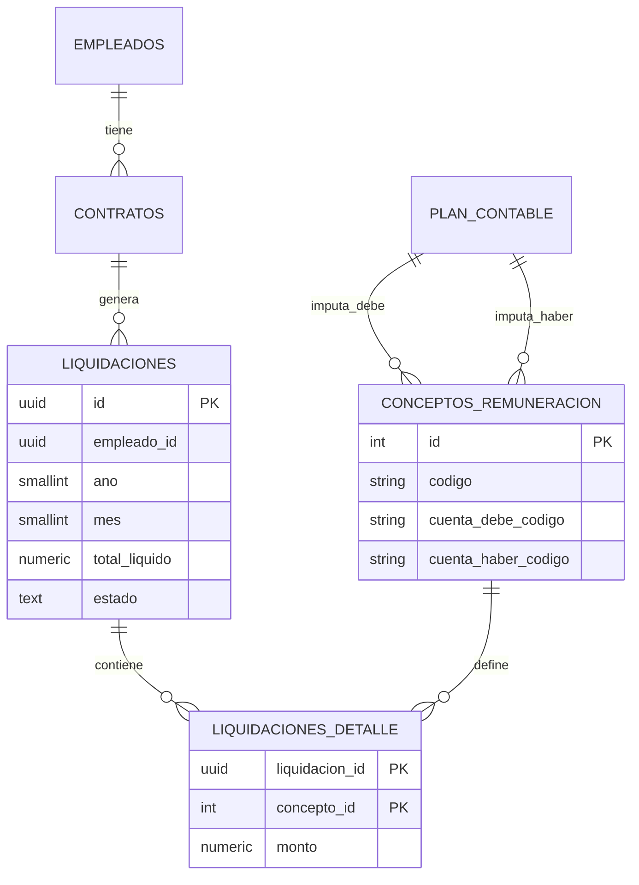

## Modelo Entidad-Relación (ERD)

Estructura de datos central del módulo de remuneraciones.

## Flujo de Cálculo (Sequence Diagram)

Cómo interactúan los procedimientos almacenados durante la generación de una liquidación.

```mermaid
sequenceDiagram
    participant FE as Frontend/API
    participant SP as sp_liquidacion_generar
    participant FX as fx_liquidacion_previa
    participant DB as Tablas (Liquidaciones)

    FE->>SP: Generar Liquidación (Mes X)
    
    rect rgb(57, 68, 70)
    note right of SP: Fase 1: Cálculo en Memoria
    SP->>FX: Calcular montos (sin guardar)
    FX->>FX: Cargar Contrato + Asistencia
    FX->>FX: Calcular Haberes
    FX->>FX: Calcular Descuentos Legales
    FX->>FX: Calcular Impuesto Único
    FX-->>SP: Retorna Estructura {Header, Detalles[]}
    end

    rect rgb(26, 31, 32)
    note right of SP: Fase 2: Persistencia
    SP->>DB: INSERT/UPDATE liquidaciones (Header)
    SP->>DB: DELETE liquidaciones_detalle (Limpieza)
    loop Para cada Concepto > 0
        SP->>DB: INSERT liquidaciones_detalle (con Concepto ID)
    end
    end

    SP-->>FE: Retorna ID Liquidación + Resumen
```

