import { Tabs, TabItem, Aside, Steps } from '@astrojs/starlight/components';

Modelos visuales que documentan la estructura de datos y los flujos de procesamiento del módulo de remuneraciones.

---

## Modelo Entidad-Relación (ERD)

Estructura de datos central del módulo de remuneraciones.

<Tabs>
  <TabItem label="📊 ERD Principal">
    ```mermaid
    erDiagram
        EMPLEADOS ||--o{ CONTRATOS : "tiene"
        CONTRATOS ||--o{ LIQUIDACIONES : "genera"
        
        LIQUIDACIONES ||--o{ LIQUIDACIONES_DETALLE : "contiene"
        
        CONCEPTOS_REMUNERACION ||--o{ LIQUIDACIONES_DETALLE : "define"
        
        PLAN_CONTABLE ||--o{ CONCEPTOS_REMUNERACION : "imputa_debe"
        PLAN_CONTABLE ||--o{ CONCEPTOS_REMUNERACION : "imputa_haber"

        EMPLEADOS ||--o{ ASISTENCIA : "registra"
        EMPLEADOS ||--o{ VACACIONES : "solicita"
        
        CONTRATOS }o--|| JORNADAS : "asigna"
        ASISTENCIA }o--|| JORNADAS : "cumple"

        LIQUIDACIONES {
            uuid id PK
            uuid empleado_id FK
            smallint ano
            smallint mes
            numeric total_liquido
            text estado
        }

        LIQUIDACIONES_DETALLE {
            uuid liquidacion_id PK
            int concepto_id PK
            numeric monto
        }

        CONCEPTOS_REMUNERACION {
            int id PK
            string codigo
            string cuenta_debe_codigo
            string cuenta_haber_codigo
        }
        
        ASISTENCIA {
            uuid empleado_id PK
            date fecha PK
            uuid jornada_id FK
            text estado_asistencia
            time hora_entrada
            time hora_salida
        }
    ```
  </TabItem>

  <TabItem label="🏢 Previsión Social">
    ```mermaid
    erDiagram
        EMPLEADOS ||--o{ CONTRATOS : "tiene"
        CONTRATOS ||--o| CONTRATO_AFP : "asocia"
        CONTRATOS ||--o| CONTRATO_ISAPRE : "asocia"
        CONTRATOS ||--o{ CONTRATO_APV : "registra"
        
        AFP ||--o{ CONTRATO_AFP : "proveedor"
        ISAPRE ||--o{ CONTRATO_ISAPRE : "proveedor"
        
        LIQUIDACIONES ||--o{ IMPOSICIONES : "genera"
        HONORARIOS ||--o{ IMPOSICIONES : "genera"
        
        CONTRATO_AFP {
            uuid contrato_id PK
            uuid afp_id FK
            numeric tasa_actual
        }
        
        CONTRATO_APV {
            uuid id PK
            string regimen
            string monto_tipo
            daterange vigencia
        }
        
        IMPOSICIONES {
            int periodo
            text institucion_tipo
            numeric monto_trabajador
            numeric monto_empleador
            text estado
        }
    ```
  </TabItem>

  <TabItem label="📋 Terminación">
    ```mermaid
    erDiagram
        CONTRATOS ||--o| FINIQUITOS : "termina_con"
        FINIQUITOS ||--o{ FINIQUITOS_DETALLE : "contiene"
        CONCEPTOS_REMUNERACION ||--o{ FINIQUITOS_DETALLE : "define"
        
        CAUSALES_TERMINO ||--o{ FINIQUITOS : "justifica"
        
        VACACIONES }o--|| FINIQUITOS : "liquida_en"
        
        FINIQUITOS {
            uuid id PK
            uuid contrato_id FK
            date fecha_termino
            string causal_codigo
            numeric total_indemnizaciones
            numeric monto_vacaciones
            text estado
        }
        
        FINIQUITOS_DETALLE {
            uuid finiquito_id FK
            int concepto_id FK
            numeric monto
        }
        
        CAUSALES_TERMINO {
            string codigo PK
            string descripcion
            boolean paga_indemnizacion
            boolean paga_aviso_previo
        }
    ```
  </TabItem>
</Tabs>

---

## Flujo de Cálculo de Liquidación

<Steps>
1. **Trigger**: API/Frontend solicita generar liquidación para empleado + período
2. **Fase Cálculo**: `fx_liquidacion_previa` computa montos en memoria
3. **Fase Persistencia**: `sp_liquidacion_generar` guarda header + detalles
4. **Retorno**: ID de liquidación + resumen de totales

```mermaid
%%{init: {'theme': 'dark', 'themeVariables': { 'primaryColor': '#2a2a2a', 'primaryTextColor': '#e0e0e0', 'lineColor': '#10b981'}}}%%
sequenceDiagram
    participant FE as 🖥️ Frontend/API
    participant SP as ⚙️ sp_liquidacion_generar
    participant FX as 📊 fx_liquidacion_previa
    participant DB as 🗄️ PostgreSQL

    FE->>SP: Generar Liquidación (Mes X)
    
    rect rgba(16, 185, 129, 0.1)
    Note right of SP: 📐 Fase 1: Cálculo en Memoria
    SP->>FX: Calcular montos (sin guardar)
    FX->>FX: Cargar Contrato + Asistencia
    FX->>FX: Calcular Haberes
    FX->>FX: Calcular Descuentos Legales
    FX->>FX: Calcular Impuesto Único
    FX-->>SP: Retorna {Header, Detalles[]}
    end

    rect rgba(59, 130, 246, 0.1)
    Note right of SP: 💾 Fase 2: Persistencia
    SP->>DB: INSERT liquidaciones (Header)
    SP->>DB: DELETE liquidaciones_detalle (Limpieza)
    loop Para cada Concepto > 0
        SP->>DB: INSERT liquidaciones_detalle
    end
    end

    SP-->>FE: ✅ ID Liquidación + Resumen
```

</Steps>



<Aside type="tip" title="Separación de Fases">
  La función `fx_liquidacion_previa` puede ejecutarse independientemente para **preview** sin afectar la BD. 
  Ideal para validación antes de aprobar.
</Aside>

---

## Generación de Imposiciones

Flujo de consolidación de aportes previsionales (post-liquidación).

<Tabs>
  <TabItem label="Diagrama de Flujo">
    ```mermaid
    graph TD
        subgraph Fuentes["📥 Fuentes de Datos"]
            LIQ[Liquidaciones Detalle]
            HON[Honorarios]
        end
        
        subgraph Orchestrator["🎯 Orchestrator Domain"]
            SVC(Previsions Service)
            MAP{Mapeo por<br/>Institución}
        end
        
        subgraph Destino["🗄️ Tabla Imposiciones"]
            AFP[AFP]
            SAL[ISAPRE/FONASA]
            MUT[MUTUAL]
            SII[SII - Impuesto]
            AFC[AFC]
        end
        
        LIQ -->|Agregación<br/>por Concepto| SVC
        HON -->|Agregación<br/>Retención| SVC
        
        SVC --> MAP
        
        MAP -->|Tipo: AFP| AFP
        MAP -->|Tipo: SALUD| SAL
        MAP -->|Tipo: MUTUAL| MUT
        MAP -->|Tipo: SII| SII
        MAP -->|Tipo: AFC| AFC
        
        classDef source fill:#f59e0b,stroke:#d97706,color:#000;
        classDef service fill:#3b82f6,stroke:#2563eb,color:#fff;
        classDef dest fill:#10b981,stroke:#059669,color:#fff;
        
        class LIQ,HON source;
        class SVC,MAP service;
        class AFP,SAL,MUT,SII,AFC dest;
    ```
  </TabItem>

  <TabItem label="Proceso Paso a Paso">
    <Steps>
    1. **Recolección**: Se obtienen todas las liquidaciones del período con estado `APROBADA`
    2. **Agrupación**: Los conceptos se agrupan por tipo de institución (AFP, Salud, etc.)
    3. **Sumatorias**: Se calculan totales de aportes trabajador y empleador
    4. **Honorarios**: Se agregan las retenciones de boletas de honorarios del período
    5. **Inserción**: Se crea registro en `imposiciones` por cada institución
    6. **Estado**: Queda como `CALCULADA` hasta declaración en Previred
    </Steps>
  </TabItem>

  <TabItem label="SP Invocación">
    ```sql title="Generar Imposiciones del Período"
    -- 1. Generar liquidaciones del mes
    SELECT * FROM remuneraciones.sp_liquidacion_generar(
      contrato_id, empleado_id, '2025-08-01', usuario_id, '{}', false, true
    );

    -- 2. Consolidar imposiciones
    SELECT * FROM remuneraciones.sp_generar_imposiciones(
      2025::smallint, 
      11::smallint, 
      '3ea801cf-01f1-41ef-ac17-1b4c873d4120'::uuid
    );

    -- 3. Ver resumen para pago
    SELECT * FROM remuneraciones.v_imposiciones_pendientes;

    -- 4. Ver datos para F29
    SELECT * FROM remuneraciones.v_imposiciones_f29 
    WHERE año = 2025 AND mes = 11;
    ```
  </TabItem>
</Tabs>

---

## Leyenda de Símbolos

| Símbolo | Significado |
| :---: | :--- |
| `\|\|--o\{` | Uno a muchos (obligatorio) |
| `\}o--\|\|` | Muchos a uno |
| `\|\|--o\|` | Uno a uno opcional |
| `PK` | Primary Key |
| `FK` | Foreign Key |

<Aside type="note" title="Archivos Fuente">
  Los diagramas se basan en los archivos SQL ubicados en:
  - `db/accounting_template/remuneraciones/tbl/` — Definiciones de tablas
  - `db/accounting_template/remuneraciones/sp/` — Stored Procedures
  - `db/accounting_template/remuneraciones/fx/` — Funciones de cálculo
</Aside>
