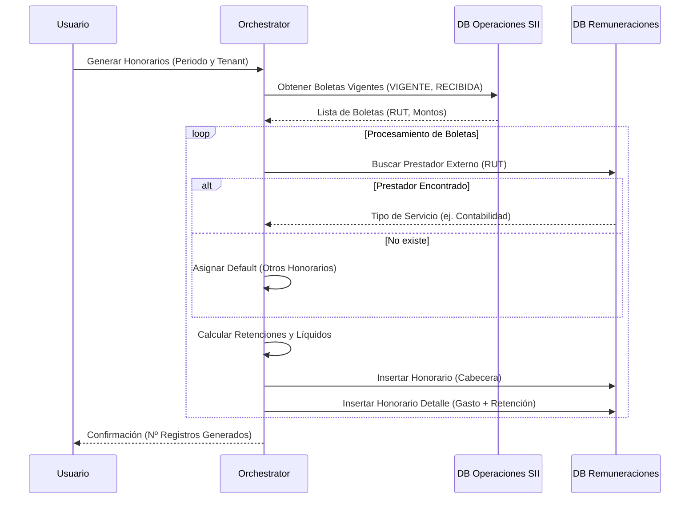
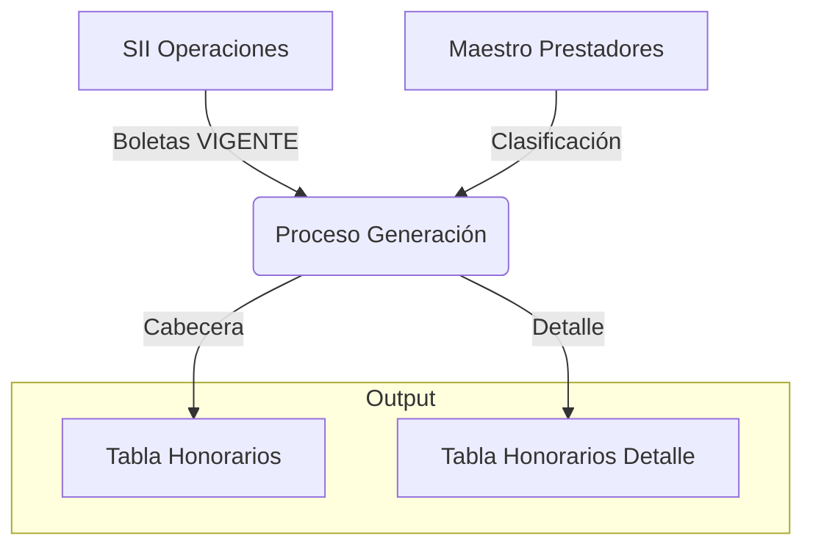

## Generación de Honorarios

El proceso de **Generación de Honorarios** permite importar, clasificar y contabilidad las Boletas de Honorarios Electrónicas recibidas desde el Servicio de Impuestos Internos (SII).

### Descripción General

El sistema se conecta con la base de datos de operaciones del SII (`operaciones_sii`) para obtener las boletas en estado `VIGENTE` y tipo `RECIBIDAS`. Posteriormente, utiliza una tabla de **Prestadores Externos** para clasificar automáticamente el gasto según el tipo de servicio (Contabilidad, Legal, Técnico, etc.).

#### Flujo del Proceso

1. **Obtención**: Se leen las boletas con estado `VIGENTE` recibidas en el período seleccionado.
2. **Routing (Clasificación)**:
   - Se busca el RUT del prestador en `remuneraciones.prestadores_externos`.
   - Si existe, se asigna el concepto contable correspondiente (ej. `HON-004` para Contabilidad).
   - Si no existe, se asigna el concepto por defecto `HON-001` (Otros Honorarios).
3. **Generación de Registros**:
   - **Cabecera**: Se crea un registro en `remuneraciones.honorarios` con los totales.
   - **Detalle**: Se crean registros en `remuneraciones.honorarios_detalle` desglosando el monto bruto y la retención (10% u otra tasa).
4. **Confirmación**: Los registros quedan disponibles para revisión y centralización contable.

#### Diagrama de Flujo de Datos

### Interfaz de Usuario

La funcionalidad se encuentra en el menú **Remuneraciones > Honorarios**.

1. Seleccione el **Año** y **Mes**.
2. Visualice la lista de boletas ya procesadas.
3. Haga clic en **Generar desde SII** para importar nuevas boletas o actualizar el período.

> [!NOTE]
> El sistema recalcula automáticamente la retención basándose en los datos del SII. Si la boleta es "RECIBIDA", la retención es de cargo de la empresa (Retención Emisor).

### Modelo de Datos

El módulo utiliza las siguientes tablas principales:

- `remuneraciones.honorarios`: Cabecera de la boleta.
- `remuneraciones.honorarios_detalle`: Detalle de conceptos (Gasto y Retención).
- `remuneraciones.prestadores_externos`: Maestro de prestadores para routing automático.
