El proceso de **Generación de Imposiciones** es una etapa posterior al cálculo de remuneraciones. Su objetivo es consolidar los montos individuales calculados en las liquidaciones (`liquidaciones_detalle`) y agruparlos por institución para facilitar la declaración y pago (ej: Planilla Previred, F29).

> **Migración 2025-12**: Esta lógica fue migrada desde un Stored Procedure (`sp_generar_imposiciones`) hacia un **Servicio de Dominio en Orchestrator** (`PrevisionsService`).

## Arquitectura

El proceso sigue una arquitectura de capas en el **Orchestrator**:

1. **Controller** (`routes/remuneraciones/previsiones.ts`): Recibe la solicitud para un Año/Mes.
2. **Service** (`PrevisionsService.ts`): Orquesta la eliminación de registros previos, obtención de agregados y persistencia.
3. **Repository** (`PrevisionsRepository.ts`): Ejecuta consultas SQL optimizadas (`GROUP BY`) para obtener los totales sin traer millones de registros a memoria.

### Diagrama de Flujo

```mermaid
sequenceDiagram
    participant API as Controller
    participant Service as PrevisionsService
    participant Repo as PrevisionsRepository
    participant DB as PostgreSQL

    API->>Service: generate(year, month)
    
    rect rgb(57, 68, 70)
    note right of Service: 1. Agregación (Read-Only)
    Service->>Repo: getAFPWorkerAggregates()
    Repo->>DB: SELECT SUM(...) FROM liquidaciones_detalle
    DB-->>Repo: Totales AFP
    Service->>Repo: getHealthWorkerAggregates()
    Repo-->>Service: Totales ISAPRE/FONASA
    Service->>Repo: getAFCEmployerAggregates()
    Service->>Repo: getTaxAggregates()
    end

    rect rgb(26, 31, 32)
    note right of Service: 2. Persistencia (Transactional)
    Service->>Repo: transactionalReplace(Entity[])
    Repo->>DB: BEGIN
    Repo->>DB: DELETE FROM imposiciones WHERE mes=X
    Repo->>DB: INSERT INTO imposiciones (Batch)
    Repo->>DB: COMMIT
    end

    Service-->>API: Resultado (Rows created)
```

## Lógica de Consolidación

La consolidación se realiza en 6 bloques principales. En todos los casos, solo se consideran liquidaciones en estado `CALCULADA`, `APROBADA` o `PAGADA`.

### 1. Cotización Obligatoria AFP (Trabajador)

- **Concepto Fuente**: `DESC-001` (Cotización AFP + Comisión).
- **Agrupación**: Por AFP.
- **Salida**: Un registro por AFP con el total descontado a los trabajadores.

### 2. Cotización Salud (Trabajador)

- **Concepto Fuente**: `DESC-002` (7% Salud / Pactado).
- **Agrupación**: Por ISAPRE. Si no tiene Isapre, se agrupa bajo `FONASA`.
- **Salida**: Un registro por Isapre y uno para Fonasa.

### 3. Seguro de Cesantía (Trabajador)

- **Concepto Fuente**: `DESC-003` (0.6% cargo trabajador, si aplica).
- **Agrupación**: Por AFP (La AFC se paga usualmente junto a la planilla de la AFP o en planilla separada pero desglosada).
- **Nota**: El sistema actual lo agrupa bajo la entidad `AFP` para efectos visuales, pero con glosa "Seguro Cesantía Trabajador".

### 4. Aportes Patronales (Empleador)

Incluye todos los costos empresa calculados en la liquidación:

- **SIS** (`APT-003`): Se paga a las AFP.
- **Seguro Cesantía Empleador** (`APT-002`): Se paga a la AFC (vía AFP o directo).
- **Mutual** (`APT-004`): Se paga a la Mutual de Seguridad.
- **Ley Sanna/Otros** (`APT-005`, `APT-006`).

**Agrupación**: Automática según el tipo de aporte. Mutales van a Mutual, SIS/AFC van a la AFP/AFC correspondiente.

### 5. Impuesto Único (SII)

- **Concepto Fuente**: `DESC-004`.
- **Destino**: SII (Tesorería).
- **Uso**: Para declarar en Formulario 29 (Línea de Impuesto Único).

### 6. Retención de Honorarios (SII)

- **Fuente**: Tabla `remuneraciones.honorarios`.
- **Lógica**: Suma todas las retenciones (13.75% o vigente) de boletas `RECIBIDA` o superior.
- **Destino**: SII (F29, Retención 2da Categoría).

## Persistencia y Transaccionalidad

El proceso es **Idempotente** para un periodo dado:

1. Se abre una transacción.
2. Se eliminan **todas** las imposiciones existentes para el `Año-Mes` con estado `CALCULADA`.
   - *Nota*: Si existen imposiciones `DECLARADA` o `PAGADA`, el sistema debería bloquear la regeneración (regla de negocio a nivel de UI/Service).
3. Se insertan los nuevos registros consolidados.
4. Se hace Commit.

### Modelo de Datos (`remuneraciones.imposiciones`)

| Campo | Descripción |
|-------|-------------|
| `institucion_tipo` | `AFP`, `ISAPRE`, `MUTUAL`, `SII`, `CCAF`. |
| `institucion_codigo` | Código interno (ej: `MODELO`, `BANMEDICA`). |
| `monto_trabajador` | Suma de descuentos a empleados. |
| `monto_empleador` | Suma de aportes patronales. |
| `codigo_previred` | Código oficial para archivos de interfase (futuro). |
