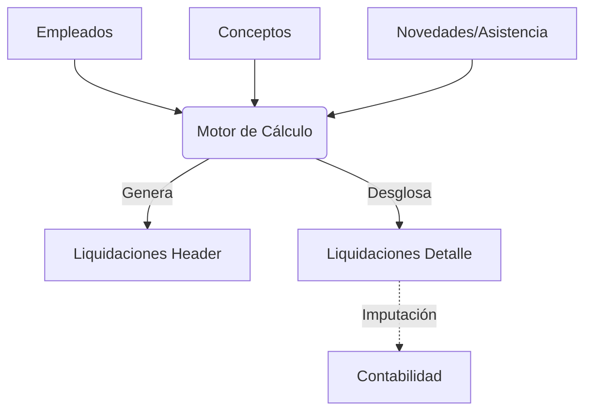

import { LinkCard, CardGrid, Card } from "@astrojs/starlight/components";

Este módulo gestiona el cálculo de remuneraciones, liquidaciones, leyes sociales e historial de pagos. Está diseñado bajo una arquitectura **Master-Detail** y fuertemente integrado con el plan contable.

## 🚀 Navegación Rápida

<CardGrid stagger>
  <LinkCard
    title="Motor de Cálculo"
    description="Arquitectura Híbrida TypeScript + PostgreSQL"
    href="./motor-calculo/"
  />
  <LinkCard
    title="Lógica de Negocio"
    description="Fórmulas de Sueldo, Gratificación y Leyes Sociales"
    href="./calculos/"
  />
  <LinkCard
    title="Diagramas y Flujos"
    description="Visualización de la arquitectura y procesos"
    href="./diagramas/"
  />
  <LinkCard
    title="Generación de Imposiciones"
    description="Procesos de consolidación mensual (Previred/F29)"
    href="./PrevisionsService/"
  />
  <LinkCard
    title="Generación de Liquidaciones"
    description="PayrollService: Fetch, Calculate & Persist"
    href="./PayrollService/"
  />
  <LinkCard
    title="Generación de Honorarios"
    description="HonorariosService: Routing de boletas SII"
    href="./HonorariosService/"
  />
</CardGrid>

## Arquitectura General

El schema `remuneraciones` centraliza toda la lógica de nómina. Su núcleo es la relación entre la cabecera de la liquidación y sus detalles desglosados concepto por concepto.

:::note[Integración Contable]
A diferencia de sistemas antiguos, aquí **cada concepto de remuneración** (haber o descuento) sabe exactamente a qué cuenta contable imputarse. Esto permite generar el asiento contable de remuneraciones de forma automática.
:::

## Componentes Principales

<CardGrid>
  <Card title="1. Maestro de Empleados" icon="user">
    Tabla `empleados`. Contiene la información contractual, personal y
    previsional. Es la base para cualquier cálculo.
  </Card>
  <Card title="2. Definición de Conceptos" icon="list-format">
    Tabla `conceptos_remuneracion`. Catálogo maestro que define: - **Qué es**:
    Haber, Descuento, Aporte Patronal. - **Cómo se calcula**: Fórmula, Monto
    Fijo, Porcentaje. - **Dónde se contabiliza**: Cuentas de Gasto, Pasivo, etc.
  </Card>
  <Card title="3. Motor de Cálculo" icon="setting">
    Arquitectura Híbrida (**TypeScript** + PostgreSQL). 1. **Orchestrator**:
    Calcula haberes y descuentos (Lógica de Negocio). 2. **Repositorio**:
    Obtiene contratos y asistencia. 3. **Persistencia**: Guarda resultados en
    `liquidaciones`.
  </Card>
</CardGrid>

## Flujo de Datos

## Ubicación del Código

Todos los objetos de base de datos se encuentran en:
`Nostromo/db/accounting_template/remuneraciones/`

- **Funciones (Lógica)**: `/fx`
- **Procedimientos (Orquestación)**: `/sp`
