## Visión General

Como parte de la estrategia **Pragmatic Hybrid Architecture 2025**, la lógica de cálculo de remuneraciones se ha migrado desde Stored Procedures (PL/pgSQL) a una capa de dominio en **TypeScript** dentro del Orchestrator.

Esta arquitectura separa claramente responsabilidades:

- **PostgreSQL**: Persistencia y lecturas eficientes (Smart Views).
- **Orchestrator (Node.js)**: Lógica de negocio compleja, validaciones y cálculo.

## Arquitectura de Componentes

El sistema se compone de tres capas principales:

1. **PayrollRepository**: Capa de acceso a datos. Ejecuta queries SQL optimizadas para traer todo el contexto necesario (Contrato, Asistencia, Indicadores) en un solo batched request.
2. **PayrollService**: Orquestador. Coordina la obtención de datos, la adaptación de entradas y la ejecución del motor.
3. **PayrollEngine**: Núcleo de cálculo puro. Recibe inputs tipados y devuelve resultados matemáticos sin efectos secundarios.

### Diagrama de Clases

## Flujo de Ejecución (Sequence Diagram)

El siguiente diagrama muestra cómo fluye una solicitud de cálculo de pre-visualización:

```mermaid
sequenceDiagram
    participant API as API Client
    participant Service as PayrollService
    participant Repo as PayrollRepository
    participant DB as PostgreSQL
    participant Engine as PayrollEngine

    API->>Service: previewPayroll(contractId, oct-2025)
    
    rect rgb(57, 68, 70)
    note right of Service: 1. Obtención de Datos
    Service->>Repo: getPayrollContext(contractId, oct-2025)
    Repo->>DB: SELECT Contrato + Empleado
    Repo->>DB: SELECT Asistencia (Resumen Mes)
    Repo->>DB: SELECT Indicadores (UF, UTM, Topes)
    Repo->>DB: SELECT Tasas (AFP, Impuesto)
    DB-->>Repo: Result Sets
    Repo-->>Service: PayrollContext (Objetos Tipados)
    end

   rect rgb(26, 31, 32)
    note right of Service: 2. Adaptación y Cálculo
    Service->>Service: Map Context -> PayrollInput
    Service->>Engine: calculate(PayrollInput)
    
    activate Engine
    Engine->>Engine: Calc Sueldo Prorrateado
    Engine->>Engine: Calc Gratificación (Tope 4.75 IMM)
    Engine->>Engine: Calc Leyes Sociales (AFP/Salud/AFC)
    Engine->>Engine: Calc Impuesto Único
    Engine->>Engine: Calc Líquido
    Engine-->>Service: PayrollResult
    deactivate Engine
    end

    Service-->>API: Retorna JSON (Liquidación Previa)


```

## Componentes Clave

### 1. Calculadoras de Dominio

Ubicación: `src/domain/payroll/calculators/`

Cada aspecto de la liquidación tiene su propia clase aislada y testeada:

- **BaseSalaryCalculator**: Maneja sueldo base, prorrateo por días trabajados y sueldo mínimo.
- **GratificationCalculator**: Aplica tope de 4.75 IMM anual (mensualizado) o 25% legal.
- **HealthPlanCalculator**: Resuelve conflicto Isapre (Plan vs 7%) y Fonasa.
- **SocialLawsCalculator**: Calcula AFP, SIS, Mutual, AFC (Trabajador y Empleador).
- **TaxCalculator**: Aplica tabla de Impuesto de 2da Categoría con rebajas.

### 2. Motor (PayrollEngine)

Ubicación: `src/domain/payroll/PayrollEngine.ts`

Es una función pura estática. No realiza I/O.

- **Entrada**: `PayrollInput` (Interfaz estricta con todos los valores monetarios y factores).
- **Salida**: `PayrollResult` (Estructura de la liquidación con haberes, descuentos y líquido).

### 3. Repositorio (PayrollRepository)

Ubicación: `src/domain/payroll/PayrollRepository.ts`

Centraliza el SQL. Reemplaza la necesidad de tener lógica de negocio dispersa en múltiples queries.

- Utiliza `Promise.all` para paralelizar la obtención de Contrato, Asistencia e Indicadores.
- Retorna valores "crudos" o semi-procesados (ej: Topes en UF) que el Servicio luego adapta.
