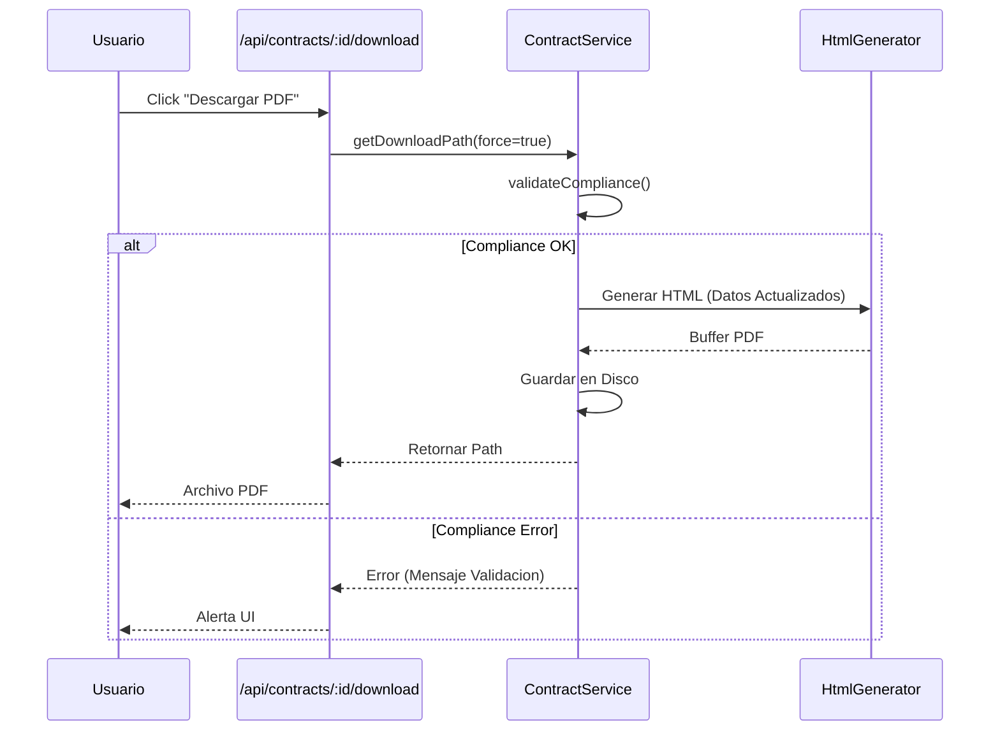

import { Steps, Aside, LinkCard, FileTree } from "@astrojs/starlight/components";

El **Servicio de Contratos** administra la relación legal entre la empresa y el colaborador. Es la fuente de verdad para el cálculo de remuneraciones (Sueldo Base, Jornada, Antigüedad) y es responsable de asegurar el cumplimiento normativo (Compliance) en la documentación generada.

<LinkCard
  title="📘 Ver Implementación Técnica"
  description="ContractService: Creación transaccional, PDF Generator y Validadores"
  href="/orchestrator/services/contractservice/"
/>

## Compliance Laboral Asistido 🛡️

El sistema no solo almacena datos, sino que actúa como un **Auditor de Compliance** previo a la emisión de documentos. Antes de generar cualquier PDF, el sistema ejecuta las siguientes validaciones estrictas:

| Validación | Descripción | Comportamiento |
| :--- | :--- | :--- |
| **Jornada Obligatoria** | Verifica que el contrato tenga asignada una Jornada de Trabajo activa. | **Bloqueante**: Error si falta jornada. |
| **Previsión y Salud** | Exige que el empleado tenga **AFP** y **Sistema de Salud** (Fonasa/Isapre) asignados. | **Bloqueante**: Necesario para la Cláusula Séptima. |
| **Coherencia de Fechas** | Valida que `Fecha Término > Fecha Inicio` (en contratos a plazo). | **Bloqueante**: Previene contratos con vigencia negativa. |
| **Formato Legal** | Asegura que RUTs y Fechas sigan el formato estándar chileno. | **Automático**: Formatea datos al vuelo. |

:::note[Lógica de Negocio]
Estas reglas están implementadas en el método `validateCompliance` de `ContractService`. Si alguna falla, se lanza una excepción `Compliance Error` que impide la descarga o creación del documento.
:::

## Generación de Documentos (PDF)

El motor de generación de contratos transforma los datos estructurados en un documento legalmente válido y estéticamente profesional.

### Plantilla Dinámica Inteligente

El generador (`ContractHtmlGenerator`) adapta las cláusulas según la configuración del contrato:

1.  **Cláusula Tercera (Jornada)**:
    *   **Dinámica**: En lugar de texto estático, obtiene los días y horas exactos desde la definición de la Jornada (`WorkingDay`).
    *   **Ejemplo**: _"Lunes a Viernes: de 08:30 a 18:30 horas"_ y _"Con un tiempo de descanso para colación de 45 minutos..."_.

2.  **Cláusula Quinta (Duración)**:
    *   **Indefinido**: Texto _"Duración INDEFINIDA"_ y oculta referencias a fechas de término.
    *   **Plazo Fijo**: Texto _"Duración A PLAZO FIJO"_ e incluye la frase _"terminará indefectiblemente el día [Fecha]"_.

3.  **Cláusula Séptima (Previsión)**:
    *   Inyecta automáticamente los nombres de la **AFP** (ej: "Habitat") y **Salud** (ej: "Fonasa") del empleado.

### Self-Healing & Regeneración 🔄

El sistema posee capacidad de autorecuperación para los archivos PDF.

*   **Detección de Archivos Perdidos**: Al intentar descargar un contrato, si el archivo físico no existe en el almacenamiento, el sistema **lo regenera automáticamente** al vuelo.
*   **Forzar Regeneración**: Desde la UI, el botón de descarga solicita explicitamente una regeneración (`?force=true`) para asegurar que el PDF refleje siempre los últimos cambios de datos (e.g., cambio de domicilio o sueldo).

## Ciclo de Vida del Contrato

El sistema maneja estados lógicos para alertar sobre la vigencia:

- **VIGENTE**: Fecha término futura o indefinida.
- **POR VENCER**: Fecha término dentro de los próximos 30 días (Alerta Amarilla).
- **VENCIDO**: Fecha término pasada (Alerta Roja).

## Categorización

El campo `categoria_trabajador` define reglas especiales de tributación o cotización:

- **DEPENDIENTE**: Regla general.
- **CASA_PARTICULAR**: Reglas especiales de indemnización y AFP.
- **MENOR_MAYOR**: Aprendices o trabajadores jóvenes.
