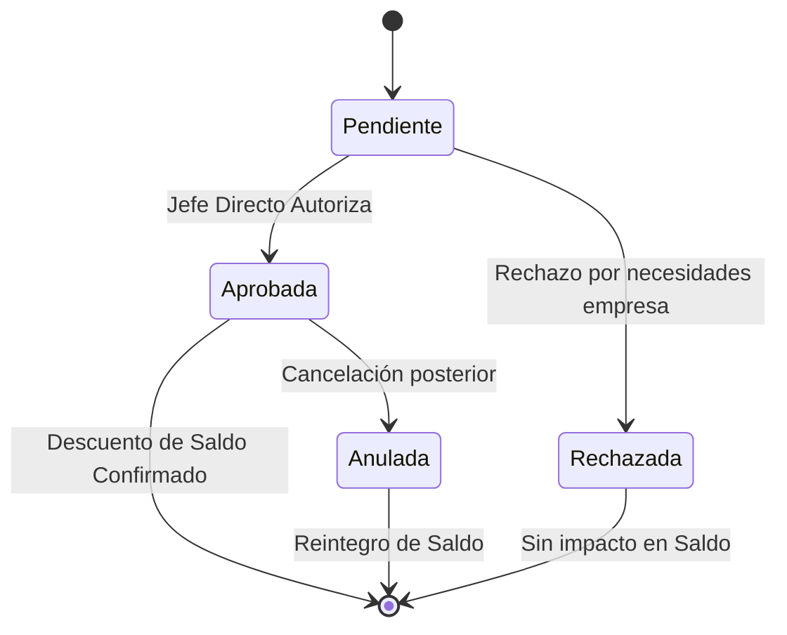

import { Tabs, TabItem } from "@astrojs/starlight/components";

El **Servicio de Vacaciones** gestiona el derecho a descanso anual remunerado. Calcula automáticamente los días ganados (devengados) y controla el consumo mediante solicitudes.

## Lógica de Devengamiento

El sistema calcula el saldo en tiempo real utilizando una función de base de datos (`remuneraciones.vac_saldo_empleado`).

### Reglas de Acumulación

| Región / Zona                                | Factor Mensual | Días Anuales    |
| :------------------------------------------- | :------------- | :-------------- |
| **General**                                  | 1.25 días      | 15 días hábiles |
| **Zona Extrema** (Magallanes, Aysén, Palena) | 1.66 días      | 20 días hábiles |

> **Nota**: El sistema detecta automáticamente la "Zona Extrema" basándose en la `region` y `comuna` de la dirección del empleado.

## Solicitudes y Días Hábiles

Al solicitar vacaciones, el sistema debe convertir el "Rango de Fechas" (Calendario) a "Días Hábiles" (Saldo).

### Algoritmo de Cálculo

1. Se iteran los días entre `fecha_inicio` y `fecha_fin`.
2. Se excluyen los **Domingos** (y Sábados si la jornada es Lunes-Viernes).
3. Se excluyen los **Feriados Legales** consultando la tabla `parametros.feriados`.

<Tabs>
  <TabItem label="Ejemplo">
    **Solicitud**: Viernes 10 a Lunes 13. - Viernes 10: **Hábil** (+1) - Sábado
    11: Inhábil - Domingo 12: Inhábil - Lunes 13: **Hábil** (+1) **Total
    Descuento**: 2.0 días.
  </TabItem>
</Tabs>

## Flujo de Aprobación

