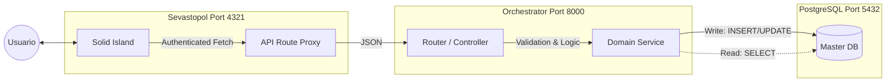
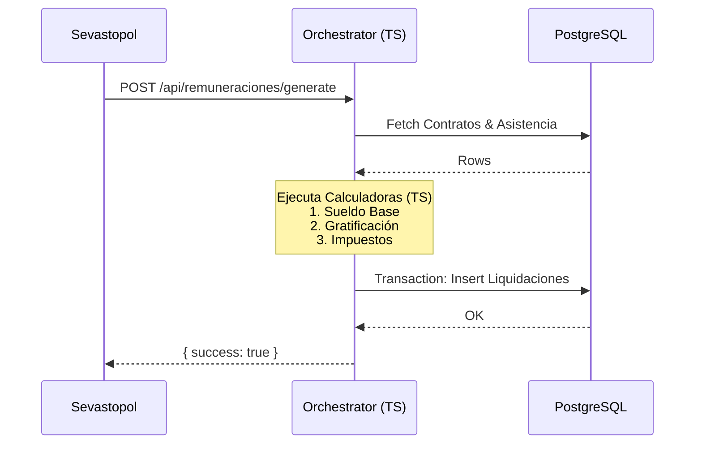

## 📊 Visión General

El **Sistema Contable Nostromo** es una plataforma multi-tenant completa que integra contabilidad, remuneraciones, operaciones comerciales y generación de reportes tributarios.

## 🏗️ Arquitectura "Pro" (Hybrid Core)

El sistema implementa el patrón **"Hybrid Core 2025"**, diseñado para maximizar la consistencia de datos y la experiencia de usuario.

### Estricta Separación de Responsabilidades

| Capa | Tecnología | Rol Principal | Regla de Oro |
| :--- | :--- | :--- | :--- |
| **Frontend** | **Sevastopol** (Astro + SolidJS) | **Experiencia (UX)** | ❌ **Nunca** calcula ni valida reglas de negocio. ✅ Solo renderiza y captura input. |
| **BFF / API** | **Orchestrator** (Express / TypeScript) | **Lógica y Control** | ✅ **Dueño de la verdad**. Valida, calcula, autoriza y persiste. |
| **Datos** | **PostgreSQL** (Multi-tenant) | **Persistencia** | ✅ Fuente de verdad final. Delegado para lecturas masivas (Smart Views). |

### Flujo de Datos (BFF Proxy Pattern)

La comunicación sigue un flujo unidireccional estricto. El frontend nunca toca la base de datos.

## 🔄 Motor de Cálculo "Hybrid Core"

La lógica de negocio compleja (ej: Remuneraciones) no vive en Stored Procedures monolíticos, sino en **TypeScript puro** dentro del Orchestrator.

### ¿Por qué?

1. **Testability**: Jest permite probar reglas complejas con inputs controlados.
2. **Maintainability**: Código modular vs. miles de líneas de PL/pgSQL.
3. **Performance**: La DB se dedica a I/O, no a cómputo de CPU.

### Flujo de Cálculo de Nómina

## 🗄️ Estructura de Base de Datos

### Schemas Principales

- **`administracion`**: Configuración global, usuarios y Plan Contable.
- **`remuneraciones`**: Nómina, contratos, empleados (Ver [Módulo Remuneraciones](./remuneraciones)).
- **`operaciones`**: Compras, ventas, inventario.
- **`parametros`**: Indicadores económicos (UF, UTM), tasas e impuestos.

## 🔐 Seguridad y Acceso

### Autenticación Session-Based

- **Cookie `sid`**: HttpOnly, SameSite=Lax.
- **JWT**: Firmado por Orchestrator, validado en cada request.
- **RBAC**: Permisos granulares checheados en middleware (`authorizeRoute`).

### Multi-Tenancy

- **Aislamiento**: Cada tenant (empresa) tiene su propio set de datos.
- **Resolución**: `tenant_id` resuelto via Token/Header, nunca confiando ciegamente en el body.

## 🔗 Integraciones y Cargas

El sistema se alimenta automáticamente de fuentes oficiales:

1. **Banco Central**: Tipos de cambio (Dólar, UF).
2. **SII**: Impuestos mensuales, UTM.
3. **Previred**: Indicadores previsionales.

Ver sección [Scripts y Subidas](/subidas/) para detalles operativos.

## 📚 Referencias Técnicas

- **Frontend Specs**: Ver `sevastopol/.github/copilot-instructions.md`
- **Backend Specs**: Ver `orchestrator/.github/copilot-instructions.md`
- **API Endpoints**: Ver [Documentación de API](/api/endpoints/)
