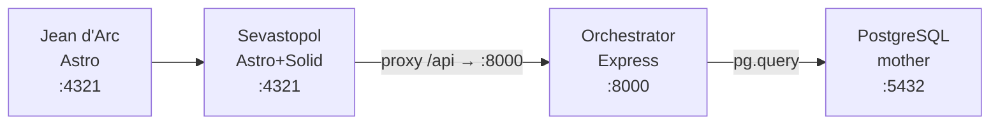

## 📊 Visión General

El **Sistema Contable Nostromo** es una plataforma multi-tenant completa que integra contabilidad, remuneraciones, operaciones comerciales y generación de reportes tributarios.

## 🏗️ Arquitectura

### Componentes Principales

1. **Nostromo (Python)** - Core del sistema contable
2. **Orchestrator (TypeScript/Express)** - API REST backend
3. **Sevastopol (Astro/Solid)** - Frontend web
4. **PostgreSQL (mother)** - Base de datos

### Flujo de Datos



## 🗄️ Estructura de Base de Datos

### Schemas

- **`administracion`** - Plan contable, usuarios, configuración
- **`parametros`** - Indicadores, tasas, topes legales
- **`operaciones`** - Compras, ventas, boletas
- **`remuneraciones`** - Empleados, contratos, liquidaciones
- **`activo_fijo`** - Gestión de activos
- **`inventario`** - Control de stock
- **`reportes`** - Consolidación de informes

## 🔄 Módulos Principales

### 1. Carga de Datos Externos

#### Banco Central

- **Script**: `bc_loader.py`
- **Función**: Extrae tipos de cambio vía API
- **Destino**: `parametros.monedas`

#### SII (Servicio de Impuestos Internos)

- **Script**: `sii_loader.py`
- **Función**: Scraping de impuestos de segunda categoría
- **Destino**: `parametros.impuesto_2cat`

#### Previred

- **Script**: `previred_loader.py`
- **Función**: Extrae tasas AFP, AFC, indicadores laborales
- **Destino**: `parametros.indicadores`, `parametros.afp_tasas`, `parametros.afc`

### 2. Remuneraciones

#### Tablas Principales

- `remuneraciones.empleados`
- `remuneraciones.contratos`
- `remuneraciones.liquidaciones`
- `remuneraciones.imposiciones`
- `remuneraciones.finiquitos`

#### Stored Procedures

- `sp_liquidacion_generar()` - Genera liquidación mensual
- `sp_calcular_finiquito()` - Calcula finiquito por término
- `sp_generar_imposiciones()` - Genera archivo Previred
- `sp_generar_honorarios()` - Procesa boletas de honorarios

#### Funciones Clave

- `fx_sueldo_base_prorrateado()` - Prorratea sueldo
- `fx_imposiciones()` - Calcula AFP, salud, AFC
- `fx_base_e_impuesto_unico()` - Calcula impuesto único
- `fx_calcular_finiquito()` - Calcula indemnizaciones

### 3. Operaciones Comerciales

#### Compras y Ventas

- Integración directa con SII
- Generación automática de detalle contable
- Stored Procedure: `sp_generar_compras_ventas_detalle()`

#### Boletas

- Carga automática desde SII
- Vinculación a cuentas contables
- Generación de reportes F29

## 📈 Plan Contable

### Estructura IFRS/Tributario

El sistema maneja un plan contable dual:

- **Categorías tributarias** - Según SII Chile
- **Categorías IFRS** - Normas internacionales
- **Naturaleza** - Deudor (D) o Acreedor (C)

### Principales Cuentas

| Código | Cuenta | Categoría |
|--------|--------|-----------|
| 1101xxx | Activos Corrientes | Activo |
| 2101xxx | Pasivos Corrientes | Pasivo |
| 3201xxx | Gastos de Administración | Resultado |
| 4101xxx | Ingresos de Explotación | Resultado |

## 🔐 Seguridad

### Autenticación

- JWT en cookies (`sid`)
- Expiración configurable (24h / 30d)
- HttpOnly + SameSite=Lax

### Autorización

- RBAC (Role-Based Access Control)
- Roles: `admin`, `user`, `viewer`
- Permisos a nivel de endpoint

### Multi-Tenant

- Aislamiento por tenant
- Pools de conexión separados (central + tenant)
- Validación en middleware

## 📊 Reportes

### Tributarios

- Balance de 8 Columnas
- Libro Mayor
- Libro Diario
- Formulario 29 (F29)

### IFRS

- Balance General
- Estado de Resultados
- Flujo de Efectivo

## 🔗 APIs Disponibles

Consulta la sección [Endpoints](/api/endpoints/) para ver la documentación completa de las APIs REST.

### Ejemplos de Uso

```bash
# Obtener empleados de un tenant
GET /api/employees?tenant_id=123

# Generar liquidación
POST /api/remuneraciones/payroll/generate
{
  "tenant_id": 123,
  "periodo": "2025-11"
}

# Consultar parámetros
GET /api/parameters
```

## 📐 Diagramas

Ver [Diagrama de Usuario](/diagramas/) para visualización completa de la arquitectura.

## 🚀 Roadmap

- [x] Plan contable IFRS
- [x] Módulo de remuneraciones
- [x] Integración SII
- [x] Multi-tenant
- [ ] Módulo de compras completo
- [ ] Módulo de inventario
- [ ] Generación automática de balances
- [ ] Exportación FECU

## 📚 Referencias

- [SII Chile](https://www.sii.cl)
- [Previred](https://www.previred.com)
- [Normas IFRS](https://www.ifrs.org)
- [Banco Central de Chile](https://www.bcentral.cl)
