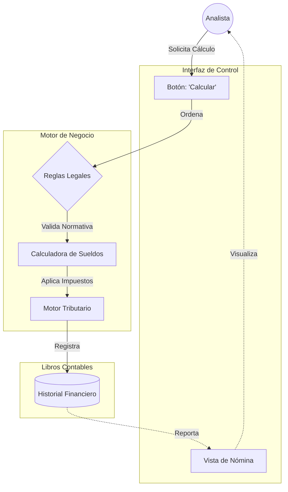

## 🏛️ Visión del Negocio

El **Sistema Contable Nostromo** no es solo un software, es la columna vertebral financiera de la organización. Su misión es garantizar la **integridad, precisión y cumplimiento normativo** de todas las operaciones contables y de personal.

Se estructura en dos pilares fundamentales que separan la "Inteligencia del Negocio" de la "Operación Diaria":

1. **Motor de Cálculo (Backend)**: Donde residen las leyes, reglas tributarias y la verdad financiera.
2. **Interfaz de Operación (Frontend)**: Herrramienta de control para los auditores y analistas.

---

## 🧠 Orchestrator: El Motor Financiero

El **Orchestrator** actúa como el "Contador Principal" del sistema. No es simplemente una API, es un **Motor de Reglas de Negocio** escrito en TypeScript para garantizar precisión matemática estricta.

### Responsabilidades de Negocio

Aquí es donde se "piensa" y calcula:

- **Remuneraciones (Payroll Core)**:
  - Cálculo de Sueldos Líquidos y Brutos.
  - Determinación de Impuestos de Segunda Categoría.
  - Leyes Sociales (AFP, Isapre, Fonasa) actualizadas con indicadores de Previred.
  - Cálculo de Finiquitos y Vacaciones proporcionales.
- **Cumplimiento Tributario (Tax Compliance)**:
  - Integración con normativas del **SII**.
  - Generación de Libros de Remuneraciones Electrónicos (LRE).
- **Gestión de Personal (HR)**:
  - Control de Asistencia y Horas Extras.
  - Administración de Contratos y Anexos.
  - Licencias Médicas y Permisos.

### Dominios Activos

El motor organiza el negocio en dominios específicos:

| Dominio | Función de Negocio |
| :--- | :--- |
| `payroll` | Motor de cálculo de nómina mensual. |
| `finiquitos` | Cálculo de indemnizaciones y haberes al término de contrato. |
| `previsions` | Gestión de indicadores previsionales (UF, UTM, Topes). |
| `operations` | Operaciones tributarias y contables generales. |
| `attendance` | Control de asistencia para cálculo de horas trabajadas. |
| `honorarios` | Gestión de boletas de honorarios y retenciones. |

---

## 🖥️ Sevastopol: Centro de Operaciones

**Sevastopol** es el escritorio de trabajo del analista. Diseñado con **SolidJS**, ofrece una experiencia fluida y reactiva, permitiendo a los usuarios interactuar con el motor financiero sin fricción.

### Funciones Principales

- **Visor de Liquidaciones**: Inspección detallada de cada ítem del sueldo.
- **Command Center**: Panel de control para ejecutar procesos masivos (ej: "Generar Nómina Octubre").
- **Gestión Documental**: Visualización y descarga de contratos y finiquitos.
- **Auditoría Visual**: Gráficos y tablas para validar la consistencia de los datos antes del cierre de mes.

> **Nota de Arquitectura**: Sevastopol es "tonto" intencionalmente. No decide impuestos ni calcula sueldos; solo muestra lo que el Orchestrator ha determinado como verdad.

---

## 🔄 Flujo de Valor: "Hybrid Core"

El sistema utiliza un enfoque **Hybrid Core** para asegurar que los datos contables nunca se corrompan por errores de interfaz.

Este flujo garantiza que un error en la capa visual jamás afecte los libros contables reales.
