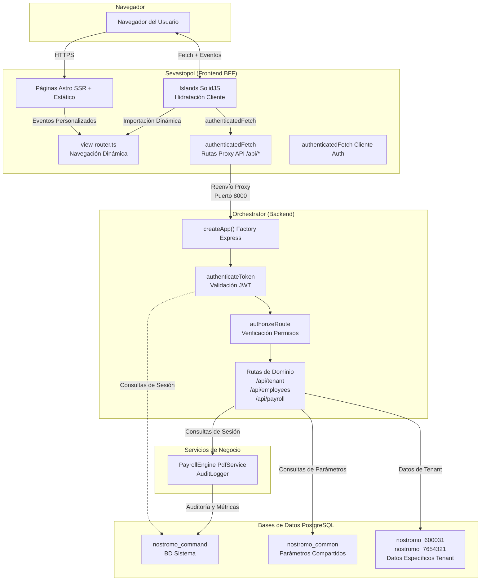
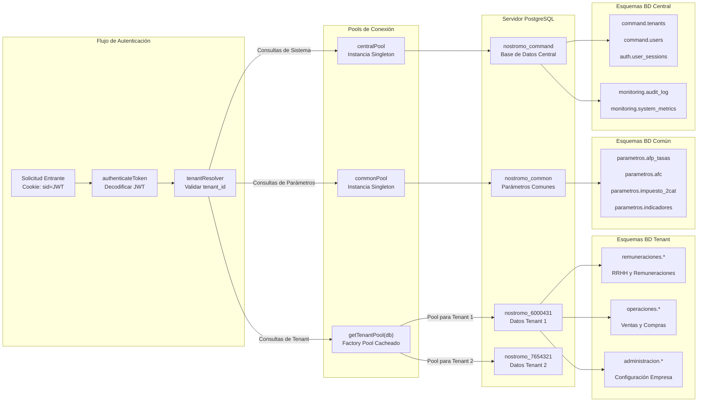
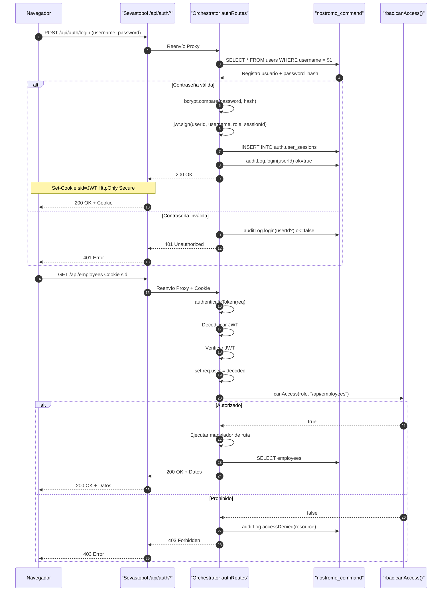

import { Code } from "@astrojs/starlight/components";

## 🏛️ Visión del Negocio

Este documento proporciona una introducción de alto nivel al sistema Accounting, una plataforma de gestión de remuneraciones, RRHH y contabilidad chilena construida como una aplicación SaaS multi-tenant. El sistema implementa el cumplimiento de la legislación laboral chilena, incluyendo cálculo de remuneraciones, seguridad social (AFP, ISAPRE, AFC), retención de impuestos y operaciones contables.

El sistema consiste en dos aplicaciones separadas que trabajan en conjunto:

- **Sevastopol**: Un frontend Astro + SolidJS que sirve como Backend-for-Frontend (BFF)
- **Orchestrator**: Un backend Node.js/Express que actúa como fuente de verdad para toda la lógica de negocio

---

## Visión General de la Arquitectura del Sistema

### Modelo de Aplicación Dual

El sistema emplea una clara separación de responsabilidades entre dos aplicaciones distintas:



---

## Stack Tecnológico

| Capa               | Tecnología        | Propósito                                              |
| :----------------- | :---------------- | :----------------------------------------------------- |
| Framework Frontend | Astro 5.x         | SSR, generación estática, arquitectura islands         |
| Biblioteca UI      | SolidJS 5.x       | Islands reactivos del lado del cliente con hidratación |
| Estilos            | Tailwind CSS      | CSS utility-first con soporte para modo oscuro         |
| Runtime Backend    | Node.js 20+       | Runtime de servidor para Orchestrator                  |
| Framework Backend  | Express 5.x       | Servidor API HTTP con pipeline de middleware           |
| Base de Datos      | PostgreSQL        | Persistencia de datos multi-tenant                     |
| Autenticación      | JWT + Sesiones    | Tokens sin estado con seguimiento de sesiones          |
| Autorización       | RBAC              | Sistema de Control de Acceso Basado en Roles           |
| Monitoreo          | Personalizado     | Logs de auditoría + métricas estilo Prometheus         |
| Generación PDF     | Puppeteer         | Renderizado de PDF del lado del servidor               |
| Testing            | Jest + Playwright | Pruebas unitarias (backend) + pruebas E2E (frontend)   |

---

## Arquitectura de Base de Datos Multi-Tenant

El sistema implementa **multi-tenancy a nivel de base de datos** con tres tipos distintos de bases de datos, garantizando estricta aislación de datos entre tenants:



### Roles de Base de Datos

| Nombre Base de Datos | Propósito                                                                                | Patrón de Acceso                           |
| :------------------- | :--------------------------------------------------------------------------------------- | :----------------------------------------- |
| `nostromo_command`   | Datos del sistema: tenants, usuarios, sesiones, logs de auditoría, métricas              | Todas las solicitudes autenticadas         |
| `nostromo_common`    | Parámetros compartidos: tablas de impuestos, tasas AFP, indicadores económicos (UF, UTM) | Solo lectura, consultas temporales         |
| `nostromo_NNNNNN`    | Datos de negocio específicos del tenant: RRHH, remuneraciones, contabilidad              | Aislación por tenant vía `getTenantPool()` |

---

## Flujo de Autenticación y Autorización

El sistema implementa autenticación basada en JWT con seguimiento de sesiones y RBAC de tres niveles:



### Roles RBAC

| Rol           | Alcance                                                                  | Rutas Típicas                                          |
| :------------ | :----------------------------------------------------------------------- | :----------------------------------------------------- |
| `SUPER_ADMIN` | Acceso completo al sistema, puede gestionar todos los tenants y usuarios | `/api/tenant/*, /api/admin/users/*, /api/monitoring/*` |
| `ADMIN`       | Administración de tenant, puede gestionar los datos de su tenant         | `/api/accounting/*, /api/employees/*, /api/payroll/*`  |
| `USER`        | Acceso de solo lectura a reportes y operaciones                          | `/api/reports/*, /api/operations/operations (lectura)` |

---

## Dominios de Negocio

El sistema está organizado en cuatro dominios de negocio principales, cada uno con rutas dedicadas y vistas UI:

```mermaid
flowchart TB

    %% =========================
    %% Dominio Operaciones
    %% =========================
    subgraph Ops["Dominio Operaciones"]
        OpsRoutes["
            /api/operations/operations
            /api/operations/sales
            /api/accounting"
        ]
        OpsView[OperationsViewIsland]
        OpsRoutes --> OpsView
    end

    %% =========================
    %% Dominio Remuneraciones
    %% =========================
    subgraph Remu["Dominio Remuneraciones"]
        RemuRoutes[
            /api/employees
            /api/contracts
            /api/attendance
            /api/remuneraciones/payroll
            /api/vacations
            /api/permissions
            /api/spare_contracts
            /api/pay_contracts
        ]

        RemuViews[
            EmployeesViewIsland
            ContractsViewIsland
            AttendanceViewIsland
            PayrollViewIsland
            VacationsViewIsland
            PermissionsViewIsland
        ]

        RemuServices[
            PayrollEngine.calculate
            SocialLawsCalculator
            TaxCalculator
            HealthPlanCalculator
        ]

        RemuRoutes --> RemuViews
        RemuRoutes --> RemuServices
    end

    %% =========================
    %% Dominio Admin
    %% =========================
    subgraph Admin["Dominio Admin"]
        AdminRoutes[
            /api/admin/company
            /api/admin/capital
            /api/admin/representatives
            /api/admin/chart-of-accounts
            /api/admin/system-config
        ]

        AdminViews[
            CompanyViewIsland
            CapitalViewIsland
            LegalRepresentativesViewIsland
            ChartOfAccountsViewIsland
            SystemConfigViewIsland
        ]

        AdminRoutes --> AdminViews
    end

    %% =========================
    %% Dominio Command
    %% =========================
    subgraph Command["Dominio Command"]
        CommandRoutes[
            /api/tenant/api/tenant-db
            /api/admin/users
            /api/sessions
            /api/monitoring
        ]

        CommandViews[
            TenantsViewIsland
            SessionsViewIsland
            MonitoringViewIsland
        ]

        CommandRoutes --> CommandViews
    end
```



### Responsabilidades de Dominios

| Dominio        | Propósito                                                                            | Entidades Clave                                                                              |
| :------------- | :----------------------------------------------------------------------------------- | :------------------------------------------------------------------------------------------- |
| Command        | Administración del sistema, gestión de tenants, gestión de usuarios, monitoreo       | `Tenant`, `TenantDatabase`, `User`, `Session`, `AuditLog`, `SystemMetrics`                   |
| Admin          | Configuración de empresa, estructura legal, plan de cuentas                          | `CompanyConfig`, `LegalRep`, `CapitalEntry`, `Account`, `SystemConfig`                       |
| Remuneraciones | Gestión de RRHH, cálculo de remuneraciones, cumplimiento legislación laboral chilena | `Employee`, `Contract`, `Attendance`, `Payroll`, `Vacation`, `IsapreContract`, `APVContract` |
| Operaciones    | Operaciones contables, integración SII, ventas y compras                             | `Operation`, `Sale`, `Purchase`, `ResumenOperaciones`                                        |

---

## Patrones Arquitectónicos Clave

### Patrón Backend-for-Frontend (BFF)

Sevastopol actúa como una capa BFF pura sin lógica de negocio. Todas las rutas API en Sevastopol son proxies simples:

<Code code={`// sevastopol/src/pages/api/tenant.ts
import { createProxy } from "@/lib/proxyUtils";

export const { GET, POST, PUT, DELETE } = createProxy("/api/tenant");`} lang="ts" title="sevastopol/src/pages/api/tenant.ts" />

La utilidad `createProxy` reenvía todas las solicitudes al Orchestrator en `localhost:8000` con credenciales incluidas.

---

## Principio Hybrid Core

El Orchestrator sigue un patrón **Hybrid Core** para la lógica de negocio:

| Tipo de Operación            | Implementación           | Ejemplo                                                               |
| :--------------------------- | :----------------------- | :-------------------------------------------------------------------- |
| Escrituras y Lógica Compleja | TypeScript en servicios  | Cálculos de PayrollEngine, cómputo de impuestos, reglas de validación |
| Lecturas y Reportes          | Vistas SQL en PostgreSQL | Vistas inteligentes como v_resumen_ventas, v_employee_balance         |

Este patrón asegura:

- **Cálculos complejos** (remuneraciones, impuestos) son testeables en Jest con completa seguridad de tipos
- **Datasets grandes** (reportes, dashboards) son consultados eficientemente vía vistas SQL optimizadas
- **Reglas de negocio** permanecen en código de aplicación, no dispersas en procedimientos almacenados

---

## Monitoreo y Observabilidad

El sistema incluye monitoreo comprensivo integrado en el Orchestrator:

### Características de Monitoreo

```Mermaid
flowchart TB

    %% =========================
    %% Pipeline de Solicitudes
    %% =========================
    subgraph Pipeline["Pipeline de Solicitudes"]
        Req[Solicitud Entrante]
        MetricsMW[metricsMiddleware]
        AuditMW[auditMiddleware]
        Handler[Manejador de Ruta]

        Req --> MetricsMW
        MetricsMW --> AuditMW
        AuditMW --> Handler
    end

    %% =========================
    %% Recolección de Métricas
    %% =========================
    subgraph Metrics["Recolección de Métricas"]
        Collector[MetricsCollector<br/>Singleton]

        M1[http_requests_total<br/>http_errors_total]
        M2[http_active_requests<br/>nodejs_heap_used_bytes]
        M3[http_request_duration_ms]
        M4[monitoring.system_metrics]

        Collector --> M1
        Collector --> M2
        Collector --> M3
        Collector --> M4
    end

    %% =========================
    %% Registro de Auditoría
    %% =========================
    subgraph Audit["Registro de Auditoría"]
        AuditLogger[AuditLogger<br/>Singleton]
        Buffer[Cola en Memoria<br/>Buffer por Lotes]
        AuditDB[monitoring.audit_log]

        AuditLogger --> Buffer
        Buffer -->|Flush cada 5s| AuditDB
    end

    %% =========================
    %% Conexiones entre dominios
    %% =========================
    MetricsMW -->|Rastrear métricas| Collector
    Collector -->|Flush cada 60s| M4

    Handler -->|Registrar operaciones| AuditLogger
```

- **Rastreo Automático de Solicitudes**: Tiempos de respuesta, códigos de estado, tasas de error
- **Métricas de Salud del Sistema**: Uso de memoria, lag del event loop, estadísticas de pool de BD
- **Pista de Auditoría**: Todas las operaciones de modificación (INSERT/UPDATE/DELETE) registradas con contexto de usuario
- **Endpoint en Tiempo Real**: `GET /metrics` expone métricas actuales como JSON
