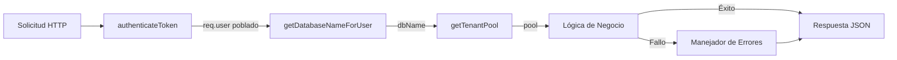
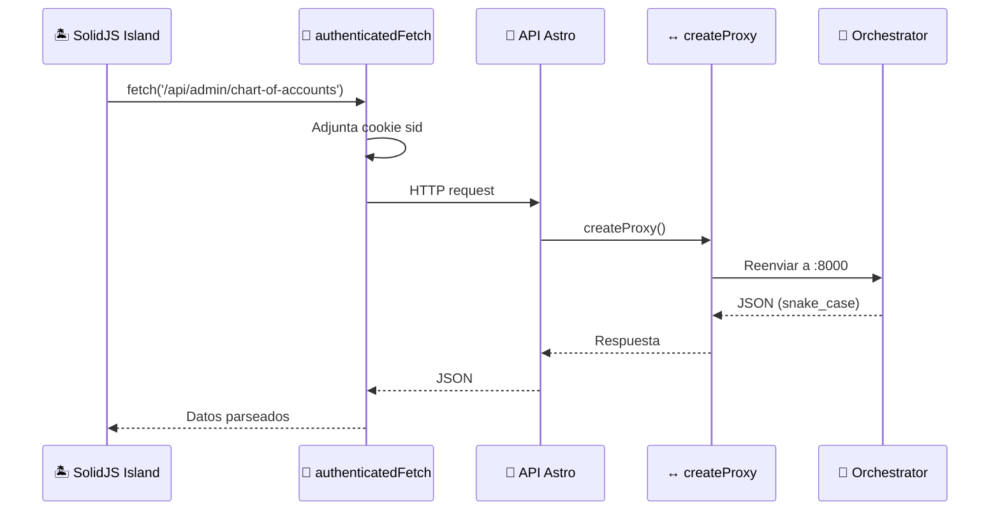

import {
  Steps,
  Aside,
  Tabs,
  TabItem,
  Code,
  LinkCard,
  CardGrid,
  FileTree,
} from "@astrojs/starlight/components";

Este documento describe los **patrones arquitectónicos** de la API. Para documentación específica de endpoints, navega a las secciones por dominio en el menú lateral.

## Dominios API

<CardGrid>
  <LinkCard
    title="Command API"
    href="/api/endpoints/command/"
    description="Tenants, Auth, Users"
  />
  <LinkCard
    title="Remuneraciones API"
    href="/api/endpoints/remuneraciones/"
    description="Empleados, Contratos, Nómina"
  />
  <LinkCard
    title="Common API"
    href="/api/endpoints/common/"
    description="Indicadores, Parámetros"
  />
</CardGrid>

---

## Arquitectura de Flujo de Solicitudes

El Orchestrator implementa una arquitectura estricta por capas donde cada capa tiene una responsabilidad específica.

## Patrón de Integración Frontend

Sevastopol se integra con el Orchestrator usando un **patrón de proxy simple**. Todas las rutas API en Sevastopol son proxies delgados que reenvían solicitudes.

## Convenciones de Respuesta

<Aside type="tip" title="Convención">
  Todas las respuestas de entidades de negocio usan `snake_case` para coincidir
  con los nombres de columnas de la base de datos. Esto **elimina la necesidad
  de transformación** en el frontend.
</Aside>

### Matriz de Códigos de Estado

| Código | Caso de Uso      | Ejemplo                        |
| ------ | ---------------- | ------------------------------ |
| `200`  | GET/PUT exitoso  | Recurso obtenido o actualizado |
| `201`  | POST exitoso     | Recurso creado                 |
| `204`  | DELETE exitoso   | Recurso eliminado (sin cuerpo) |
| `400`  | Entrada inválida | Campos requeridos faltantes    |
| `401`  | No autorizado    | Sin token o token inválido     |
| `403`  | Prohibido        | Token válido pero sin permisos |
| `404`  | No encontrado    | El recurso no existe           |
| `409`  | Conflicto        | Recurso duplicado              |
| `500`  | Error interno    | Error de base de datos         |
