import { Steps, Aside, Tabs, TabItem, Code, LinkCard, CardGrid, FileTree } from "@astrojs/starlight/components";

Este documento describe los patrones de desarrollo de API backend en el servicio Orchestrator, cubriendo la organización de rutas, arquitectura por capas, resolución de contexto multi-tenant, validación, manejo de errores y estrategias de prueba.

<Aside type="tip" title="Consistencia">
  Estos patrones aseguran **consistencia**, **mantenibilidad** y **seguridad** en todos los endpoints de la API.
</Aside>

---

## Arquitectura de Flujo de Solicitudes

El Orchestrator implementa una arquitectura estricta por capas donde cada capa tiene una responsabilidad específica.

```mermaid
flowchart LR
    A[Solicitud HTTP]
    B[authenticateToken]
    C[getDatabaseNameForUser]
    D[getTenantPool]
    E[Lógica de Negocio]
    F[Manejador de Errores]
    G[Respuesta JSON]

    A --> B
    B -->|req.user poblado| C
    C -->|dbName| D
    D -->|pool| E

    E -->|Éxito| G
    E -->|Fallo| F
    F --> G
```



---

## Organización por Dominios

Las rutas API están organizadas en cinco dominios distintos, cada uno con su propio directorio bajo `routes/`:

| Dominio | Prefijo | Propósito | Esquema de BD |
| --- | --- | --- | --- |
| **Command** | `/api/tenant`, `/api/admin`, `/api/auth` | Gestión del sistema, usuarios, sesiones | `command.*` |
| **Common** | `/api/parameters`, `/api/afc` | Datos de referencia compartidos | `parametros.*` |
| **Operations** | `/api/accounting` | Operaciones contables | `operaciones_sii.*` |
| **Remuneraciones** | `/api/employees`, `/api/payroll` | RRHH y remuneraciones | `remuneraciones.*` |
| **Admin** | `/api/admin/plan-contable` | Funciones administrativas | `administracion.*` |

<Tabs>
  <TabItem label="Estructura de Archivos">
    <FileTree>
      - src/routes/
        - command/
          - tenant.ts
          - users.ts
          - auth.ts
          - sessions.ts
        - common/
          - parameters.ts
          - afc.ts
        - remuneraciones/
          - employees.ts
          - contracts.ts
          - payroll.ts
          - previsiones.ts
        - admin/
          - chart-of-accounts.ts
    </FileTree>
  </TabItem>
  <TabItem label="Registro de Rutas">
    ```typescript title="app.ts"
    // Dominio Command
    app.use('/api/tenant', tenantRoutes);
    app.use('/api/admin', userRoutes);
    app.use('/api/auth', authRoutes);

    // Dominio Remuneraciones (15+ rutas)
    app.use('/api/employees', employeesRoutes);
    app.use('/api/contracts', contractRoutes);
    app.use('/api/remuneraciones/payroll', payrollRoutes);
    app.use('/api/previsiones', previsionesRoutes);
    ```
  </TabItem>
</Tabs>

---

## Patrón Estándar de Ruta

Cada ruta API sigue un patrón consistente con cuatro pasos obligatorios:

<Steps>
1. **Autenticación**: Validar token JWT via `authenticateToken`
2. **Resolución de Tenant**: Obtener `dbName` con `getDatabaseNameForUser()`
3. **Lógica de Negocio**: Ejecutar consultas con el pool del tenant
4. **Manejo de Errores**: Capturar excepciones y retornar respuestas normalizadas
</Steps>

### Ejemplo de Ruta CRUD Básica

```typescript title="routes/remuneraciones/departments.ts"
import express from 'express';
import { getTenantPool } from '@/lib/db';
import { authenticateToken, AuthenticatedRequest } from '@/middleware/auth';
import { getDatabaseNameForUser } from '@/lib/tenantResolver';

const router = express.Router();

// GET /api/departments - Listar todos los departamentos
router.get("/", authenticateToken, async (req: AuthenticatedRequest, res) => {
  try {
    // Paso 1: Resolver nombre de base de datos del tenant
    const db = await getDatabaseNameForUser(req.user!, req);
    const pool = getTenantPool(db);
    
    // Paso 2: Ejecutar consulta con filtros
    const where: string[] = [];
    const params: any[] = [];
    
    if (req.query.codigo) {
      where.push(`codigo ILIKE $${params.length + 1}`);
      params.push(`%${req.query.codigo}%`);
    }
    
    const whereClause = where.length ? `WHERE ${where.join(' AND ')}` : '';
    
    const { rows } = await pool.query(
      `SELECT id, codigo, nombre, descripcion, activo
       FROM remuneraciones.departamentos
       ${whereClause}
       ORDER BY nombre
       LIMIT 1000`,
      params
    );
    
    // Paso 3: Retornar resultados en snake_case
    res.json(rows);
  } catch (e: any) {
    // Paso 4: Manejar errores con logging apropiado
    console.error("GET /api/departments error:", e);
    res.status(500).json({ error: e.message || "Error obteniendo departamentos" });
  }
});
```

### Ruta POST con Validación

<Aside type="caution" title="Validación Obligatoria">
  Las rutas POST deben validar la entrada **antes** de procesar. El patrón incluye extracción de payload, validación de campos requeridos, validación de tipos y población de campos de auditoría.
</Aside>

```typescript title="POST /api/departments"
router.post("/", authenticateToken, async (req: AuthenticatedRequest, res) => {
  try {
    const user = req.user!;
    const db = await getDatabaseNameForUser(user, req);
    const pool = getTenantPool(db);

    // Extraer payload con valores por defecto
    const {
      codigo, 
      nombre, 
      descripcion = null,
      departamento_padre_id = null,
      activo = true
    } = req.body;

    // Validación de campos requeridos
    if (!codigo || !nombre) {
      return res.status(400).json({ 
        error: "Faltan campos requeridos: codigo, nombre" 
      });
    }

    // Validación de tipos
    if (typeof codigo !== 'string' || typeof nombre !== 'string') {
      return res.status(400).json({ 
        error: "Tipos inválidos: codigo y nombre deben ser strings" 
      });
    }

    // Insertar con campos de auditoría
    await pool.query(`
      INSERT INTO remuneraciones.departamentos
        (codigo, nombre, descripcion, departamento_padre_id, activo, 
         created_by, updated_by, created_at, updated_at)
      VALUES ($1, $2, $3, $4, $5, $6, $6, NOW(), NOW())
    `, [codigo, nombre, descripcion, departamento_padre_id, activo, user.userId]);

    res.status(201).json({ ok: true });
  } catch (e: any) {
    console.error("POST /api/departments error:", e);
    res.status(500).json({ error: e.message || "Error al crear departamento" });
  }
});
```

---

## Patrón de Arquitectura por Capas

El Orchestrator sigue una arquitectura estricta de tres capas para dominios de lógica de negocio complejos.


<Tabs>
  <TabItem label="Capa 1: Rutas">
    Las rutas manejan preocupaciones específicas de HTTP: parseo de solicitudes, formateo de respuestas y códigos de error. **Nunca contienen lógica de negocio**.

    ```typescript title="routes/remuneraciones/payroll.ts"
    router.post("/generar", async (req: AuthenticatedRequest, res) => {
      try {
        const db = await getDatabaseNameForUser(req.user, req);
        const userId = String(req.user?.userId);

        const {
          contrato_id,
          periodo_mes,
          overrides = {},
          dry_run = true,
          force = false,
        } = req.body || {};

        // Validación básica
        if (!contrato_id || !periodo_mes) {
          return res.status(400).json({ 
            error: "Faltan datos requeridos: contrato_id, periodo_mes" 
          });
        }

        // Delegar al servicio
        const result = await PayrollService.generatePayroll(
          db, userId, contrato_id, new Date(periodo_mes),
          { overrides, dryRun: dry_run, force }
        );

        res.json(result);
      } catch (e: any) {
        if (e.message?.includes("ya está")) {
          return res.status(409).json({ error: e.message });
        }
        console.error("Error generating payroll:", e);
        res.status(500).json({ error: e.message || "Error al calcular liquidación" });
      }
    });
    ```
  </TabItem>
  <TabItem label="Capa 2: Servicios">
    Los servicios orquestan la lógica de negocio, coordinan repositorios y aplican reglas de negocio. Implementan el patrón de flujo de dos fases: **preview → commit**.

    ```typescript title="domain/payroll/PayrollService.ts"
    export class PayrollService {
      static async generatePayroll(
        tenantDb: string,
        userId: string,
        contractId: string,
        period: Date,
        options: { overrides?: any, dryRun?: boolean, force?: boolean } = {}
      ): Promise<PayrollResult> {
        const db = getTenantPool(tenantDb);
        
        // Fase 1: Recopilación de Contexto
        const ctx = await PayrollRepository.getPayrollContext(db, contractId, period);
        
        // Fase 2: Mapeo de Entrada
        const input = this.mapContextToInput(ctx, options.overrides || {}, period);
        
        // Fase 3: Cálculo Puro
        const result = PayrollEngine.calculate(input);

        // Fase 4: Modo Preview
        if (options.dryRun) {
          return { ...result, id: null, saved: false, message: 'DRY RUN' };
        }

        // Fase 5: Persistencia
        const persistedId = await PayrollRepository.savePayroll(
          db, userId, input, result, { force: options.force || false }
        );

        return { ...result, id: persistedId, saved: true, message: 'OK' };
      }
    }
    ```
  </TabItem>
  <TabItem label="Capa 3: Repositorios">
    Los repositorios manejan todas las interacciones con la base de datos. Usan **vistas de base de datos** para lecturas complejas y SQL directo para escrituras.

    ```typescript title="domain/payroll/PayrollRepository.ts"
    export class PayrollRepository {
      // Fetching paralelo de datos para rendimiento
      static async getPayrollContext(
        db: Pool, contractId: string, period: Date
      ): Promise<PayrollContext> {
        const periodStr = period.toISOString().split('T')[0];

        const [contractRes, attendanceRes, indicatorsRes, socialLawsRes, taxRes] = 
          await Promise.all([
            this.getContractData(db, contractId, periodStr),
            this.getAttendanceData(db, contractId, periodStr),
            this.getIndicators(db, periodStr),
            this.getSocialLawsRates(db, contractId, periodStr),
            this.getTaxBrackets(db, periodStr)
          ]);

        if (!contractRes) throw new Error(`Contract ${contractId} not found`);

        return { contract: contractRes, attendance: attendanceRes, 
                 indicators: indicatorsRes, social_laws_rates: socialLawsRes, 
                 tax_brackets: taxRes };
      }
    }
    ```
  </TabItem>
  <TabItem label="Dominio Puro">
    La lógica de dominio está separada en **funciones puras** sin dependencias de infraestructura. Esto la hace altamente testeable y reutilizable.

    ```typescript title="domain/payroll/PayrollEngine.ts"
    export class PayrollEngine {
      static calculate(input: PayrollInput): PayrollResult {
        // 1. Salario base (prorrateado)
        const salary = BaseSalaryCalculator.calculate(
          input.sueldo_base, input.sueldo_minimo, input.dias_trabajados
        );

        // 2. Horas extras
        const valorHora = Math.round(input.sueldo_base * factorHora);
        const amountHex50 = Math.round(input.horas_extra_50 * valorHora * 1.5);

        // 3. Gratificación
        const gratification = GratificationCalculator.calculate(
          salary + input.bono_imponible, input.sueldo_minimo, input.gratification_mode
        );

        // 4. Leyes sociales (AFP, Salud, AFC)
        const socialLaws = SocialLawsCalculator.calculate({ /* ... */ });

        // 5. Cálculo de impuestos
        const taxResult = TaxCalculator.calculate({ /* ... */ });

        // 6. Totales
        return {
          total_tributable: totalTaxable,
          total_haberes: totalAssets,
          total_descuentos: totalDiscounts,
          total_liquido: totalAssets - totalDiscounts,
        };
      }
    }
    ```
  </TabItem>
</Tabs>

---

## Resolución de Contexto Multi-Tenant

<Aside type="note" title="Aislamiento de Datos">
  El patrón de resolución de tenant asegura aislamiento a nivel de base de datos determinando qué base de datos puede acceder cada usuario **antes** de ejecutar cualquier consulta.

```mermaid
sequenceDiagram
    participant R as 🔀 Router
    participant T as 🏢 TenantResolver
    participant C as 📊 centralPool
    participant CACHE as 💾 Pool Cache
    participant P as 🗄️ Tenant Pool
    participant Q as 📋 Query

    R->>T: getDatabaseNameForUser(req.user, req)
    T->>C: SELECT tenant_id FROM command.users
    C-->>T: tenant_id = abc-123

    T->>C: SELECT db_name FROM command.tenant_databases
    C-->>T: db_name = nostromo_6000431

    T-->>R: return "nostromo_6000431"

    R->>CACHE: getTenantPool("nostromo_6000431")

    alt Pool en caché
        CACHE-->>R: Return instancia existente
    else Pool no existe
        R->>CACHE: Crear nuevo Pool
        CACHE-->>R: Nueva instancia
    end

    R->>P: pool.query(SQL)
    P->>Q: Ejecutar
    Q-->>P: rows
    P-->>R: Resultados
```

</Aside>



### Patrón de Implementación

```typescript title="Resolución de Tenant"
import { getDatabaseNameForUser } from '@/lib/tenantResolver';
import { getTenantPool } from '@/lib/db';

router.get("/", authenticateToken, async (req: AuthenticatedRequest, res) => {
  try {
    // Paso 1: Resolver nombre de base de datos del tenant
    const dbName = await getDatabaseNameForUser(req.user!, req);
    
    // Paso 2: Obtener conexión con pool (cacheado)
    const pool = getTenantPool(dbName);
    
    // Paso 3: Ejecutar consultas contra el tenant
    const { rows } = await pool.query(
      `SELECT * FROM remuneraciones.empleados WHERE activo = true`
    );
    
    res.json(rows);
  } catch (e: any) {
    res.status(500).json({ error: e.message });
  }
});
```

<Aside type="danger" title="Reglas Críticas">
  - **Nunca** hardcodear nombres de base de datos en rutas
  - **Siempre** llamar a `getDatabaseNameForUser()` antes de `getTenantPool()`
  - **Nunca** crear instancias de `Pool` fuera de `db.ts`
  - Los pools se cachean por nombre de base de datos para rendimiento
</Aside>

---

## Patrones de Validación de Entrada

Todos los endpoints POST/PUT deben validar las entradas antes de procesar.

<Tabs>
  <TabItem label="express-validator">
    Para validación estructurada, usar `express-validator`:

    ```typescript title="Validación con express-validator"
    import { body, validationResult } from 'express-validator';

    router.post(
      "/",
      authenticateToken,
      [
        body("rut").isString().notEmpty(),
        body("business_name").isString().isLength({ min: 3 }),
        body("email").isEmail(),
      ],
      async (req: AuthenticatedRequest, res) => {
        const errors = validationResult(req);
        if (!errors.isEmpty()) {
          return res.status(400).json({ errors: errors.array() });
        }
        
        // Proceder con datos validados
        const { rut, business_name, email } = req.body;
        // ...
      }
    );
    ```
  </TabItem>
  <TabItem label="Validación Manual">
    Para endpoints simples, la validación manual es aceptable:

    ```typescript title="Validación manual"
    router.post("/generar", authenticateToken, async (req: AuthenticatedRequest, res) => {
      const { contrato_id, periodo_mes } = req.body || {};
      
      // Validar campos requeridos
      if (!contrato_id || !periodo_mes) {
        return res.status(400).json({ 
          error: "Faltan datos requeridos: contrato_id, periodo_mes" 
        });
      }
      
      // Validar tipos
      if (typeof contrato_id !== 'string') {
        return res.status(400).json({ error: "contrato_id debe ser string" });
      }
      
      // Continuar procesando...
    });
    ```
  </TabItem>
</Tabs>

---

## Convenciones de Manejo de Errores

Los errores deben normalizarse para evitar filtrar detalles de la base de datos o del sistema a los clientes.

### Matriz de Códigos de Estado

| Código | Caso de Uso | Ejemplo |
| --- | --- | --- |
| `200` | GET/PUT exitoso | Recurso obtenido o actualizado |
| `201` | POST exitoso | Recurso creado |
| `204` | DELETE exitoso | Recurso eliminado (sin cuerpo) |
| `400` | Entrada inválida | Campos requeridos faltantes |
| `401` | No autorizado | Sin token o token inválido |
| `403` | Prohibido | Token válido pero sin permisos |
| `404` | No encontrado | El recurso no existe |
| `409` | Conflicto | Recurso duplicado |
| `500` | Error interno | Error de base de datos |

### Formato de Respuesta de Error

<Tabs>
  <TabItem label="✅ Correcto">
    ```typescript title="Error normalizado"
    // Error estructurado
    return res.status(404).json({
      success: false,
      error: "TENANT_NOT_FOUND",
      message: "Tenant no existe"
    });

    // Error genérico + logging interno
    catch (error) {
      console.error('Tenant creation error:', error);
      res.status(500).json({
        success: false,
        error: 'INTERNAL_ERROR',
        message: 'Error al crear tenant'
      });
    }
    ```
  </TabItem>
  <TabItem label="❌ Incorrecto">
    ```typescript title="Error expuesto"
    // ❌ MAL: Exponer error de base de datos
    catch (error) {
      res.status(500).json({ error: error.message }); 
      // Puede filtrar detalles SQL!
    }
    ```
  </TabItem>
</Tabs>

### Ejemplos Prácticos

```typescript title="Manejo de errores por tipo"
// 404 - No Encontrado
const row = await PayrollRepository.findById(pool, req.params.id);
if (!row) {
  return res.status(404).json({ error: "Liquidación no encontrada" });
}

// 409 - Conflicto
if (existing.length > 0 && !force) {
  return res.status(409).json({ 
    error: "Liquidación ya existe para este período" 
  });
}

// 400 - Error de Validación
if (!contrato_id || !periodo_mes) {
  return res.status(400).json({ 
    error: "Faltan datos requeridos: contrato_id, periodo_mes" 
  });
}

// Manejo de Error Específico
catch (e: any) {
  if (e.message?.includes("ya está")) {
    return res.status(409).json({ error: e.message });
  }
  console.error("Error generating payroll:", e);
  res.status(500).json({ error: e.message || "Error al calcular liquidación" });
}
```

---

## Convenciones de Respuesta

### Campos en snake_case

<Aside type="tip" title="Convención">
  Todas las respuestas de entidades de negocio usan `snake_case` para coincidir con los nombres de columnas de la base de datos. Esto **elimina la necesidad de transformación** en el frontend.
</Aside>

<Tabs>
  <TabItem label="✅ Correcto">
    ```typescript title="snake_case (coincide con BD)"
    res.json({
      liquidacion_id: "abc-123",
      empleado_nombre: "Juan Pérez",
      empleado_rut: "12.345.678-9",
      total_liquido: 1500000,
      total_haberes: 2000000,
      sueldo_base: 800000,
      año: 2025,
      mes: 12
    });
    ```
  </TabItem>
  <TabItem label="❌ Incorrecto">
    ```typescript title="camelCase (requiere transformación)"
    res.json({
      liquidacionId: "abc-123",
      empleadoNombre: "Juan Pérez",
      totalLiquido: 1500000
    });
    ```
  </TabItem>
</Tabs>

### Formatos de Respuesta Exitosa

```typescript title="Tipos de respuesta"
// Lista simple (más común)
res.json(rows);

// Recurso único
res.json(row);

// Confirmación de operación
res.json({ ok: true });
res.json({ success: true, id: "created-id" });

// Respuesta de dry-run/preview
res.json({
  ...result,
  saved: false,
  message: "DRY RUN - Preview Only"
});
```

### Vistas de Base de Datos

Para consultas complejas que involucran múltiples joins, **prefiera vistas de base de datos** sobre joins a nivel de aplicación:

```typescript title="Usando vistas de BD"
// ✅ BIEN: Usar vista materializada o estándar
const { rows } = await pool.query(`
  SELECT * FROM remuneraciones.v_liquidaciones_departamento
  WHERE año = $1 AND mes = $2
  ORDER BY empleado_nombre
  LIMIT 2000
`, [year, month]);

// La vista consolida: liquidaciones + empleados + contratos + departamentos
```

---

## Patrón de Integración Frontend

Sevastopol se integra con el Orchestrator usando un **patrón de proxy simple**. Todas las rutas API en Sevastopol son proxies delgados que reenvían solicitudes.

```mermaid
sequenceDiagram
    participant I as 🏝️ SolidJS Island
    participant AF as 🔐 authenticatedFetch
    participant API as 📡 API Astro
    participant PX as ↔️ createProxy
    participant O as 🎯 Orchestrator

    I->>AF: fetch('/api/admin/chart-of-accounts')
    AF->>AF: Adjunta cookie sid
    AF->>API: HTTP request

    API->>PX: createProxy()
    PX->>O: Reenviar a :8000

    O-->>PX: JSON (snake_case)
    PX-->>API: Respuesta
    API-->>AF: JSON
    AF-->>I: Datos parseados
```



<Tabs>
  <TabItem label="Proxy en Sevastopol">
    ```typescript title="pages/api/admin/chart-of-accounts.ts"
    import { createProxy } from '@/lib/proxyUtils';

    // Exportar todos los métodos HTTP como proxies simples
    export const { GET, POST, PUT, DELETE } = createProxy('/api/admin/chart-of-accounts');
    ```
  </TabItem>
  <TabItem label="createProxy">
    ```typescript title="lib/proxyUtils.ts"
    export function createProxy(targetPath: string) {
      const handler = async (context: APIContext) => {
        const orchestratorUrl = `http://localhost:8000${targetPath}`;
        
        const response = await fetch(orchestratorUrl, {
          method: context.request.method,
          headers: {
            'Cookie': context.request.headers.get('cookie') || '',
            'Content-Type': 'application/json'
          },
          body: ['POST', 'PUT'].includes(context.request.method) 
            ? await context.request.text() 
            : undefined
        });
        
        return response;
      };
      
      return { GET: handler, POST: handler, PUT: handler, DELETE: handler };
    }
    ```
  </TabItem>
  <TabItem label="Consumo en Island">
    ```typescript title="components/islands/ExampleIsland.tsx"
    import { authenticatedFetch } from "@/lib/authFetch";

    async function loadAccounts() {
      try {
        const response = await authenticatedFetch("/api/admin/chart-of-accounts");
        
        if (!response.ok) {
          throw new Error("Error loading accounts");
        }
        
        // Los campos están en snake_case
        const accounts = await response.json();
        setAccounts(accounts);
      } catch (e) {
        console.error("Error loading accounts:", e);
        toast.push("Error al cargar cuentas", "error");
      }
    }
    ```
  </TabItem>
</Tabs>

<Aside type="danger" title="Reglas de Integración">
  - **Nunca** consultar bases de datos directamente desde Sevastopol
  - **Siempre** usar `authenticatedFetch` para llamadas API
  - **Siempre** usar `createProxy` para rutas API de Sevastopol
  - El frontend espera campos en `snake_case`
</Aside>

---

## Checklist para Nuevos Endpoints

<Tabs>
  <TabItem label="Auth & Multi-Tenant">
    - [ ] Ruta usa middleware `authenticateToken`
    - [ ] Autorización RBAC aplicada con `authorizeRoute` si es necesario
    - [ ] Contexto de usuario extraído de `req.user`
    - [ ] Base de datos del tenant resuelta con `getDatabaseNameForUser()`
    - [ ] Pool obtenido vía `getTenantPool()` (nunca `new Pool()`)
    - [ ] Consultas usan pool específico del tenant
  </TabItem>
  <TabItem label="Validación">
    - [ ] Campos requeridos validados (retornar 400)
    - [ ] Validación de tipos implementada
    - [ ] Validación de reglas de negocio
    - [ ] Usar `express-validator` para esquemas complejos
  </TabItem>
  <TabItem label="Base de Datos">
    - [ ] Campos de auditoría: `created_by`, `updated_by`, `created_at`, `updated_at`
    - [ ] Transacciones para operaciones multi-tabla
    - [ ] Lecturas complejas usan vistas de BD
    - [ ] Consultas parametrizadas ($1, $2, etc.)
  </TabItem>
  <TabItem label="Respuestas">
    - [ ] Campos en `snake_case` coincidiendo con BD
    - [ ] Códigos de estado HTTP correctos
    - [ ] Errores normalizados (sin errores crudos de BD)
    - [ ] Respuestas exitosas: datos directos o `{ ok: true }`
  </TabItem>
  <TabItem label="Errores & Testing">
    - [ ] Errores registrados con contexto
    - [ ] Bloques try-catch en operaciones asíncronas
    - [ ] Errores específicos (404, 409) antes del 500 genérico
    - [ ] Tests unitarios para servicios/repositorios
    - [ ] Tests de integración para ruta feliz
    - [ ] Tests de validación (400) y autorización (403)
  </TabItem>
  <TabItem label="Frontend">
    - [ ] Ruta proxy creada con `createProxy()`
    - [ ] Island usa `authenticatedFetch()`
    - [ ] Frontend espera `snake_case`
  </TabItem>
</Tabs>

---

<CardGrid>
  <LinkCard
    title="Arquitectura del Sistema"
    description="Visión integral de la arquitectura Sevastopol + Orchestrator"
    href="/arquitectura/overview/"
  />
  <LinkCard
    title="Diagramas del Sistema"
    description="Diagramas Mermaid de flujos y componentes"
    href="/arquitectura/diagramas/"
  />
</CardGrid>
