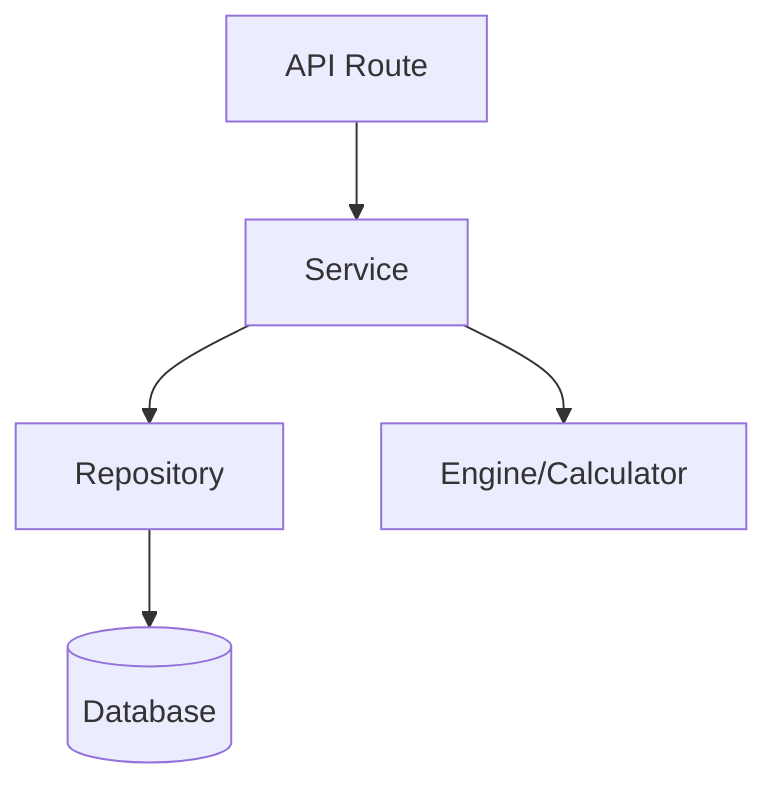

import { Steps, Aside, Tabs, TabItem } from "@astrojs/starlight/components";

# [Nombre del Servicio] Service

**Responsabilidad Principal**: [Descripción breve de lo que hace el servicio, ej: Calcular nóminas mensuales].

**Ubicación**: `src/domain/[dominio]/[Nombre]Service.ts`

---

## 🏗️ Arquitectura



## 🔄 Métodos Principales

### `methodName(params): ReturnType`

Descripción del método.

- **Entrada**: Explicación de parámetros.
- **Salida**: Explicación del resultado.
- **Efectos Secundarios**: Cambios en DB, logs, etc.

```typescript
// Ejemplo de uso
const result = await Service.method(db, id);
```

---

## 💾 Modelo de Datos

Entidades principales manejadas por este servicio.

| Campo   | Tipo | Descripción         |
| :------ | :--- | :------------------ |
| `id`    | UUID | Identificador único |
| `campo` | Type | Descripción         |

---

## 🧪 Estrategia de Testing

- **Unit Tests**: Pruebas de lógica pura en Calculators.
- **Integration Tests**: Pruebas del Servicio con mocks de DB.
