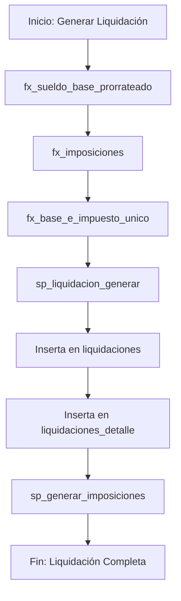
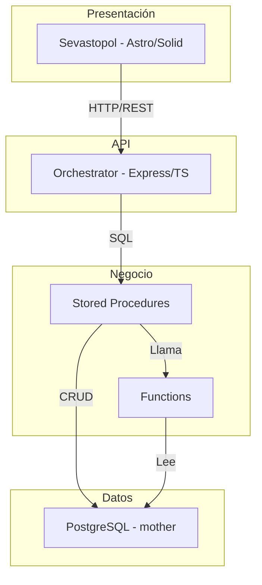
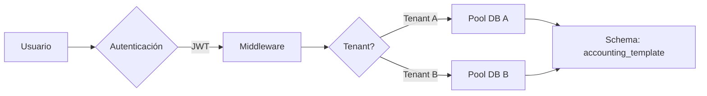

import { Code } from '@astrojs/starlight/components';

## 📊 Diagrama de Usuario - Accounting System

Este diagrama muestra el flujo completo de datos desde servicios externos hasta la base de datos PostgreSQL.

´´´mermaid

´´´

### Componentes Principales

- 🌐 **Servicios Externos**: SII, Previred, Banco Central, OpenAI
- 📦 **Loaders Python**: Scripts de carga de datos
- 🗄️ **Base de Datos**: PostgreSQL con múltiples schemas
- ⚙️ **Stored Procedures**: Lógica de negocio
- 🔧 **Functions**: Cálculos y validaciones

### Código del Diagrama

```mermaid
---
title: USER Diagram - Accounting Systems
---
%%{init:{
  "themeVariables":{
    "primaryColor":"#8073ff",
    "lineColor":"#26ff8e",
    "nodeBorder":"#8073ff",
    "clusterBkg":"#2d2c2cff",
    "fontColor":"#fff",
    "fontFamily":"Cascadia Code",
    "edgeLabelBackground":"#181818ff",
    "tertiaryColor":"#1a1a1a"
  }
}}%%

flowchart LR
    A["Sii (Servicio de Impuestos Internos)"]
    B["Previred"]
    C["Banco Central"]
    D["Openai"]
    DDOC@{ shape: lin-doc, label: "indicadores-previred-2025-11.json", animate: true}

    subgraph E["Accounting System (Python)"]
        E1["bc_loader.py"]
        E2["impuesto_2cat_loader.py"]
        E3["previred_loader.py"]
        E4["sii_loader.py"]
        E5["run_cargas_sii.py"]
     end

    subgraph F["Database (PostgreSQL)"]
        SH1["Activo Fijo"]
        SH2["Administración"]
        SH3["Declaraciones"]
        SH4["Ext_Auth"]
        SH5["Financieros"]
        SH6["Inventario"]

        subgraph SH7["Parametros"]
          SH71["afc"]
          SH72["afp_tasas"]
          SH73["asignacion_familiar_tramos"]
          SH74["Comunas Vacaciones"]
          SH75["Impuesto_2cat"]
          SH76["Indicadores"]
          SH77["Laboral Causales Termino"]
          SH78["Monedas"]
          SH79["Regiones Vacaciones"]
          SH710["Renta Minima"]
          SH711["Topes"]
          SH712["Feriados"]
        end

        subgraph SH8["Operaciones"]
          SH81["Boletas"]
          SH82["Compras"]
          SH83["Ventas"]
          SH84["Boletas Honorarios"]
          SH85["Compras_Ventas Detalle"]
          SH86["Conceptos Operaciones"]
          SH87(["sp_generar_compras_ventas_detalle"])
        end

        subgraph SH9["Remuneraciones"]
          SH9TBL1["Afp"]
          SH9TBL2["Asistencia"]
          SH9TBL3["Cargos"]
          SH9TBL7["Contratos"]
          SH9TBL9["Empleados"]
          SH9TBL10["Finiquitos"]
          SH9TBL12["Honorarios"]
          SH9TBL14["Imposiciones"]
          SH9TBL18["Liquidaciones"]

          SH9SP1(["sp_generar_honorarios"])
          SH9SP2(["sp_calcular_finiquito"])
          SH9SP3(["sp_liquidacion_generar"])
          SH9SP4(["sp_generar_imposiciones"])

          SH9FN1{{"fx_sueldo_base_prorrateado"}}
          SH9FN3{{"fx_imposiciones"}}
          SH9FN4{{"fx_base_e_impuesto_unico"}}
        end
        SH10["Reportes"]
    end

    subgraph G["Sevastopol"]
        subgraph G1["Backend"]
        G11["API REST - Employees"]
        G12["API REST - Contracts"]
        end
        subgraph G2["Frontend"]
        G21["EmployeesViewIsland"]
        G22["ContractsViewIsland"]
        end
    end

    C -->|Extrae monedas vía API| E1
    E1 -->|Inserta monedas| SH78

    A -->|Extrae impuestos 2 categorías vía Web Scraping| E2
    E2 -->|Inserta impuestos 2 categorías| SH75

    B -->|Extrae tasas e indicadores + topes Previred| D
    D -->|Entrega archivo JSON| E3
    DDOC --- D

    E3 -->|Inserta indicadores Previred| SH76
    E3 -->|Inserta tasas AFC| SH71
    E3 -->|Inserta tasas AFP| SH72

    A -->|Extrae datos SII vía Playwright| E4
    E4 -->|Ejecuta cargas SII| E5
    E5 -->|Inserta compras SII| SH82
    E5 -->|Inserta ventas SII| SH83

    SH82 -->|Genera detalle compras| SH87
    SH87 -->|Inserta detalle compras y ventas| SH85

    G21 -->|Consume API REST| G11
    G11 -->|Obtiene e inserta empleados| SH9TBL9

    G22 -->|Consume API REST| G12
    G12 -->|Obtiene e inserta contratos| SH9TBL7

    classDef externos fill:#000,stroke:#d3095f,stroke-width:3px
    classDef functions fill:#000,stroke:#01579b,stroke-width:3px
    classDef producers fill:#000,stroke:#ffd45a,stroke-width:3px
    classDef finales fill:#5a86ff,stroke:#5a86ff,stroke-width:3px

    class SH9FN1,SH9FN3,SH9FN4 functions
    class SH9SP1,SH9SP2,SH9SP3,SH9SP4,SH87 producers
    class A,B,C,D externos
    class SH85,SH9TBL10,SH9TBL18,SH9TBL12,SH9TBL14 finales
```

### Leyenda

| Símbolo | Tipo | Descripción |
|---------|------|-------------|
| 📊 Rectángulo | Tabla/Esquema | Entidad de base de datos |
| ⚙️ Rectángulo redondeado | Stored Procedure | Lógica de negocio en DB |
| 🔧 Hexágono | Function | Función de cálculo |
| 🌐 Rectángulo (rojo) | Servicio Externo | APIs externas |
| 📦 Rectángulo (azul) | Módulo Python | Scripts de carga |

### Flujos Principales

#### 1. Carga de Parámetros

```mermaid
flowchart LR
    BC["Banco Central"] -->|API| BCL["bc_loader.py"]
    BCL -->|Inserta| PM["parametros.monedas"]
    
    PR["Previred"] -->|Datos| OAI["OpenAI"]
    OAI -->|JSON| PRL["previred_loader.py"]
    PRL -->|Inserta| PP["parametros.*"]
    
    SII["SII"] -->|Web Scraping| SIIL["sii_loader.py"]
    SIIL -->|Inserta| PI["parametros.impuesto_2cat"]
    
    classDef externos fill:#000,stroke:#d3095f,stroke-width:3px
    classDef loaders fill:#000,stroke:#ffd45a,stroke-width:3px
    classDef tablas fill:#5a86ff,stroke:#5a86ff,stroke-width:3px
    
    class BC,PR,SII,OAI externos
    class BCL,PRL,SIIL loaders
    class PM,PP,PI tablas
```

#### 2. Operaciones Comerciales

```mermaid
flowchart LR
    SII["SII"] -->|Extrae datos| RCS["run_cargas_sii.py"]
    RCS -->|Inserta| OPC["operaciones.compras"]
    RCS -->|Inserta| OPV["operaciones.ventas"]
    RCS -->|Inserta| OPB["operaciones.boletas"]
    
    OPC -->|Procesa| SP["sp_generar_compras_ventas_detalle()"]
    OPV -->|Procesa| SP
    
    SP -->|Inserta| CVD["operaciones.compras_ventas_detalle"]
    
    classDef externos fill:#000,stroke:#d3095f,stroke-width:3px
    classDef loaders fill:#000,stroke:#ffd45a,stroke-width:3px
    classDef producers fill:#000,stroke:#01579b,stroke-width:3px
    classDef tablas fill:#5a86ff,stroke:#5a86ff,stroke-width:3px
    
    class SII externos
    class RCS loaders
    class SP producers
    class OPC,OPV,OPB,CVD tablas
```

#### 3. Remuneraciones

```mermaid
flowchart LR
    SEV["Sevastopol UI"] -->|Solicita liquidación| ORC["Orchestrator API"]
    
    EMP["remuneraciones.empleados"] -->|Lee datos| SP["sp_liquidacion_generar()"]
    CONT["remuneraciones.contratos"] -->|Lee datos| SP
    
    ORC -->|Ejecuta| SP
    SP -->|Inserta| LIQ["remuneraciones.liquidaciones"]
    
    classDef externos fill:#000,stroke:#d3095f,stroke-width:3px
    classDef producers fill:#000,stroke:#01579b,stroke-width:3px
    classDef tablas fill:#5a86ff,stroke:#5a86ff,stroke-width:3px
    
    class SEV,ORC externos
    class SP producers
    class EMP,CONT,LIQ tablas
```

## 🔄 Diagrama de Flujo de Liquidación

## 🏗️ Arquitectura de Capas

## 📱 Integración Multi-Tenant

## 🔗 Enlaces Relacionados

- [Sistema Contable](/accounting/sistema-contable/) - Documentación completa
- [Endpoints API](/api/endpoints/) - Referencia de APIs
- [Demo en Vivo](/demo-api/) - Prueba la integración

---

> [!NOTE] [Nota Técnica]
Los diagramas se actualizan automáticamente cuando se modifica el archivo fuente en `Nostromo/docs/Accounting_system_docs/diagramas/diagrama_usuario.mmd`
