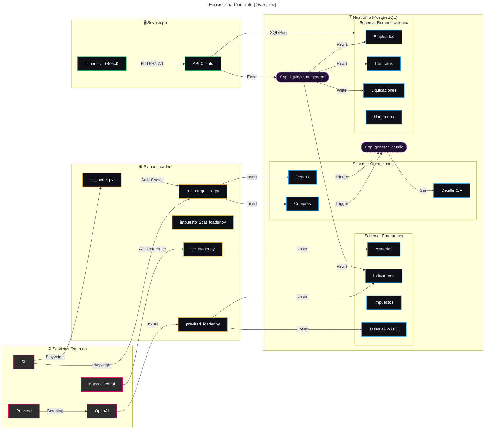
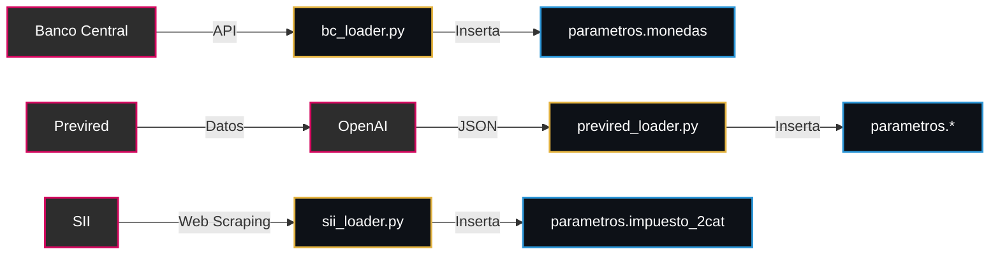
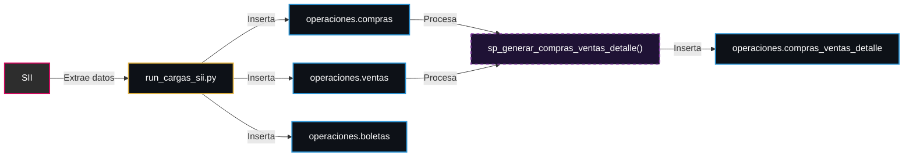
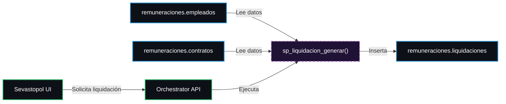
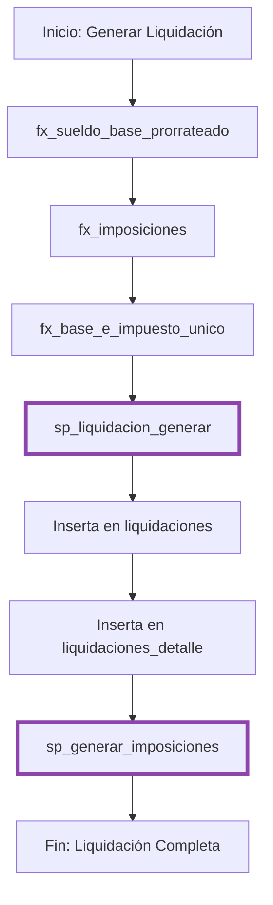
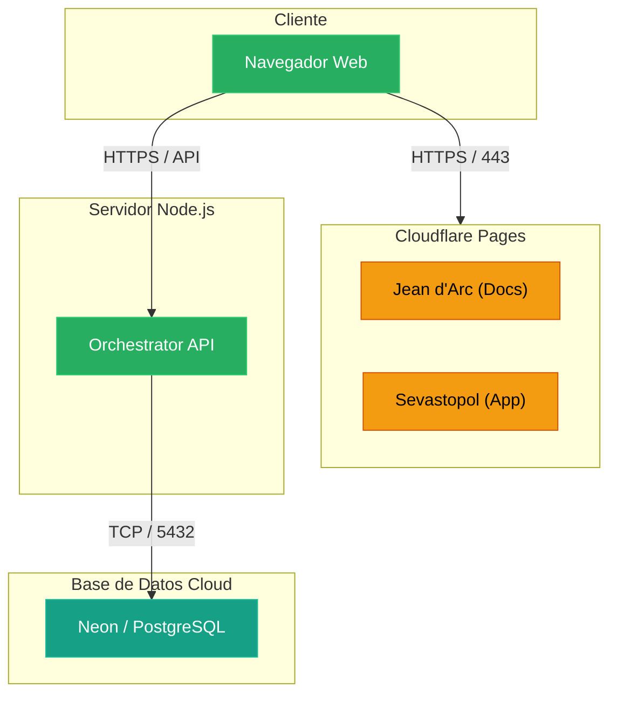
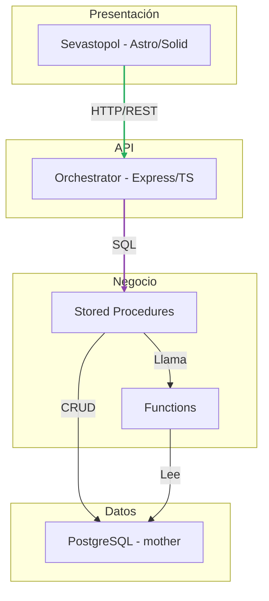
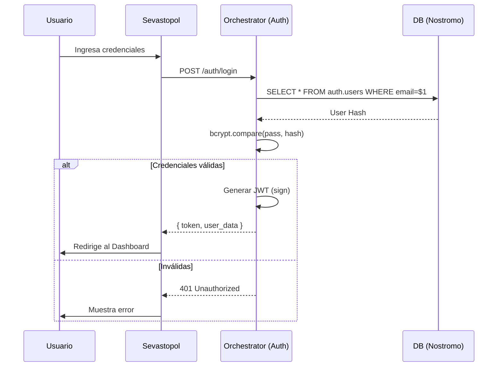
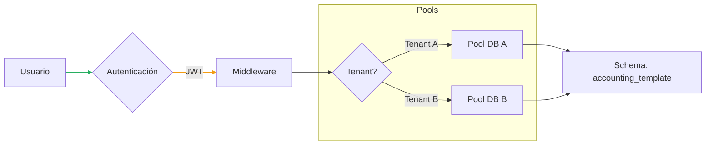

import { Code } from '@astrojs/starlight/components';

## 📊 Diagrama de Usuario - Accounting System

Este diagrama muestra el flujo completo de datos desde servicios externos hasta la base de datos PostgreSQL.

´´´mermaid

´´´

### Componentes Principales

- 🌐 **Servicios Externos**: SII, Previred, Banco Central, OpenAI
- 📦 **Loaders Python**: Scripts de carga de datos
- 🗄️ **Base de Datos**: PostgreSQL con múltiples schemas
- ⚙️ **Stored Procedures**: Lógica de negocio
- 🔧 **Functions**: Cálculos y validaciones

### Código del Diagrama

### Leyenda Estilizada

| Color (Borde) | Componente | Descripción |
| :--- | :--- | :--- |
| █ Magenta | **Externo** | Servicios fuera de nuestra red. |
| █ Amarillo| **Python** | Scripts de extracción y carga (ETLs). |
| █ Cyan | **PostgreSQL** | Tablas y vistas materializadas (Azul claro). |
| █ Verde | **Frontend** | Interfaces de usuario en Sevastopol. |
| █ Violeta | **Stored Proc** | Lógica compilada en base de datos. |

### Flujos Principales

#### 1. Carga de Parámetros

#### 1. Carga de Parámetros

#### 2. Operaciones Comerciales

#### 3. Remuneraciones

## 🔄 Diagrama de Flujo de Liquidación

## ☁️ Arquitectura de Despliegue

## 🏗️ Arquitectura de Capas

## 🔐 Flujo de Autenticación

## 📱 Integración Multi-Tenant

## 🔗 Enlaces Relacionados

- [Sistema Contable](/accounting/sistema-contable/) - Documentación completa
- [Endpoints API](/api/endpoints/) - Referencia de APIs
- [Demo en Vivo](/demo-api/) - Prueba la integración

---

> [!NOTE] [Nota Técnica]
Los diagramas se actualizan automáticamente cuando se modifica el archivo fuente en `Nostromo/docs/Accounting_system_docs/diagramas/diagrama_usuario.mmd`
