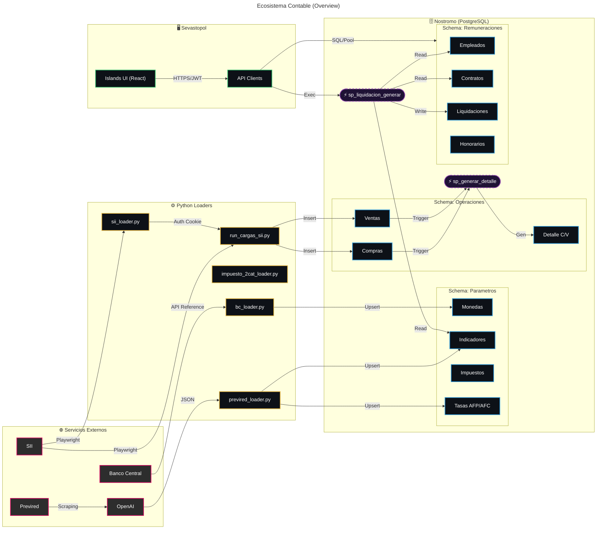
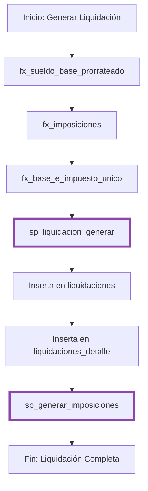
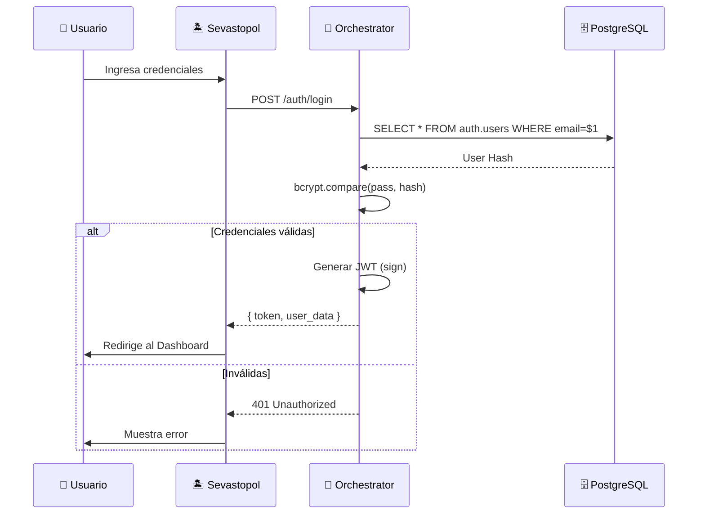
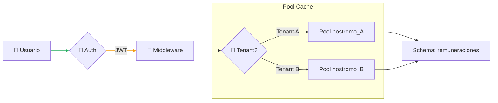

import { Tabs, TabItem, Aside, Steps, LinkCard, CardGrid } from '@astrojs/starlight/components';

Esta página contiene los diagramas técnicos del ecosistema Nostromo, mostrando flujos de datos, arquitectura de capas, autenticación y despliegue.

---

## Ecosistema Contable (Overview)

El diagrama principal muestra el flujo completo de datos desde servicios externos hasta la base de datos PostgreSQL.



### Leyenda de Colores

| Color | Componente | Descripción |
| :--- | :--- | :--- |
| 🟣 Magenta | **Externo** | Servicios fuera de nuestra red (SII, Previred, BC, OpenAI) |
| 🟡 Amarillo | **Python** | Scripts de extracción y carga (ETLs) |
| 🔵 Cyan | **PostgreSQL** | Tablas y vistas materializadas |
| 🟢 Verde | **Frontend** | Interfaces de usuario en Sevastopol |
| 🟣 Violeta | **Stored Proc** | Lógica compilada en base de datos |

---

## Flujos de Datos Principales

<Tabs>
  <TabItem label="1. Parámetros">
    Carga de parámetros desde servicios externos hacia el schema `parametros`:

    ```mermaid
    flowchart LR
        BC["Banco Central"] -->|API| BCL["bc_loader.py"]
        BCL -->|Inserta| PM["parametros.monedas"]
        
        PR["Previred"] -->|Datos| OAI["OpenAI"]
        OAI -->|JSON| PRL["previred_loader.py"]
        PRL -->|Inserta| PP["parametros.*"]
        
        SII["SII"] -->|Web Scraping| SIIL["sii_loader.py"]
        SIIL -->|Inserta| PI["parametros.impuesto_2cat"]
        
        classDef ext fill:#2d2d2d,stroke:#d3095f,stroke-width:2px,color:#fff;
        classDef py fill:#0d1117,stroke:#e3b341,stroke-width:2px,color:#fff;
        classDef db fill:#0d1117,stroke:#2b95d6,stroke-width:2px,color:#fff;
        
        class BC,PR,SII,OAI ext
        class BCL,PRL,SIIL py
        class PM,PP,PI db
    ```

    <Aside type="tip" title="Scripts Involucrados">
      - `bc_loader.py` - Tipos de cambio (UF, USD, EUR)
      - `previred_loader.py` - Indicadores, topes, AFP/AFC
      - `sii_loader.py` - Tramos de impuesto 2da categoría
    </Aside>
  </TabItem>

  <TabItem label="2. Operaciones">
    Extracción de compras/ventas del SII hacia el schema `operaciones_sii`:

    ```mermaid
    flowchart LR
        SII["SII"] -->|Extrae datos| RCS["run_cargas_sii.py"]
        RCS -->|Inserta| OPC["operaciones.compras"]
        RCS -->|Inserta| OPV["operaciones.ventas"]
        RCS -->|Inserta| OPB["operaciones.boletas"]
        
        OPC -->|Procesa| SP["sp_generar_compras_ventas_detalle()"]
        OPV -->|Procesa| SP
        
        SP -->|Inserta| CVD["operaciones.compras_ventas_detalle"]
        
        classDef ext fill:#2d2d2d,stroke:#d3095f,stroke-width:2px,color:#fff;
        classDef py fill:#0d1117,stroke:#e3b341,stroke-width:2px,color:#fff;
        classDef sp fill:#1f1235,stroke:#8e44ad,stroke-width:2px,stroke-dasharray: 5 5,color:#fff;
        classDef db fill:#0d1117,stroke:#2b95d6,stroke-width:2px,color:#fff;
        
        class SII ext
        class RCS py
        class SP sp
        class OPC,OPV,OPB,CVD db
    ```

    <Aside type="note" title="Proceso">
      1. `run_cargas_sii.py` extrae datos del SII via Playwright
      2. Inserta en tablas brutas (compras, ventas, boletas)
      3. SP genera detalle consolidado para F29
    </Aside>
  </TabItem>

  <TabItem label="3. Remuneraciones">
    Generación de liquidaciones desde el frontend:

    ```mermaid
    flowchart LR
        SEV["Sevastopol UI"] -->|Solicita liquidación| ORC["Orchestrator API"]
        
        EMP["remuneraciones.empleados"] -->|Lee datos| SP["sp_liquidacion_generar()"]
        CONT["remuneraciones.contratos"] -->|Lee datos| SP
        
        ORC -->|Ejecuta| SP
        SP -->|Inserta| LIQ["remuneraciones.liquidaciones"]
        
        classDef front fill:#0d1117,stroke:#27ae60,stroke-width:2px,color:#fff;
        classDef sp fill:#1f1235,stroke:#8e44ad,stroke-width:2px,stroke-dasharray: 5 5,color:#fff;
        classDef db fill:#0d1117,stroke:#2b95d6,stroke-width:2px,color:#fff;
        
        class SEV,ORC front
        class SP sp
        class EMP,CONT,LIQ db
    ```

    <Aside type="caution" title="Hybrid Core 2025">
      En la arquitectura actual, los cálculos complejos se están migrando a TypeScript (PayrollEngine).
      Los SPs se mantienen para lecturas rápidas y agregaciones.
    </Aside>
  </TabItem>
</Tabs>

---

## Flujo de Liquidación

El proceso de generación de liquidaciones sigue estos pasos:

<Steps>
1. **Sueldo Base Prorrateado** - `fx_sueldo_base_prorrateado()`
2. **Cálculo de Imposiciones** - `fx_imposiciones()`
3. **Base e Impuesto Único** - `fx_base_e_impuesto_unico()`
4. **Generación de Liquidación** - `sp_liquidacion_generar()`
5. **Inserción de Detalles** - Líneas de concepto
6. **Generación de Imposiciones** - `sp_generar_imposiciones()`
</Steps>



---

## Arquitectura de Despliegue

<Tabs>
  <TabItem label="Infraestructura">
    ```mermaid
    graph TD
        subgraph Client["👤 Cliente"]
            Browser["Navegador Web"]
        end

        subgraph CDN["☁️ Cloudflare Pages"]
            Static["Jean d'Arc (Docs)"]
            App["Sevastopol (App)"]
        end

        subgraph Backend["🖥️ Servidor Node.js"]
            Orchest["Orchestrator API"]
        end

        subgraph Data["🗄️ Base de Datos"]
            Neon["PostgreSQL"]
        end

        Browser -->|HTTPS / 443| CDN
        Browser -->|HTTPS / API| Orchest
        Orchest -->|TCP / 5432| Neon
        
        classDef cdn fill:#f39c12,stroke:#d35400,color:#000;
        classDef node fill:#27ae60,stroke:#2ecc71,color:#fff;
        classDef db fill:#16a085,stroke:#1abc9c,color:#fff;
        
        class Static,App cdn;
        class Orchest node;
        class Neon db;
    ```
  </TabItem>

  <TabItem label="Capas">
    ```mermaid
    graph TB
        subgraph Presentación
            A[Sevastopol - Astro/Solid]
        end
        subgraph API
            B[Orchestrator - Express/TS]
        end
        subgraph Negocio
            C[Stored Procedures]
            D[Functions]
        end
        subgraph Datos
            E[PostgreSQL - mother]
        end
        
        A -->|HTTP/REST| B
        B -->|SQL| C
        C -->|Llama| D
        C -->|CRUD| E
        D -->|Lee| E
        
        linkStyle 0 stroke:#27ae60,stroke-width:2px;
        linkStyle 1 stroke:#8e44ad,stroke-width:2px;
    ```
  </TabItem>
</Tabs>

---

## Flujo de Autenticación



<Aside type="note" title="Sesiones">
  El token JWT se almacena en una cookie `sid` (httpOnly, secure).
  Sevastopol lo reenvía automáticamente al Orchestrator via `authenticatedFetch()`.
</Aside>

---

## Integración Multi-Tenant

La arquitectura multi-tenant asegura aislamiento de datos por empresa:



<Aside type="caution" title="Regla Crítica">
  Cada tenant tiene su propia base de datos (`nostromo_{rut}`).
  **Nunca** mezclar conexiones entre tenants.
</Aside>

---

<CardGrid>
  <LinkCard
    title="Sistema Contable"
    description="Documentación completa del sistema de contabilidad"
    href="/accounting/sistema-contable/"
  />
  <LinkCard
    title="Endpoints API"
    description="Referencia de APIs del Orchestrator"
    href="/api/endpoints/"
  />
  <LinkCard
    title="Arquitectura Overview"
    description="Visión general de la arquitectura"
    href="/arquitectura/overview/"
  />
</CardGrid>
