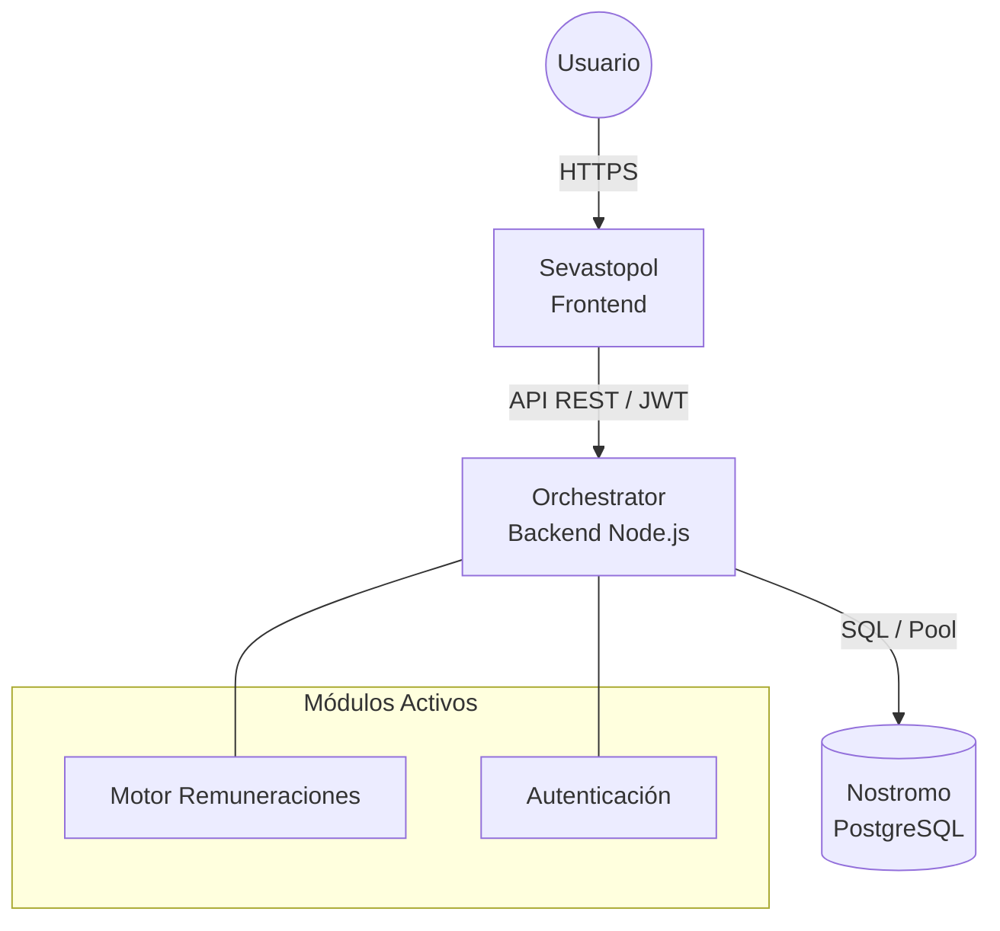

## Estado del Sistema

Actualmente, el ecosistema se encuentra en una fase de implementación progresiva.

| Módulo | Estado | Notas |
| --- | --- | --- |
| **Remuneraciones** | ✅ **Producción** | Motor de cálculo completo, liquidaciones, leyes sociales, honorarios. |
| **Contabilidad** | 🚧 En Desarrollo | Estructura base de asientos y plan de cuentas. |
| **Inventario** | ⏳ Planificado | Aún no iniciado. |

## Componentes Principales

### 1. Sevastopol (Frontend)

- **Tecnología**: Astro + React.
- **Rol**: Interfaz de usuario final.
- **Responsabilidad**: Renderizado de vistas, gestión de estado local (Islands) y consumo de API.

### 2. Orchestrator (Backend API)

- **Tecnología**: Node.js / Express (TypeScript).
- **Rol**: API Gateway y Lógica de Negocio.
- **Responsabilidad**:
  - cálculo de nómina (Payroll Engine).
  - Autenticación y Autorización (JWT/RBAC).
  - Orquestación de llamadas a base de datos.
  - Generación de documentos (PDF).

### 3. Nostromo (Base de Datos)

- **Tecnología**: PostgreSQL 16.
- **Rol**: Persistencia y Reglas de Integridad.
- **Responsabilidad**:
  - Multi-tenancy (Esquemas separados).
  - Validaciones a nivel de datos (Foreign Keys, Constraints).
  - Almacenamiento JSONB para flexibilidad en parámetros.

## Diagrama de Alto Nivel

