import { Steps, Aside, Tabs, TabItem, Code, LinkCard, CardGrid, FileTree } from "@astrojs/starlight/components";

Esta página proporciona una visión integral de toda la arquitectura del sistema, incluyendo el diseño de servicios, patrones de comunicación, stack tecnológico y decisiones arquitectónicas clave.

<Aside type="note" title="Arquitectura BFF">
  El sistema implementa un patrón **Backend for Frontend (BFF)** con dos servicios independientes: 
  **Sevastopol** (frontend) y **Orchestrator** (backend), garantizando una separación limpia entre presentación y lógica de negocio.
</Aside>

## Servicios del Sistema

<CardGrid>
  <LinkCard
    title="Sevastopol (Frontend)"
    description="Astro + SolidJS en puerto 4321. Renderizado SSR con Islands Architecture."
    href="/sevastopol/"
  />
  <LinkCard
    title="Orchestrator (Backend)"
    description="Node.js + Express en puerto 8000. API REST con autenticación JWT."
    href="/orchestrator/"
  />
</CardGrid>

| Servicio | Tecnología | Puerto | Propósito |
| --- | --- | --- | --- |
| **Sevastopol** | Astro 5.x + SolidJS | 4321 | Capa de presentación, enrutamiento de vistas, componentes UI |
| **Orchestrator** | Node.js 20+ / Express 5.x | 8000 | Lógica de negocio, acceso a datos, servicios API |

---

## Límites de Servicios


---

## Flujo de Peticiones Autenticadas

El siguiente diagrama muestra cómo fluye una petición API autenticada típica a través del sistema:

```mermaid
sequenceDiagram
    participant N as 🌐 Navegador
    participant V as Sevastopol
    participant P as Proxy API
    participant A as Orchestrator
    participant M as Auth Middleware
    participant R as RBAC
    participant D as PostgreSQL

    N->>V: Click en navegación
    V->>V: Dispara sidebar:navigate
    V->>P: authenticatedFetch('/api/employees')
    Note right of V: Cookie sid adjunta

    P->>A: HTTP con cookie sid
    A->>M: Verifica JWT + sesión
    M->>D: Consulta sessions
    D-->>M: Sesión válida ✅

    M->>R: Verifica permisos
    R->>R: rbac.canAccess(role, route)

    alt ✅ Autorizado
        R->>A: Ejecuta handler
        A->>D: Query SQL
        D-->>A: Datos
        A-->>P: JSON (snake_case)
        P-->>V: Respuesta
        V->>N: Re-renderiza UI
    else ❌ No autorizado
        R-->>A: 403 Forbidden
        A-->>P: Error
        P-->>V: Error
        V->>N: Mensaje de error
    end
```



---

## Arquitectura Frontend (Sevastopol)

Sevastopol usa Astro con **Islands Architecture** de SolidJS para hidratación selectiva e interactividad.

<Tabs>
  <TabItem label="Stack Tecnológico">
    | Componente | Tecnología | Versión |
    | --- | --- | --- |
    | Framework | Astro (SSR) | 5.x |
    | UI Library | SolidJS (Islands) | 1.x |
    | Estilos | TailwindCSS | 3.x |
    | Build Tool | Vite | 6.x |
  </TabItem>
  <TabItem label="Estructura de Archivos">
    <FileTree>
      - src/
        - pages/
          - command.astro (Contenedor principal)
          - api/ (Proxies al backend)
        - components/
          - atoms/ (Input, Button, Modal)
          - molecules/ (StatCard, StatusBadge)
          - organisms/ (Sidebar, PageHeader)
          - islands/ (Componentes interactivos)
          - templates/ (IslandBase.tsx)
        - lib/
          - authFetch.ts
          - view-router.ts
        - config/
          - menu.config.ts
    </FileTree>
  </TabItem>
</Tabs>

### Componentes Principales

```mermaid
flowchart TD
    A[command.astro<br/>Contenedor Principal]

    A -->|Inicializa| B

    subgraph GV["Gestión de Vistas"]
        B[view-router.ts<br/>Cargador dinámico]
        M[menu.config.ts<br/>Estructura de navegación]
        B -->|Lee| M
    end

    B -->|import dinámico| I1
    B -->|import dinámico| I2
    B -->|import dinámico| I3

    subgraph IS["Islands SolidJS"]
        I1[Remuneraciones<br/>PayrollViewIsland<br/>EmployeesViewIsland]
        I2[Administración<br/>TenantsViewIsland<br/>CompanyViewIsland]
        I3[Contabilidad<br/>OperationsViewIsland]
    end

    I1 & I2 & I3 -->|Envuelve en| C

    subgraph BC["Biblioteca de Componentes"]
        C[IslandBase.tsx]
        C --> O[Organismos]
        O --> MO[Moléculas]
        MO --> AT[Átomos]
    end
```



### Mecanismo del View Router

<Steps>
1. Usuario hace clic en elemento de navegación en `Sidebar.astro`
2. Sidebar dispara `CustomEvent("sidebar:navigate", detail: viewKey)`
3. View router escucha el evento en `view-router.ts`
4. Router realiza `import()` dinámico del módulo island correspondiente
5. Función `render()` de SolidJS monta el island en `#command-view`
6. Router emite `CustomEvent("view:state")` para actualizar estado activo
</Steps>

---

## Arquitectura Backend (Orchestrator)

Orchestrator implementa **Diseño Orientado al Dominio (DDD)** con contextos delimitados claros y una arquitectura por capas.

<Tabs>
  <TabItem label="Stack Tecnológico">
    | Componente | Tecnología |
    | --- | --- |
    | Runtime | Node.js 20+ |
    | Framework | Express 5.x |
    | Lenguaje | TypeScript 5.x |
    | Base de Datos | PostgreSQL (node-postgres) |
    | Documentos | Puppeteer, docxtemplater |
  </TabItem>
  <TabItem label="Estructura de Archivos">
    <FileTree>
      - src/
        - app.ts (Express factory)
        - server.ts (HTTP bootstrap)
        - lib/
          - db.ts (Pool management)
          - rbac.ts (Control de acceso)
        - middleware/
          - auth.ts (JWT validation)
        - routes/
          - command/ (tenant, users, auth)
          - remuneraciones/ (payroll, employees)
          - common/ (parameters, afc)
          - admin/ (chart-of-accounts)
        - domain/
          - payroll/ (Service, Repository, Calculators)
          - common/ (CommonDataService, PdfService)
    </FileTree>
  </TabItem>
</Tabs>

### Estructura de Capas


### Inicialización de Express

<Steps>
1. **Middleware de Seguridad**: `helmet()` para encabezados HTTP seguros
2. **CORS**: Configurado para puertos 4320-4322 con credenciales
3. **Logging**: `morgan('combined')` para registro de peticiones
4. **Parsing de Body**: `express.json()` con límite de 2MB
5. **Parsing de Cookies**: `cookieParser()` para cookies de sesión
</Steps>

### Registro de Rutas

| Prefijo | Módulo | Propósito |
| --- | --- | --- |
| `/api/tenant` | `command/tenant.ts` | Gestión de tenants (SUPER_ADMIN) |
| `/api/admin` | `command/users.ts` | Gestión de usuarios |
| `/api/sessions` | `command/sessions.ts` | Monitoreo de sesiones |
| `/api/parameters` | `common/parameters.ts` | Indicadores económicos |
| `/api/remuneraciones/payroll` | `remuneraciones/payroll.ts` | Liquidaciones |
| `/api/employees` | `remuneraciones/employees.ts` | CRUD empleados |
| `/api/admin/chart-of-accounts` | `admin/chart-of-accounts.ts` | Plan de cuentas |

---

## Organización de Dominios

### Dominio de Remuneraciones

<Aside type="tip" title="Legislación Chilena">
  Este dominio implementa los cálculos de **AFP**, **Salud**, **Seguro de Cesantía** e **Impuesto Único** según la legislación laboral chilena vigente.
</Aside>

**Clases Clave:**

- `PayrollService`: Orquesta el flujo de generación de liquidaciones
- `PayrollRepository`: Recopilación de contexto y persistencia
- `SocialLawsCalculator`: Cálculos de AFP, salud, seguro de cesantía
- `HealthPlanCalculator`: Lógica FONASA vs ISAPRE
- `TaxCalculator`: Impuesto progresivo (Impuesto 2da Categoría)

**Patrón de Recopilación de Contexto:**

```typescript title="PayrollRepository.ts"
// Consultas paralelas para optimizar rendimiento
const [attendanceRes, indicatorsRes, afpCode, taxRes] = await Promise.all([
  this.getAttendanceData(db, contractRes.employeeId, periodStr),
  CommonDataService.getIndicators(periodStr),
  this.getAfpCode(db, contractId),
  CommonDataService.getTaxBrackets(periodStr)
]);
```

### Dominio Común

Proporciona parámetros regulatorios compartidos:

- `CommonDataService`: Consultas de parámetros temporales
- `PdfService`: Generación de documentos usando Puppeteer

<Aside type="caution" title="Patrón de Consulta Temporal">
  Todas las consultas de parámetros usan el patrón:
  ```sql
  WHERE periodo_mes = $date ORDER BY periodo_mes DESC LIMIT 1
  ```
  para recuperar los parámetros vigentes a la fecha de cálculo.
</Aside>

---

## Patrones de Diseño API

### Convenciones RESTful

<Tabs>
  <TabItem label="Formato de Petición">
    - **Query params**: `snake_case` (ej: `?empleado_id=123`)
    - **Body**: JSON en `snake_case`
    - **Auth**: Cookie `sid` con token JWT
  </TabItem>
  <TabItem label="Formato de Respuesta">
    ```json title="Respuesta exitosa"
    {
      "field_name": "value",
      "nested_object": {
        "snake_case_key": 123
      }
    }
    ```
  </TabItem>
  <TabItem label="Formato de Error">
    ```json title="Respuesta de error"
    {
      "success": false,
      "error": "ERROR_CODE",
      "message": "Descripción legible"
    }
    ```
  </TabItem>
</Tabs>

### Patrones de Rutas

| Método | Patrón | Propósito |
| --- | --- | --- |
| `GET` | `/api/resource` | Listar todos (con filtros opcionales) |
| `GET` | `/api/resource/:id` | Obtener por ID |
| `POST` | `/api/resource` | Crear nuevo |
| `PUT/PATCH` | `/api/resource/:id` | Actualizar existente |
| `DELETE` | `/api/resource/:id` | Eliminar (con `?force=true` opcional) |

```typescript title="Ejemplo: Rutas de Remuneraciones"
router.get("/", async (req, res) => { /* Listar */ });
router.get("/vista/:id", async (req, res) => { /* Obtener por ID */ });
router.get("/:id/details", async (req, res) => { /* Obtener detalles */ });
router.post("/generar", async (req, res) => { /* Crear/Generar */ });
router.patch("/:id", async (req, res) => { /* Actualizar */ });
router.delete("/:id", async (req, res) => { /* Eliminar */ });
```

---

## Capa de Acceso a Datos

### Gestión de Connection Pools

El sistema usa tres tipos de connection pools:


### Resolución de Tenant

<Steps>
1. Extraer `tenant_id` de los parámetros de consulta
2. Mapear a nombre de base de datos: `nostromo_${tenant_id}`
3. Recuperar o crear connection pool
4. Ejecutar consulta en base de datos específica del tenant
</Steps>

```typescript title="lib/db.ts"
const tenantDb = await getDatabaseNameForUser(req.user, req);
const pool = getTenantPool(tenantDb);
const result = await pool.query(sql, params);
```

---

## Patrones de Comunicación

### Frontend-a-Backend

Sevastopol usa un patrón de proxy para comunicarse con Orchestrator:

<Steps>
1. **Proxy de Desarrollo**: Vite hace proxy de `/api/*` a `http://localhost:8000`
2. **Páginas Proxy API**: `sevastopol/src/pages/api/*` implementan proxies simples
3. **Fetch Autenticado**: La utilidad `authenticatedFetch()` adjunta la cookie `sid`
</Steps>

```typescript title="Ejemplo de Proxy"
// sevastopol/src/pages/api/admin/chart-of-accounts.ts
import { createProxy } from '@/lib/proxyUtils';
export const { GET, POST, PUT, DELETE } = createProxy('/api/admin/chart-of-accounts');
```

### Flujo de Autenticación

<Steps>
1. Usuario inicia sesión vía `/api/auth/login`
2. Orchestrator valida credenciales contra `nostromo_command.users`
3. Crea sesión en tabla `sessions`
4. Retorna cookie `sid` con token JWT (HttpOnly)
5. Todas las peticiones subsecuentes incluyen la cookie
6. Middleware `authenticateToken` valida token y sesión
</Steps>

<Aside type="caution" title="Seguridad">
  El token JWT se almacena en una **cookie HttpOnly** para prevenir acceso desde JavaScript y mitigar ataques XSS.
</Aside>

---

## Patrones Arquitectónicos Clave

### Separación de Responsabilidades

| Capa | Responsabilidad | Ejemplo |
| --- | --- | --- |
| **Presentación** | Renderizado UI, interacción | `view-router.ts`, Islands SolidJS |
| **API Gateway** | Enrutamiento, auth, RBAC | `app.ts`, `rbac.ts` |
| **Servicio** | Orquestación de lógica | `PayrollService.generatePayroll()` |
| **Repositorio** | Acceso a datos | `PayrollRepository.getPayrollContext()` |
| **Calculador** | Lógica de negocio pura | `SocialLawsCalculator.calculate()` |

### Diseño Orientado al Dominio

Cada dominio es autocontenido con:

<FileTree>
  - src/domain/chart-of-accounts/
    - types.ts (Account, CreateAccountDTO)
    - ChartOfAccountsService.ts (Lógica de negocio)
  - src/routes/admin/
    - chart-of-accounts.ts (Rutas HTTP)
</FileTree>

### Patrón Repository con Mapeo

```typescript title="Mapeo DB → Dominio"
private static mapRow(row: any): LegalRep {
  return {
    fecha_desde: row.fecha_nombramiento,  // Mapea DB a dominio
    fecha_hasta: row.fecha_termino,
    vigente: row.activo,
    // ... otros campos
  };
}
```

---

## Configuración de Entorno

### Variables Requeridas

| Variable | Servicio | Propósito |
| --- | --- | --- |
| `PORT` | Orchestrator | Puerto HTTP (8000) |
| `DB_HOST` | Orchestrator | Host PostgreSQL |
| `DB_PORT` | Orchestrator | Puerto PostgreSQL (5432) |
| `DB_USER` | Orchestrator | Usuario de BD |
| `DB_PASSWORD` | Orchestrator | Contraseña de BD |
| `JWT_SECRET` | Orchestrator | Clave de firma de token (256+ bits) |
| `LIQUIDACIONES_DIR` | Orchestrator | Ruta de almacenamiento PDF |

<Aside type="danger" title="Seguridad">
  **Nunca** commitear archivos `.env` al repositorio. Usar variables de entorno o secret managers en producción.
</Aside>

---

## Arquitectura de Despliegue

<Tabs>
  <TabItem label="Desarrollo">
    ```
    localhost:4321  ← Sevastopol (Vite dev server)
        ↓ (proxy /api/*)
    localhost:8000  ← Orchestrator (nodemon)
        ↓
    localhost:5432  ← PostgreSQL (Docker)
    ```
  </TabItem>
  <TabItem label="Producción">
    - **Sevastopol**: Build estático `npm run build` servido por Nginx/CDN
    - **Orchestrator**: Proceso Node.js detrás de proxy reverso (Nginx/Caddy)
    - **PostgreSQL**: Servidor dedicado con connection pooling (PgBouncer)
  </TabItem>
</Tabs>

---

<CardGrid>
  <LinkCard
    title="Ver Endpoints API"
    description="Documentación completa de todos los endpoints REST"
    href="/api/endpoints/"
  />
  <LinkCard
    title="Diagramas del Sistema"
    description="Diagramas Mermaid adicionales y flujos de datos"
    href="/arquitectura/diagramas/"
  />
</CardGrid>
