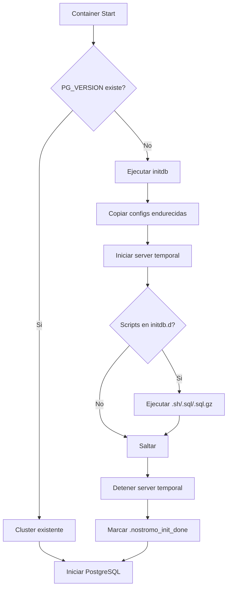

import { Card, CardGrid, Tabs, TabItem, Steps, Aside, FileTree } from '@astrojs/starlight/components';

El container `mother` ejecuta PostgreSQL 16 en una imagen Docker personalizada y endurecida, basada en Debian 13 (trixie-slim). Está diseñado para entornos de desarrollo y producción con foco en seguridad y estabilidad.

## Estructura del Proyecto

<FileTree>
- pg16-clean/
  - Dockerfile - Imagen base endurecida
  - docker-compose.yml - Configuración del servicio
  - docker-entrypoint.sh - Script de inicio customizado
  - conf/
    - pg_hba.conf - Control de acceso
    - postgresql.conf.sample - Configuración del servidor
  - initdb/ - Scripts de inicialización
</FileTree>

## Imagen Docker

La imagen está construida con los siguientes principios de seguridad:

<CardGrid>
  <Card title="Imagen Minimal" icon="seti:docker">
    Base `debian:13-slim` sin paquetes innecesarios. Build-tools eliminados después de compilación.
  </Card>
  <Card title="Usuario No-Root" icon="approve-check">
    PostgreSQL corre como usuario `postgres` (UID 999) usando `gosu` para cambio seguro.
  </Card>
  <Card title="Filesystem Read-Only" icon="warning">
    Container en modo `read_only: true` con tmpfs para directorios de escritura.
  </Card>
  <Card title="Capabilities Mínimas" icon="close">
    `cap_drop: ALL` con solo `SETUID` y `SETGID` habilitados para gosu.
  </Card>
</CardGrid>

### Dockerfile Highlights

```dockerfile
# Base mínima
FROM debian:13-slim

# PostgreSQL 16 desde repositorio oficial PGDG
ARG PG_MAJOR=16
ARG PG_VERSION=16.10-1.pgdg13+1

# Autenticación SCRAM obligatoria desde initdb
gosu postgres initdb -D "$PGDATA" \
  --auth-local=scram-sha-256 --auth-host=scram-sha-256 \
  --encoding=UTF8 --locale="en_US.utf8"

# Healthcheck integrado
HEALTHCHECK --interval=30s --timeout=5s --start-period=20s --retries=5 \
  CMD pg_isready -U "${POSTGRES_USER:-postgres}" || exit 1
```

<Aside type="caution">
  Las build-tools (`curl`, `gnupg`) se purgan en el mismo layer RUN donde se instalan para minimizar el tamaño de la imagen.
</Aside>

## Configuración de Seguridad

### pg_hba.conf

Control de acceso basado en host con SCRAM-SHA-256 obligatorio:

<Tabs>
  <TabItem label="Configuración">
    ```conf
    # Local: SCRAM obligatorio
    local   all   all   scram-sha-256

    # IPv4 - Solo localhost y red Docker bridge
    host    all   all   127.0.0.1/32      scram-sha-256
    host    all   all   172.17.0.0/16     scram-sha-256

    # IPv6 loopback
    host    all   all   ::1/128           scram-sha-256
    ```
  </TabItem>
  <TabItem label="Explicación">
    | Regla | Propósito |
    |-------|-----------|
    | `local ... scram-sha-256` | Conexiones via Unix socket requieren password SCRAM |
    | `172.17.0.0/16` | Permite conexiones desde otros containers Docker |
    | No hay `trust` | Ninguna conexión sin autenticación |
    | No hay `md5` | MD5 es vulnerable, solo SCRAM |
  </TabItem>
</Tabs>

### Medidas de Hardening

<Steps>
1. **SCRAM-SHA-256**: Hash de passwords resistente a ataques de diccionario y replay. Reemplaza MD5 deprecado.

2. **Read-Only Filesystem**: El container no puede escribir en su filesystem excepto en volúmenes montados y tmpfs.

3. **CAP_DROP ALL**: Elimina todas las Linux capabilities excepto las mínimas necesarias.

4. **No Root**: El proceso PostgreSQL nunca corre como root. El entrypoint usa `gosu` para cambiar a `postgres`.

5. **Volumen Externo**: Los datos viven en `nostromo_pgdata`, un volumen Docker externo y persistente.
</Steps>

## Configuración de Performance

### postgresql.conf

```conf
# Conexiones
listen_addresses = '*'
password_encryption = 'scram-sha-256'

# Memoria
shared_buffers = 256MB
work_mem = 16MB
maintenance_work_mem = 128MB

# WAL (Write-Ahead Logging)
wal_level = replica
max_wal_size = 1GB
min_wal_size = 80MB

# Logging
log_destination = 'stderr'
logging_collector = on
log_min_duration_statement = 500ms
log_line_prefix = '%m [%p] %u@%d '
```

| Parámetro | Valor | Justificación |
|-----------|-------|---------------|
| `shared_buffers` | 256MB | Cache de datos en memoria, ~25% de RAM disponible |
| `work_mem` | 16MB | Memoria por operación de sort/hash |
| `wal_level` | replica | Preparado para streaming replication |
| `log_min_duration_statement` | 500ms | Loguea queries lentos para optimización |

<Aside type="tip">
  El `log_line_prefix` incluye timestamp, PID, usuario y base de datos para facilitar debugging.
</Aside>

## Entrypoint Customizado

El script `docker-entrypoint.sh` maneja la inicialización del cluster:



### Detección de Cluster Existente

```bash
# Si existe PG_VERSION, el cluster ya está inicializado
if gosu postgres bash -lc "test -f '$PGDATA/PG_VERSION'"; then
    echo ">> existing cluster detected, skipping initdb"
else
    # Ejecutar initdb con SCRAM
    gosu postgres initdb -D "$PGDATA" \
      --auth-local=scram-sha-256 \
      --auth-host=scram-sha-256
fi
```

<Aside type="note">
  El archivo `.nostromo_init_done` marca que los scripts de initdb.d ya fueron ejecutados, evitando re-ejecución en reinicios.
</Aside>

## Docker Compose

```yaml
services:
  mother:
    image: nostromo/postgres:16-hardened-stable
    container_name: mother
    restart: unless-stopped
    environment:
      POSTGRES_USER: "chris"
      TZ: "America/Santiago"
    ports:
      - "5432:5432"
    volumes:
      - nostromo_pgdata:/var/lib/postgresql/data
      - ./initdb:/docker-entrypoint-initdb.d:ro
    read_only: true
    tmpfs:
      - "/run/postgresql:rw,nosuid,nodev,mode=3777,size=32m"
      - "/var/lib/postgresql/tmp:rw,nosuid,nodev,mode=1777,size=256m"
    cap_drop:
      - ALL
    cap_add:
      - SETUID
      - SETGID
    healthcheck:
      test: ["CMD-SHELL", "pg_isready -U chris -d postgres"]
      interval: 30s
      timeout: 5s
      retries: 5
```

### Volúmenes

| Mount | Tipo | Propósito |
|-------|------|-----------|
| `nostromo_pgdata` | Volume externo | Datos persistentes del cluster |
| `./initdb` | Bind mount (ro) | Scripts de inicialización |
| `/run/postgresql` | tmpfs | Socket Unix y locks |
| `/var/lib/postgresql/tmp` | tmpfs | Archivos temporales de queries |

<Aside type="caution">
  El volumen `nostromo_pgdata` debe existir antes de iniciar el container: `docker volume create nostromo_pgdata`
</Aside>

## Healthcheck

El container incluye healthcheck integrado:

```bash
pg_isready -U chris -d postgres
```

- **Intervalo**: Cada 30 segundos
- **Timeout**: 5 segundos máximo
- **Start Period**: 30 segundos de gracia inicial
- **Retries**: 5 intentos antes de marcar unhealthy

## Comandos Útiles

<Tabs>
  <TabItem label="Construcción">
    ```bash
    cd c:\pg16-clean
    docker compose build --no-cache
    docker compose up -d
    ```
  </TabItem>
  <TabItem label="Conexión">
    ```bash
    # Desde host
    psql -h localhost -U chris -d postgres

    # Desde otro container
    psql -h mother -U chris -d nostromo_command
    ```
  </TabItem>
  <TabItem label="Logs">
    ```bash
    docker logs mother -f --tail 100

    # Logs de PostgreSQL dentro del container
    docker exec mother cat /var/lib/postgresql/data/log/postgresql*.log
    ```
  </TabItem>
  <TabItem label="Backup">
    ```bash
    # Dump completo del cluster
    docker exec mother pg_dumpall -U chris | gzip > backup.sql.gz

    # Backup de base de datos específica
    docker exec mother pg_dump -U chris -d nostromo_common | gzip > common.sql.gz
    ```
  </TabItem>
</Tabs>

## Referencias

- [Mother Database Overview](/mother/) - Arquitectura y schemas
- [PostgreSQL 16 Docs](https://www.postgresql.org/docs/16/) - Documentación oficial
- [Docker Security Best Practices](https://docs.docker.com/develop/security-best-practices/) - Guía de hardening
