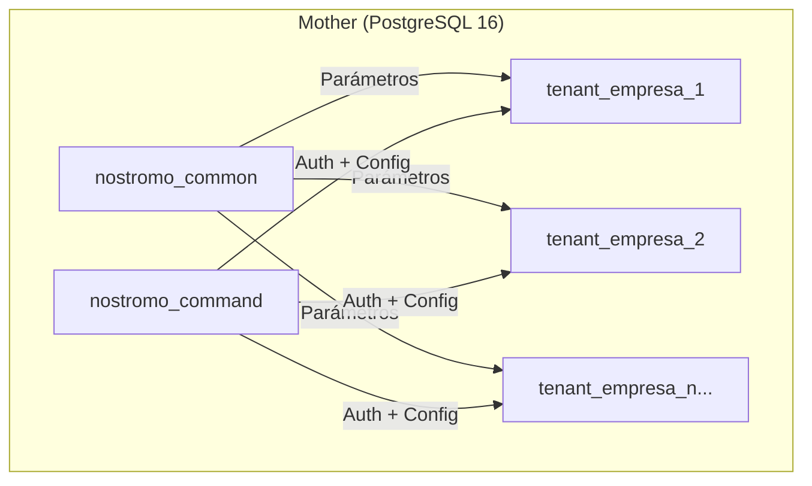

import { Card, CardGrid, Tabs, TabItem, LinkCard, Aside } from '@astrojs/starlight/components';

Mother es el nombre del servicio de base de datos PostgreSQL 16 que actúa como el núcleo de almacenamiento del ecosistema Nostromo. Contiene tanto los datos compartidos del sistema (parámetros, monedas, configuraciones globales) como la lógica de autenticación, autorización y gestión de tenants.

## Arquitectura Multi-Tenant

El sistema implementa un modelo multi-tenant donde una única instancia de PostgreSQL alberga múltiples empresas (tenants) de forma aislada.

<CardGrid>
  <Card title="nostromo_common" icon="setting">
    Base de datos con parámetros compartidos: monedas, tipos de cambio, indicadores económicos, AFPs, ISAPREs, y tablas de referencia.
  </Card>
  <Card title="nostromo_command" icon="rocket">
    Base de datos de control central: autenticación (usuarios, sesiones), gestión de tenants, y monitoreo del sistema.
  </Card>
  <Card title="Databases por Tenant" icon="document">
    Cada empresa tiene su propia base de datos con schema `accounting` aislado, usando template `accunting_template`.
  </Card>
</CardGrid>

## Schemas Principales

<Tabs>
  <TabItem label="nostromo_common">
    ### Schema: parametros
    
    Contiene las tablas maestras de parámetros del sistema chileno:
    
    | Tabla | Descripción |
    |-------|-------------|
    | `monedas` | Tipos de cambio (USD, EUR, UF, UTM) desde Banco Central |
    | `afps` | Administradoras de Fondos de Pensiones con tasas vigentes |
    | `isapres` | Instituciones de salud y planes |
    | `tramos_impuesto` | Tramos de impuesto único de segunda categoría |
    | `topes_imponibles` | Topes para cotizaciones previsionales |
    | `gratificacion` | Parámetros de gratificación legal |
    
    **Functions**: Cálculo de UF a fecha, conversión de monedas, interpolación de tasas.
    
    **Views**: Vista consolidada de parámetros vigentes por período.
  </TabItem>
  
  <TabItem label="nostromo_command">
    ### Schema: auth
    
    Sistema de autenticación y sesiones:
    
    | Tabla | Descripción |
    |-------|-------------|
    | `users` | Usuarios del sistema con hash SCRAM |
    | `user_sessions` | Sesiones activas con JWT y expiración |
    | `user_roles` | Roles asignados por tenant |
    | `refresh_tokens` | Tokens de renovación |
    
    ### Schema: command
    
    Gestión de tenants y configuración:
    
    | Tabla | Descripción |
    |-------|-------------|
    | `tenants` | Empresas registradas con RUT y metadata |
    | `tenant_databases` | Mapping tenant a base de datos |
    | `tenant_config` | Configuración específica por tenant |
    
    ### Schema: monitoring
    
    Métricas y auditoría del sistema.
  </TabItem>
</Tabs>

## Por qué PostgreSQL 16

<Aside type="note">
  PostgreSQL fue elegido sobre otras alternativas por su madurez, extensibilidad y características enterprise.
</Aside>

| Criterio | PostgreSQL 16 | Alternativas |
|----------|---------------|--------------|
| **Autenticación** | SCRAM-SHA-256 nativo | MySQL: caching_sha2 menos probado |
| **Multi-tenant** | Schemas + databases aislados | MongoDB: menos aislamiento nativo |
| **Transacciones** | ACID completo, MVCC | Redis: eventual consistency |
| **Extensiones** | pg_cron, pgbouncer, timescaledb | Limitado en otros RDBMS |
| **Madurez** | 35+ años, battle-tested | Menor track record |
| **Licencia** | PostgreSQL License (libre) | Oracle/SQL Server: costos |

### Características Clave Usadas

- **SCRAM-SHA-256**: Autenticación moderna resistente a ataques de replay
- **Row-Level Security (RLS)**: Aislamiento de datos por tenant a nivel de fila
- **CTEs y Window Functions**: Queries complejos para reportes financieros
- **JSONB**: Almacenamiento flexible para configuraciones dinámicas
- **Full-Text Search**: Búsqueda en documentos y descripciones

## Mejoras Futuras

<CardGrid>
  <LinkCard
    title="pg_cron"
    description="Programación de jobs dentro de PostgreSQL para tareas de mantenimiento automático"
    href="https://github.com/citusdata/pg_cron"
  />
  <LinkCard
    title="PgBouncer"
    description="Connection pooling para manejar más conexiones concurrentes sin overhead"
    href="https://www.pgbouncer.org/"
  />
  <LinkCard
    title="Streaming Replication"
    description="Réplicas de lectura para distribuir carga de queries pesados"
    href="https://www.postgresql.org/docs/16/warm-standby.html"
  />
  <LinkCard
    title="Logical Replication"
    description="Replicación selectiva de datos para analytics o disaster recovery"
    href="https://www.postgresql.org/docs/16/logical-replication.html"
  />
</CardGrid>

<Aside type="tip">
  El container actual ya está preparado con `wal_level = replica` para habilitar replicación cuando sea necesario.
</Aside>

## Referencias

- [Container PostgreSQL](/mother/container-postgresql/) - Configuración del container Docker
- [Nostromo ETL](../../Nostromo/.github/copilot-instructions.md) - Pipeline de datos Python
- [Orchestrator API](/orchestrator/) - Backend que consume Mother
