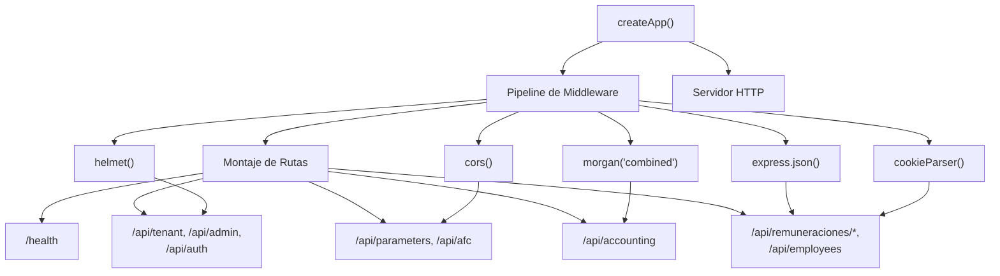
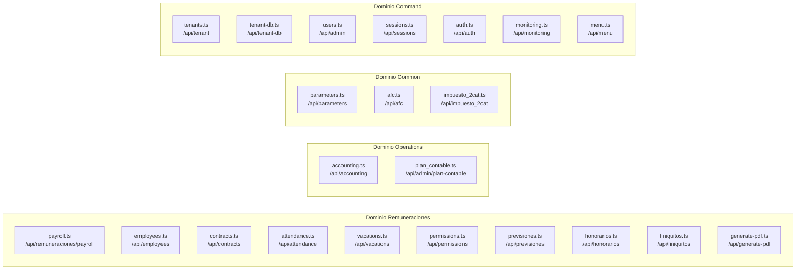
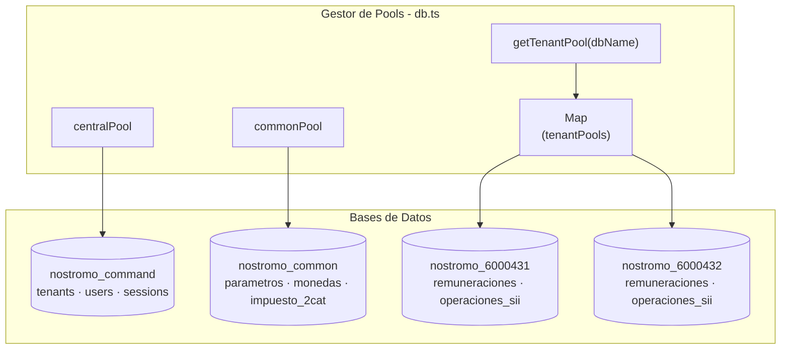
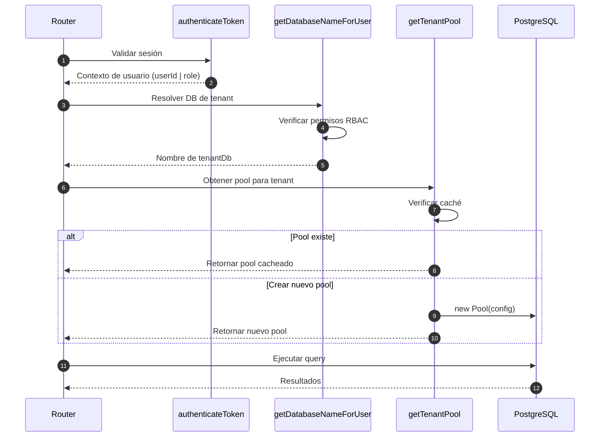
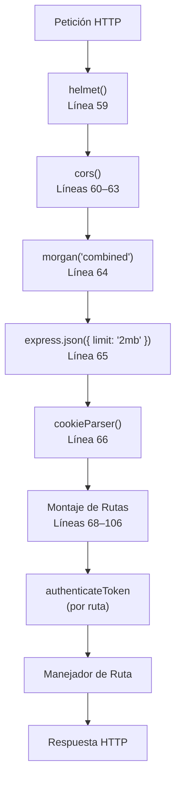
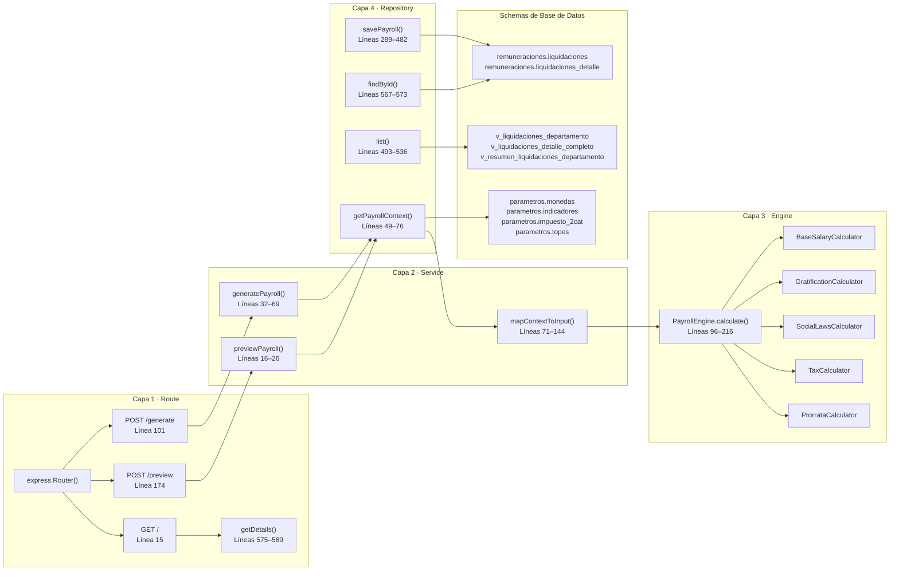

import { FileTree, Steps, Tabs, TabItem } from "@astrojs/starlight/components";

## Propósito y alcance

**Orchestrator** es la puerta de enlace API backend del sistema de contabilidad, construida en **Node.js** con **Express** y **TypeScript** e implementando una arquitectura basada en dominios. Sirve como fuente única de verdad para todas las operaciones de lógica empresarial, validación de datos y bases de datos de múltiples inquilinos. Orchestrator expone los puntos finales RESTful consumidos por la interfaz de Sebastopol y aplica autenticación, autorización y coherencia de datos en todas las operaciones.

Este documento cubre la arquitectura del Orchestrator, la organización del dominio, el flujo de middleware y los patrones de desarrollo. Para obtener información sobre la aplicación frontend, consulte Frontend (Sebastopol). Para obtener detalles sobre dominios específicos como el cálculo de nómina, consulte Sistema de nóminas y recursos humanos.

## Tecnologías

| Paquete           | Versión | Propósito                              |
| ----------------- | ------- | -------------------------------------- |
| express           | 5.1.0   | Marco del servidor HTTP                |
| pg                | 8.16.3  | Cliente PostgreSQL (nodo-postgres)     |
| jsonwebtoken      | 9.0.2   | Manejo de tokens JWT                   |
| bcryptjs          | 3.0.2   | Hashing de contraseñas                 |
| helmet            | 8.1.0   | Middleware de seguridad                |
| cors              | 2.8.5   | Intercambio de recursos entre orígenes |
| morgan            | 1.10.1  | Registro de solicitudes HTTP           |
| express-validator | 7.0.1   | Validación de entrada                  |
| cookie-parser     | 1.4.7   | Análisis de cookies                    |
| dotenv            | 17.2.1  | Variables ambientales                  |
| date-fns          | 4.1.0   | Manipulación de fecha                  |
| puppeteer         | 23.7.0  | Generación de PDF                      |
| jest              | 29.6.1  | Marco de pruebas (dev)                 |
| supertest         | 6.3.3   | Pruebas HTTP (dev)                     |
| typescript        | 5.9.2   | Sistema de tipos (dev)                 |

Tiempo de ejecución: Node.js 20+

## Arquitectura de la Aplicación

### Factoría de Aplicación Express

El Orchestrator utiliza un patrón de factoría para crear la instancia de aplicación Express, habilitando testabilidad y arranque limpio del servidor:



La función `createApp` retorna una aplicación Express configurada sin iniciar el servidor, permitiendo importarla para testing:

### Organización de Rutas Orientada al Dominio

Las rutas están organizadas por dominio de negocio, con cada archivo de ruta importado y montado en `app.ts`:

Registro Completo de Rutas:

| Prefijo de Ruta             | Ruta de Archivo                           | Dominio                            | Schema de Base de Datos        |
| --------------------------- | ----------------------------------------- | ---------------------------------- | ------------------------------ |
| /api/tenant                 | routes/command/tenant.ts                  | Command                            | command.tenants                |
| /api/tenant-db              | routes/command/tenant-db.ts               | Command                            | command.tenant_databases       |
| /api/admin                  | routes/command/users.ts                   | Command                            | command.users                  |
| /api/sessions               | routes/command/sessions.ts                | Command                            | command.sessions               |
| /api/monitoring             | routes/command/monitoring.ts              | Command                            | Métricas del sistema           |
| /api/auth                   | routes/command/auth.ts                    | Command                            | Autenticación                  |
| /api/menu                   | routes/command/menu.ts                    | Command                            | Menús dinámicos                |
| /api/parameters             | routes/common/parameters.ts               | Common                             | parametros.indicadores         |
| /api/afc                    | routes/common/afc.ts                      | Common                             | parametros.afc                 |
| /api/impuesto_2cat          | routes/common/impuesto_2cat.ts            | Common                             | parametros.impuesto_2cat       |
| /api/accounting             | routes/accounting.ts                      | Operations                         | operaciones_sii.\*             |
| /api/afp                    | routes/remuneraciones/afp.ts              | Remuneraciones                     | remuneraciones.afp             |
| /api/attendance             | routes/remuneraciones/attendance.ts       | Remuneraciones                     | remuneraciones.asistencia_dia  |
| /api/cargos                 | routes/remuneraciones/cargos.ts           | Remuneraciones                     | remuneraciones.cargos          |
| /api/contracts              | routes/remuneraciones/contracts.ts        | Remuneraciones                     | remuneraciones.contratos       |
| /api/departments            | routes/remuneraciones/departments.ts      | Remuneraciones                     | remuneraciones.departamentos   |
| /api/employees              | routes/remuneraciones/employees.ts        | Remuneraciones                     | remuneraciones.empleados       |
| /api/apv_contracts          | routes/remuneraciones/apv_contracts.ts    | Remuneraciones                     | remuneraciones.contrato_apv    |
| /api/isapre_contracts       | routes/remuneraciones/isapre_contracts.ts | Remuneraciones                     | remuneraciones.contrato_isapre |
| /api/isapre                 | routes/remuneraciones/isapre.ts           | Remuneraciones                     | remuneraciones.isapre          |
| /api/remuneraciones/payroll | routes/remuneraciones/payroll.ts          | Remuneraciones                     | remuneraciones.liquidaciones   |
| /api/permissions            | routes/remuneraciones/permissions.ts      | Remuneraciones                     | remuneraciones.permisos        |
| /api/previsiones            | routes/remuneraciones/previsiones.ts      | Remuneraciones                     | Seguridad social agregada      |
| /api/honorarios             | routes/remuneraciones/honorarios.ts       | Remuneraciones                     | remuneraciones.honorarios      |
| /api/vacations              | routes/remuneraciones/vacations.ts        | Remuneraciones                     | remuneraciones.vacaciones      |
| /api/working_day            | routes/remuneraciones/working_day.ts      | Remuneraciones                     | remuneraciones.jornadas        |
| /api/generate-pdf           | routes/remuneraciones/generate-pdf.ts     | Remuneraciones                     | Generación de PDF              |
| /api/finiquitos             | routes/remuneraciones/finiquitos.ts       | Remuneraciones                     | remuneraciones.finiquitos      |
| /api/admin/plan-contable    | routes/admin/plan_contable.ts             | Admin administracion.plan_contable |

### Patrón de Organización de Dominios:



---

## Multi-Tenencia y Gestión de Bases de Datos

### Arquitectura de Pools de Base de Datos

El Orchestrator gestiona tres tipos de pools de conexión PostgreSQL:



Características de los Pools:

| Tipo de Pool  | Singleton | Propósito                                    | Configuración                              |
| ------------- | --------- | -------------------------------------------- | ------------------------------------------ |
| `centralPool` | Sí        | Datos del sistema (usuarios, tenants)        | Creado al inicio                           |
| `commonPool`  | Sí        | Datos de referencia compartidos (parámetros) | Creado al inicio                           |
| `TenantPools` | Cacheados | Datos de negocio aislados por tenant         | Creados bajo demanda, cacheados en memoria |

La función `getTenantPool` implementa una estrategia de caché para reutilizar conexiones:

### Flujo de Resolución de Tenant



Funciones Clave:

`authenticateToken` - Valida cookie de sesión y adjunta contexto de usuario a la petición
`getDatabaseNameForUser` - Determina a qué base de datos de tenant puede acceder el usuario
`getTenantPool` - Retorna o crea un pool de conexión cacheado para el tenant

---

## Pipeline de Middleware

El stack de middleware procesa las peticiones en el siguiente orden:

Pipeline de Middleware (desde `createApp()`):



Configuración Global de Middleware:

| Línea | Middleware                                   | Propósito                                | Configuración                                  |
| ----- | -------------------------------------------- | ---------------------------------------- | ---------------------------------------------- |
| 59    | `helmet()`                                   | Headers de seguridad (XSS, CSP, HSTS)    | Configuración por defecto                      |
| 60-63 | `cors({ origin: [...], credentials: true })` | CORS para frontend                       | localhost:4321, localhost:4322, localhost:4320 |
| 64    | `morgan('combined')`                         | Logging de peticiones HTTP estilo Apache | Salida a consola                               |
| 65    | `express.json({ limit: '2mb' })`             | Parsear cuerpos de petición JSON         | Max payload: 2MB                               |
| 66    | `cookieParser()`                             | Parsear cookies desde header Cookie      | Habilita `req.cookies`                         |

Autenticación por Ruta:

Las rutas protegidas usan el middleware `authenticateToken` de `src/middleware/auth.ts`:

```typescript
// Patrón usado en todas las rutas protegidas (ej., payroll.ts línea 10)
router.use(authenticateToken);

// O aplicado a rutas individuales
router.get("/", authenticateToken, async (req: AuthenticatedRequest, res) => {
  const user = req.user!; // user: { userId, username, role }
  // ... lógica de ruta
});
```

El middleware authenticateToken:

1. Extrae JWT de la cookie `sid`
2. Verifica firma y expiración
3. Adjunta contexto de usuario a `req.user`
4. Retorna `401 Unauthorized` si el token es inválido

---

## Estructura de Dominios: Arquitectura en Capas

El Orchestrator implementa una arquitectura Hybrid Core donde la lógica de negocio compleja se ejecuta en TypeScript (Engine Layer) mientras que las operaciones de datos masivos se delegan a PostgreSQL (Smart Views). Este patrón es más visible en el dominio de Remuneraciones:

#### Dominio de Remuneraciones: Arquitectura de 4 Capas



Responsabilidades por Capa:

| Capa       | Archivo              | Funciones Clave                                  | Acceso a Base de Datos | Testabilidad    |
| ---------- | -------------------- | ------------------------------------------------ | ---------------------- | --------------- |
| Route      | payroll.ts           | Manejo de peticiones HTTP, formato de respuestas | Vía Service/Repository | E2E (Supertest) |
| Service    | PayrollService.ts    | Orquestación, transformación de datos            | Vía Repository         | Integración     |
| Engine     | PayrollEngine.ts     | Cálculo puro, reglas de negocio                  | Ninguno                | Unit tests      |
| Repository | PayrollRepository.ts | Queries SQL, mapeo de datos                      | Directo (Pool)         | Integración     |

Ejemplo de Flujo de Ejecución (POST /generar):

1. **Capa Route** (`payroll.ts:101-132`): Parsear petición, validar `contrato_id` y `periodo_mes`
2. **Capa Service** (`PayrollService.ts:32-69`): Llamar `getPayrollContext()` → `mapContextToInput()` → `calculate()` → `savePayroll()`
3. **Capa Engine** (`PayrollEngine.ts:96-216`): Ejecutar 8 calculadores en secuencia, retornar PayrollResult
4. **Capa Repository** (`PayrollRepository.ts:49-76, 289-482`): Obtener datos de contexto, persistir liquidación + detalles

#### El Principio Hybrid Core

El sistema divide estratégicamente la responsabilidad entre TypeScript y PostgreSQL:

**TypeScript (Engine Layer) - "Escrituras y Lógica":**

- Cálculos complejos (remuneraciones, impuestos, prorrateo)
- Validación de reglas de negocio (rangos de fechas, umbrales)
- Workflows multi-paso (generar → validar → persistir)
- Completamente testeable en aislamiento (no requiere base de datos)

**PostgreSQL (Smart Views) - "Lecturas y Reportes":**

- Recuperación masiva de datos con filtrado
- Agregaciones y resúmenes
- Joins complejos entre tablas normalizadas
- Vistas pre-computadas para performance

**Hybrid Core en Acción - Ejemplo de Remuneraciones:**

Cálculo en TypeScript (Engine):

```typescript
// PayrollEngine.calculate() - Líneas 96-216
// SIN acceso a base de datos, función pura
static calculate(input: PayrollInput): PayrollResult {
  // 1. Calcular sueldo base prorrateado
  const salary = BaseSalaryCalculator.calculate(
    input.sueldo_base,
    input.sueldo_minimo,
    input.dias_trabajados
  );

  // 2. Calcular horas extras (50% y 100%)
  const factorHora = (1 / 30 * 28) / input.work_hours;
  const valorHora = Math.round(input.sueldo_base * factorHora);
  const amountHex50 = Math.round(input.horas_extra_50 * valorHora * 1.5);

  // 3. Calcular gratificación (25% o 4.75 SMM)
  const gratification = GratificationCalculator.calculate(...);

  // 4. Calcular leyes sociales (AFP, Salud, AFC)
  const socialLaws = SocialLawsCalculator.calculate(...);

  // 5. Calcular impuesto progresivo
  const tax = TaxCalculator.calculate(...);

  return { total_liquido, total_haberes, total_descuentos, ... };
}
```

**Vista Inteligente de PostgreSQL (Repository):**

```typescript
// PayrollRepository.list() - Líneas 493-536
// Delega filtrado/agregación a la base de datos
static async list(db: Pool, filters: {...}): Promise<any[]> {
  const { rows } = await db.query(`
    SELECT * FROM remuneraciones.v_liquidaciones_departamento
    WHERE año = $1 AND mes = $2
      AND unaccent(lower(empleado_nombre)) LIKE unaccent(lower($3))
    ORDER BY año DESC, mes DESC, empleado_nombre ASC
    LIMIT $4 OFFSET $5
  `, [año, mes, `%${empleado_nombre}%`, limit, offset]);

  return rows; // La vista ya hace joins de empleados, contratos, departamentos
}
```

Principio Clave: Las escrituras (cálculos) ocurren en TypeScript para testabilidad. Las lecturas (consultas) ocurren en PostgreSQL para performance.

---

## Patrones y Convenciones de API

### Patrón Estándar de Ruta

Todas las rutas siguen una estructura consistente demostrada en `payroll.ts`:

```typescript
// 1. Importar dependencias (Líneas 1-7)
import express from "express";
import { getTenantPool } from "@/lib/db";
import { authenticateToken, AuthenticatedRequest } from "@/middleware/auth";
import { getDatabaseNameForUser } from "@/lib/tenantResolver";
import { PayrollService } from "@/domain/payroll/PayrollService";
import { PayrollRepository } from "@/domain/payroll/PayrollRepository";

// 2. Crear router (Línea 9)
const router = express.Router();

// 3. Aplicar middleware de autenticación globalmente (Línea 10)
router.use(authenticateToken);

// 4. Definir endpoints (Líneas 14-43)
router.get("/", async (req: AuthenticatedRequest, res) => {
  try {
    // 4a. Resolver base de datos de tenant
    const db = await getDatabaseNameForUser(req.user, req);
    const pool = getTenantPool(db);

    // 4b. Verificar existencia de vista (opcional, por seguridad)
    if (
      !(await PayrollRepository.checkViewExists(
        pool,
        "remuneraciones.v_liquidaciones_departamento"
      ))
    ) {
      return res.status(501).json({ error: "Vista no disponible" });
    }

    // 4c. Parsear parámetros de query
    const q = req.query;
    const rows = await PayrollRepository.list(pool, {
      año: Number(q.año ?? q.anio ?? q.year) || undefined,
      mes: Number(q.mes ?? q.month) || undefined,
      empleado_id: q.empleado_id as string,
      estado: q.estado as string,
      limit: parseInt((q.limit as string) || "2000"),
      offset: parseInt((q.offset as string) || "0"),
    });

    // 4d. Retornar respuesta
    res.json(rows);
  } catch (e: any) {
    res.status(500).json({ error: e.message });
  }
});

// 5. Exportar router (Línea 197)
export default router;
```

#### Patrones Comunes entre Rutas:

| Patrón                    | Implementación                                | Ubicación de Ejemplo |
| ------------------------- | --------------------------------------------- | -------------------- |
| Autenticación             | router.use(authenticateToken)                 | Línea 10             |
| Resolución de Tenant      | getDatabaseNameForUser(req.user, req)         | Línea 17             |
| Obtención de Pool         | getTenantPool(db)                             | Línea 18             |
| Parseo de Params de Query | Number(q.año ?? q.anio ?? q.year)             | Líneas 26-33         |
| Manejo de Errores         | try/catch con res.status(500).json({ error }) | Líneas 15-42         |
| Validación                | Verificar existencia antes de operaciones     | Líneas 20-23         |

### Formatos de Respuesta

#### Respuesta Exitosa:

```json
{
  "success": true,
  "data": {
    /* payload */
  },
  "meta": {
    /* paginación, etc */
  }
}
```

#### Respuesta Error:

```json
{
  "success": false,
  "error": "ERROR_CODE",
  "message": "Descripción legible para humanos"
}
```

#### Códigos de Estado HTTP:

| Código                    | Uso                            | Ejemplo                           |
| ------------------------- | ------------------------------ | --------------------------------- |
| 200 OK                    | GET/PUT exitoso                | Listar liquidaciones              |
| 201 Created               | POST exitoso                   | Crear un tenant                   |
| 204 No Content            | DELETE exitoso                 | Eliminar registro de nómina       |
| 400 Bad Request           | Payload inválido               | Falta campos requeridos           |
| 401 Unauthorized          | Token faltante/inválido        | Sin cookie sid                    |
| 403 Forbidden             | Token válido pero sin permisos | Rol de usuario insuficiente       |
| 404 Not Found             | Recurso no existe              | ID de empleado no encontrado      |
| 500 Internal Server Error | Error del servidor             | Fallo de conexión a base de datos |

### Convenciones de Nomenclatura

El Orchestrator mantiene consistencia entre dominios y respuestas de API:

#### Interno (Lógica de Dominio):

- TypeScript usa `camelCase` para variables, funciones, clases
- Ejemplo:`totalAssets`, `baseSalary`, `PayrollEngine`

####Base de Datos:

- PostgreSQL usa `snake_case` para todos los identificadores
- Ejemplo: `total_haberes`, `sueldo_base`, liquidaciones_detalle`

#### Respuestas de API:

- Siempre retornan `snake_case` coincidiendo con la estructura de base de datos
- Elimina capa de transformación, simplifica integración con frontend

```typescript
// Cálculo de dominio (camelCase)
const result = { totalAssets: 1000, baseSalary: 800 };

// Respuesta de API (snake_case)
res.json({ total_haberes: result.totalAssets, sueldo_base: result.baseSalary });
```

---

## Flujo de Trabajo de Desarrollo

### Scripts NPM

| Comando                    | Propósito                             | Implementación                                     |
| -------------------------- | ------------------------------------- | -------------------------------------------------- |
| `npm run dev`              | Servidor de desarrollo con hot reload | `nodemon -r tsconfig-paths/register src/server.ts` |
| `npm run build`            | Compilar TypeScript a JavaScript      | `tsc (salida: dist/)`                              |
| `npm start`                | Servidor de producción                | `node dist/server.js`                              |
| `npm run test`             | Ejecutar solo unit tests              | `jest --testMatch="**/*.unit.test.ts"`             |
| `npm run test:all`         | Ejecutar todos los tests              | `jest (incluye unit + integration)`                |
| `npm run test:unit`        | Unit tests explícitos                 | `jest --testMatch="**/*.unit.test.ts"`             |
| `npm run test:integration` | Solo integration tests                | `jest --testMatch="**/*.integration.test.ts"`      |
| `npm run test:domain`      | Testear capa de dominio               | `jest --testPathPattern=src/domain`                |
| `npm run test:payroll`     | Testear dominio de remuneraciones     | `jest --testPathPattern=src/domain/payroll`        |
| `npm run test:honorarios`  | Testear dominio de honorarios         | `jest --testPathPattern=src/domain/honorarios`     |
| `npm run test:previsions`  | Testear dominio de previsiones        | `jest --testPathPattern=src/domain/previsions`     |
| `npm run test:finiquitos`  | Testear dominio de finiquitos         | `jest --testPathPattern=src/domain/finiquitos`     |
| `npm run test:watch`       | Modo watch                            | `jest --watch (auto-ejecutar al cambiar)`          |

Organización de Pruebas:

- Unit tests: `*.unit.test.ts` - Funciones puras, sin base de datos
- Integration tests: `*.integration.test.ts` - Capa de repositorio con base de datos
- E2E tests: `*.e2e.test.ts` - Ciclo completo de petición/respuesta HTTP

### Estrategia de Testing

El Orchestrator usa Jest con diferentes patrones de test:

#### Unit Tests (`*.unit.test.ts`):

- Testean funciones puras en la capa Engine
- No requieren base de datos
- Ejecución rápida (&lt;100ms por test)
- Ejemplo: `PayrollEngine.test.ts`

#### Integration Tests (`*.integration.test.ts`):

- Testean capa de Repository con base de datos real
- Usan base de datos de test o transacciones
- Verifican queries SQL y mapeo de datos

#### E2E Tests (`*.e2e.test.ts`):

- Testean ciclo completo de petición/respuesta HTTP
- Usan Supertest para hacer peticiones
- Ejemplo: users.e2e.test.ts

#### Requerimientos de Cobertura:

- Endpoints críticos: 100% (auth, generación de nómina)
- Capa de Repository: 70%+ (queries SQL)
- Capa de Engine: 90%+ (lógica de negocio)

## Estructura del Proyecto

<FileTree>

- orchestrator/
  - src/
    - app.ts # Factoría de aplicación Express (createApp)
    - server.ts # Arranque del servidor HTTP
    - lib/
      - db.ts # Gestión de pools (centralPool, commonPool, getTenantPool)
      - rbac.ts # Control de acceso basado en roles
      - tenantResolver.ts # getDatabaseNameForUser()
      - accessControl.ts # Verificaciones de permisos
    - middleware/
      - auth.ts # authenticateToken, AuthenticatedRequest
      - authorization.ts # authorizeRoute
    - domain/ — **Capa de Dominio (DDD)**
      - afp/ — AFP y Previsión
        - AfpRepository.ts
        - AfpService.ts
        - \_\_tests\_\_/
      - attendance/ — Control de Asistencia
        - AttendanceRepository.ts
        - AttendanceService.ts
        - \_\_tests\_\_/
      - cargos/ — Gestión de Cargos
        - CargoRepository.ts
        - CargoService.ts
        - \_\_tests\_\_/
      - command/ — **Gestión del Sistema**
        - MonitoringRepository.ts
        - MonitoringService.ts
        - SessionRepository.ts
        - SessionService.ts
        - TenantRepository.ts
        - TenantService.ts
        - types.ts
        - \_\_tests\_\_/
      - contracts/ — Contratos Laborales
        - ContractGenerator.ts
        - ContractRepository.ts
        - ContractService.ts
        - \_\_tests\_\_/
      - employees/ — Maestro de Empleados
        - EmployeeRepository.ts
        - EmployeeService.ts
        - \_\_tests\_\_/
      - finiquitos/ # Pagos de finiquito
        - FiniquitoCalculator.ts
        - FiniquitoRepository.ts
        - FiniquitoService.ts
        - \_\_tests\_\_/
      - honorarios/ # Dominio de honorarios
        - HonorariosRepository.ts
        - HonorariosService.ts
        - types.ts
        - \_\_tests\_\_/
      - isapre/ — Instituciones de Salud
        - IsapreRepository.ts
        - IsapreService.ts
        - \_\_tests\_\_/
      - payroll/
        - PayrollService.ts # generatePayroll(), previewPayroll()
        - PayrollEngine.ts # calculate() - función pura
        - PayrollRepository.ts # getPayrollContext(), savePayroll(), list()
        - types.ts # ContractType, HealthMode, GratificationMode
        - calculators/
          - BaseSalaryCalculator.ts
          - GratificationCalculator.ts
          - SocialLawsCalculator.ts
          - TaxCalculator.ts
          - ProrrataCalculator.ts
      - permissions/ — Permisos y Licencias
        - PermissionRepository.ts
        - PermissionService.ts
        - \_\_tests\_\_/
      - previsions/ # Agregaciones de seguridad social
        - ApvRepository.ts
        - ApvService.ts
        - PrevisionsRepository.ts
        - PrevisionsService.ts
        - types.ts
        - \_\_tests\_\_/
      - vacations/ — Vacaciones
        - VacationRepository.ts
        - VacationService.ts
        - \_\_tests\_\_/
      - working_day/ — Jornadas Laborales
        - WorkingDayRepository.ts
        - WorkingDayService.ts
        - \_\_tests\_\_/
    - routes/
      - command/ # 7 rutas (tenant, users, auth, sessions, etc.)
        - tenant.ts # /api/tenant
        - tenant-db.ts # /api/tenant-db
        - users.ts # /api/admin
        - sessions.ts # /api/sessions
        - monitoring.ts # /api/monitoring
        - auth.ts # /api/auth
        - menu.ts # /api/menu
      - common/ # 3 rutas (parameters, afc, impuesto)
        - parameters.ts # /api/parameters
        - afc.ts # /api/afc
        - impuesto_2cat.ts # /api/impuesto_2cat
      - accounting.ts # /api/accounting
      - remuneraciones/ # 18 rutas (payroll, employees, contracts, etc.)
        - payroll.ts # /api/remuneraciones/payroll
        - employees.ts # /api/employees
        - contracts.ts # /api/contracts
        - attendance.ts # /api/attendance
        - vacations.ts # /api/vacations
        - permissions.ts # /api/permissions
        - previsiones.ts # /api/previsiones
        - honorarios.ts # /api/honorarios
        - finiquitos.ts # /api/finiquitos
        - generate-pdf.ts # /api/generate-pdf
        - afp.ts # /api/afp
        - isapre.ts # /api/isapre
        - apv_contracts.ts # /api/apv_contracts
        - isapre_contracts.ts # /api/isapre_contracts
        - cargos.ts # /api/cargos
        - departments.ts # /api/departments
        - working_day.ts # /api/working_day
      - admin/
        - plan_contable.ts # /api/admin/plan-contable
    - tests/
      - \*.unit.test.ts # Tests de funciones puras
      - \*.integration.test.ts # Tests de integración con base de datos
      - \*.e2e.test.ts # Tests de endpoints HTTP
    - storage/
      - liquidaciones/ # PDFs de nómina generados
  - package.json # Dependencias + scripts
  - tsconfig.json # Configuración TypeScript
  - jest.orchestrator.config.js # Configuración de tests Jest

</FileTree>

#### Alias de Rutas de TypeScript (tsconfig.json):

- `@/lib/*` → `src/lib/*`
- `@/middleware/*` → `src/middleware/*`
- `@/domain/*` → `src/domain/*`
- `@/routes/*` → `src/routes/*`

## Scripts Disponibles

Comandos para desarrollo, build y testing.

| Comando             | Descripción                           | Ejecución                   |
| :------------------ | :------------------------------------ | :-------------------------- |
| `dev`               | Servidor de desarrollo con hot-reload | `npm run dev`               |
| `build`             | Compila TypeScript a JavaScript       | `npm run build`             |
| `start`             | Inicia el servidor compilado          | `npm run start`             |
| `test:orchestrator` | Runner principal de tests             | `npm run test:orchestrator` |
| `test:payroll`      | Tests del dominio de remuneraciones   | `npm run test:payroll`      |
| `test:domain`       | Tests de todos los dominios           | `npm run test:domain`       |

## Resumen

El Orchestrator implementa un backend robusto multi-tenant con clara separación entre manejo HTTP (Routes), orquestación de negocio (Services), cálculo puro (Engines) y acceso a datos (Repositories). La arquitectura Hybrid Core balancea testabilidad con performance ejecutando lógica compleja en TypeScript mientras delega operaciones de datos masivos a Vistas Inteligentes de PostgreSQL. Todos los endpoints refuerzan autenticación, autorización y aislamiento de tenant, asegurando la seguridad de datos a través del sistema multi-tenant.
