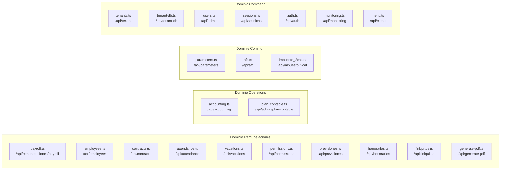
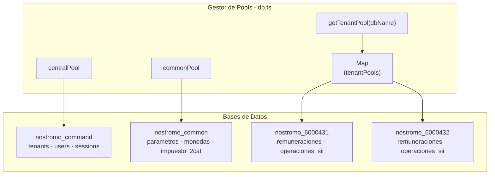
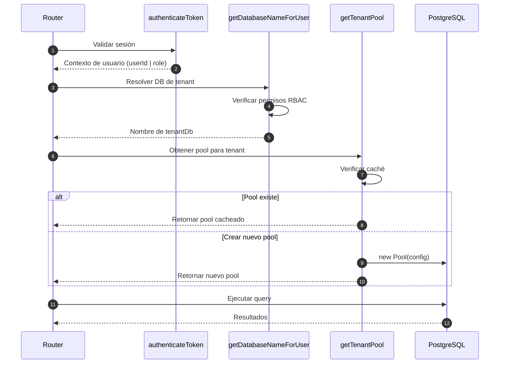
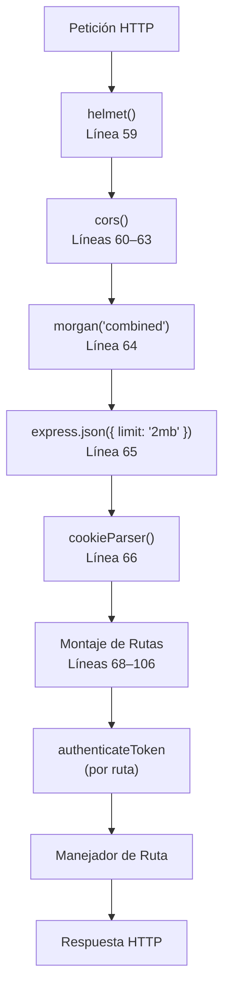

import { FileTree, Steps, Tabs, TabItem } from "@astrojs/starlight/components";

## Propósito y alcance

**Orchestrator** es la puerta de enlace API backend del sistema de contabilidad, construida en **Node.js** con **Express** y **TypeScript** e implementando una arquitectura basada en dominios. Sirve como fuente única de verdad para todas las operaciones de lógica empresarial, validación de datos y bases de datos de múltiples inquilinos. Orchestrator expone los puntos finales RESTful consumidos por la interfaz de Sebastopol y aplica autenticación, autorización y coherencia de datos en todas las operaciones.

Este documento cubre la arquitectura del Orchestrator, la organización del dominio, el flujo de middleware y los patrones de desarrollo. Para obtener información sobre la aplicación frontend, consulte Frontend (Sebastopol). Para obtener detalles sobre dominios específicos como el cálculo de nómina, consulte Sistema de nóminas y recursos humanos.

## Tecnologías

| Paquete |	Versión | Propósito  |
| --- | --- | --- |
| express	| 5.1.0	| Marco del servidor HTTP |
| pg	| 8.16.3	| Cliente PostgreSQL (nodo-postgres) |
| jsonwebtoken	| 9.0.2	| Manejo de tokens JWT |
| bcryptjs	| 3.0.2	| Hashing de contraseñas |
| helmet	| 8.1.0	| Middleware de seguridad |
| cors	| 2.8.5	| Intercambio de recursos entre orígenes |
| morgan	| 1.10.1	| Registro de solicitudes HTTP |
| express-validator	| 7.0.1	| Validación de entrada |
| cookie-parser	| 1.4.7	| Análisis de cookies |
| dotenv	| 17.2.1	| Variables ambientales |
| date-fns	| 4.1.0	| Manipulación de fecha |
| puppeteer	| 23.7.0	| Generación de PDF |
| jest	| 29.6.1	| Marco de pruebas (dev) |
| supertest	| 6.3.3	| Pruebas HTTP (dev) |
| typescript	| 5.9.2	| Sistema de tipos (dev) |

Tiempo de ejecución: Node.js 20+

## Arquitectura de la Aplicación

### Factoría de Aplicación Express

El Orchestrator utiliza un patrón de factoría para crear la instancia de aplicación Express, habilitando testabilidad y arranque limpio del servidor:

```mermaid
flowchart TB
  A[createApp()] --> P[Pipeline de Middleware]
  A --> H[Servidor HTTP]

  P --> R[Montaje de Rutas]
  P --> HM[helmet()]
  P --> CS[cors()]
  P --> MG["morgan('combined')"]
  P --> EJ[express.json()]
  P --> CP[cookieParser()]

  %% Rutas
  R --> HE["/health"]
  R --> TA["/api/tenant, /api/admin,<br/>/api/auth"]
  R --> PA["/api/parameters, /api/afc"]
  R --> AC["/api/accounting"]
  R --> RE["/api/remuneraciones/*,<br/>/api/employees"]

  %% Relación middleware -> grupos (como en el diagrama)
  HM --> TA
  CS --> PA
  MG --> AC
  EJ --> RE
  CP --> RE
```

La función `createApp` retorna una aplicación Express configurada sin iniciar el servidor, permitiendo importarla para testing:

### Organización de Rutas Orientada al Dominio

Las rutas están organizadas por dominio de negocio, con cada archivo de ruta importado y montado en `app.ts`:

Registro Completo de Rutas:

| Prefijo de Ruta	| Ruta de Archivo	| Dominio	| Schema de Base de Datos |
| --- | --- | --- | --- |
| /api/tenant	| routes/command/tenant.ts |	Command |	command.tenants |
| /api/tenant-db |	routes/command/tenant-db.ts |	Command | command.tenant_databases |
| /api/admin |	routes/command/users.ts	| Command | command.users |
| /api/sessions |	routes/command/sessions.ts |	Command |	command.sessions |
| /api/monitoring	| routes/command/monitoring.ts | Command | Métricas del sistema |
| /api/auth	| routes/command/auth.ts |	Command	| Autenticación |
| /api/menu	| routes/command/menu.ts	| Command	| Menús dinámicos |
| /api/parameters	| routes/common/parameters.ts	| Common  |	parametros.indicadores |
| /api/afc	| routes/common/afc.ts	| Common |	parametros.afc |
| /api/impuesto_2cat	| routes/common/impuesto_2cat.ts	| Common |	parametros.impuesto_2cat |
| /api/accounting	| routes/accounting.ts	| Operations |	operaciones_sii.* |
| /api/afp	| routes/remuneraciones/afp.ts	| Remuneraciones |	remuneraciones.afp |
| /api/attendance	| routes/remuneraciones/attendance.ts	| Remuneraciones |	remuneraciones.asistencia_dia |
| /api/cargos	| routes/remuneraciones/cargos.ts	| Remuneraciones |	remuneraciones.cargos |
| /api/contracts |	routes/remuneraciones/contracts.ts |	Remuneraciones	| remuneraciones.contratos |
| /api/departments	| routes/remuneraciones/departments.ts	| Remuneraciones	| remuneraciones.departamentos |
| /api/employees	| routes/remuneraciones/employees.ts	| Remuneraciones	| remuneraciones.empleados |
| /api/apv_contracts	| routes/remuneraciones/apv_contracts.ts	| Remuneraciones	| remuneraciones.contrato_apv |
| /api/isapre_contracts	| routes/remuneraciones/isapre_contracts.ts	| Remuneraciones	| remuneraciones.contrato_isapre |
| /api/isapre	| routes/remuneraciones/isapre.ts	| Remuneraciones	| remuneraciones.isapre |
| /api/remuneraciones/payroll	| routes/remuneraciones/payroll.ts	| Remuneraciones	| remuneraciones.liquidaciones |
| /api/permissions	| routes/remuneraciones/permissions.ts	| Remuneraciones	| remuneraciones.permisos |
| /api/previsiones	| routes/remuneraciones/previsiones.ts	| Remuneraciones	| Seguridad social agregada |
| /api/honorarios	| routes/remuneraciones/honorarios.ts	| Remuneraciones	| remuneraciones.honorarios |
| /api/vacations	| routes/remuneraciones/vacations.ts	| Remuneraciones	| remuneraciones.vacaciones |
| /api/working_day	| routes/remuneraciones/working_day.ts	| Remuneraciones	| remuneraciones.jornadas |
| /api/generate-pdf	| routes/remuneraciones/generate-pdf.ts	| Remuneraciones	| Generación de PDF |
| /api/finiquitos	| routes/remuneraciones/finiquitos.ts	| Remuneraciones	| remuneraciones.finiquitos |
| /api/admin/plan-contable	| routes/admin/plan_contable.ts	| Admin	administracion.plan_contable |


### Patrón de Organización de Dominios:


---

## Multi-Tenencia y Gestión de Bases de Datos

### Arquitectura de Pools de Base de Datos

El Orchestrator gestiona tres tipos de pools de conexión PostgreSQL:



Características de los Pools:

| Tipo de Pool	| Singleton	| Propósito	| Configuración |
| --- | --- | --- | --- |
| `centralPool`	| Sí	| Datos del sistema (usuarios, tenants)	| Creado al inicio |
| `commonPool`	| Sí	| Datos de referencia compartidos (parámetros)	| Creado al inicio |
| `TenantPools`	| Cacheados	| Datos de negocio aislados por tenant	| Creados bajo demanda, cacheados en memoria |

La función `getTenantPool` implementa una estrategia de caché para reutilizar conexiones:

### Flujo de Resolución de Tenant



Funciones Clave:

`authenticateToken` - Valida cookie de sesión y adjunta contexto de usuario a la petición
`getDatabaseNameForUser` - Determina a qué base de datos de tenant puede acceder el usuario
`getTenantPool` - Retorna o crea un pool de conexión cacheado para el tenant

---

## Pipeline de Middleware

El stack de middleware procesa las peticiones en el siguiente orden:

Pipeline de Middleware (desde `createApp()`):



Configuración Global de Middleware:

| Línea	| Middleware	| Propósito	| Configuración |
| --- | --- | --- | --- | 
| 59 | helmet() | Headers de seguridad (XSS, CSP, HSTS) | Configuración por defecto |
| 60-63 | cors({ origin: [...], credentials: true }) | CORS para frontend | localhost:4321, localhost:4322, localhost:4320 |
| 64 | morgan('combined') | Logging de peticiones HTTP estilo Apache | Salida a consola |
| 65 | express.json({ limit: '2mb' }) | Parsear cuerpos de petición JSON | Max payload: 2MB |
| 66 | cookieParser() | Parsear cookies desde header Cookie | Habilita req.cookies |

Autenticación por Ruta:

Las rutas protegidas usan el middleware `authenticateToken` de `src/middleware/auth.ts`:


```typescript
// Patrón usado en todas las rutas protegidas (ej., payroll.ts línea 10)
router.use(authenticateToken);

// O aplicado a rutas individuales
router.get('/', authenticateToken, async (req: AuthenticatedRequest, res) => {
  const user = req.user!; // user: { userId, username, role }
  // ... lógica de ruta
});
```

### Estrategia de Testing
El Orchestrator usa Jest con diferentes patrones de test:

Unit Tests (`*.unit.test.ts`):

- Testean funciones puras en la capa Engine
- No requieren base de datos
- Ejecución rápida (<100ms por test)
- Ejemplo: `PayrollEngine.test.ts`

Integration Tests (`*.integration.test.ts`):

- Testean capa de Repository con base de datos real
- Usan base de datos de test o transacciones
- Verifican queries SQL y mapeo de datos

E2E Tests (`*.e2e.test.ts`):

- Testean ciclo completo de petición/respuesta HTTP
- Usan Supertest para hacer peticiones
- Ejemplo: users.e2e.test.ts

Requerimientos de Cobertura:

- Endpoints críticos: 100% (auth, generación de nómina)
- Capa de Repository: 70%+ (queries SQL)
- Capa de Engine: 90%+ (lógica de negocio)

## Estructura del Proyecto

<FileTree>

- src/
  - app.ts — Configuración Express
  - server.ts — Entry point
  - domain/ — **Capa de Dominio (DDD)**
    - afp/ — AFP y Previsión
      - AfpRepository.ts
      - AfpService.ts
      - \_\_tests\_\_/
    - attendance/ — Control de Asistencia
      - AttendanceRepository.ts
      - AttendanceService.ts
      - \_\_tests\_\_/
    - cargos/ — Gestión de Cargos
      - CargoRepository.ts
      - CargoService.ts
      - \_\_tests\_\_/
    - command/ — **Gestión del Sistema**
      - MonitoringRepository.ts
      - MonitoringService.ts
      - SessionRepository.ts
      - SessionService.ts
      - TenantRepository.ts
      - TenantService.ts
      - types.ts
      - \_\_tests\_\_/
    - contracts/ — Contratos Laborales
      - ContractGenerator.ts
      - ContractRepository.ts
      - ContractService.ts
      - \_\_tests\_\_/
    - employees/ — Maestro de Empleados
      - EmployeeRepository.ts
      - EmployeeService.ts
      - \_\_tests\_\_/
    - finiquitos/ — Finiquitos y Desvinculación
      - FiniquitoCalculator.ts
      - FiniquitoRepository.ts
      - FiniquitoService.ts
      - \_\_tests\_\_/
    - honorarios/ — Boletas de Honorarios
      - HonorariosRepository.ts
      - HonorariosService.ts
      - types.ts
      - \_\_tests\_\_/
    - isapre/ — Instituciones de Salud
      - IsapreRepository.ts
      - IsapreService.ts
      - \_\_tests\_\_/
    - payroll/ — **Motor de Remuneraciones**
      - PayrollEngine.ts — Orquestador de cálculo
      - PayrollRepository.ts
      - PayrollService.ts
      - types.ts
      - calculators/ — Calculadoras especializadas
        - BaseSalaryCalculator.ts
        - GratificationCalculator.ts
        - HealthPlanCalculator.ts
        - ProrrataCalculator.ts
        - SocialLawsCalculator.ts
        - TaxCalculator.ts
        - \_\_tests\_\_/
      - \_\_tests\_\_/
    - permissions/ — Permisos y Licencias
      - PermissionRepository.ts
      - PermissionService.ts
      - \_\_tests\_\_/
    - previsions/ — Previsiones (AFP + APV)
      - ApvRepository.ts
      - ApvService.ts
      - PrevisionsRepository.ts
      - PrevisionsService.ts
      - types.ts
      - \_\_tests\_\_/
    - vacations/ — Vacaciones
      - VacationRepository.ts
      - VacationService.ts
      - \_\_tests\_\_/
    - working_day/ — Jornadas Laborales
      - WorkingDayRepository.ts
      - WorkingDayService.ts
      - \_\_tests\_\_/
  - lib/ — Utilidades compartidas
  - middleware/ — Middlewares Express
  - routes/ — Definiciones de API
  - test/ — Tests de integración
- package.json
- tsconfig.json

</FileTree>


## Scripts Disponibles

Comandos para desarrollo, build y testing.

| Comando             | Descripción                           | Ejecución                   |
| :------------------ | :------------------------------------ | :-------------------------- |
| `dev`               | Servidor de desarrollo con hot-reload | `npm run dev`               |
| `build`             | Compila TypeScript a JavaScript       | `npm run build`             |
| `start`             | Inicia el servidor compilado          | `npm run start`             |
| `test:orchestrator` | Runner principal de tests             | `npm run test:orchestrator` |
| `test:payroll`      | Tests del dominio de remuneraciones   | `npm run test:payroll`      |
| `test:domain`       | Tests de todos los dominios           | `npm run test:domain`       |

## Arquitectura

El Orchestrator sigue principios de **Clean Architecture** y **Domain-Driven Design (DDD)**, separando claramente las rutas (capa de presentación) de la lógica de dominio.

- **Rutas**: Definen los endpoints HTTP.
- **Dominio**: Contiene la lógica pura de negocio (Calculadoras, Servicios).
- **Persistencia**: Interactúa con PostgreSQL.

## Dominio y Servicios

El núcleo del Orchestrator se divide en contextos delimitados (Bounded Contexts) bajo `src/domain`.

### Command (Gestión del Sistema)

Servicios transversales para la administración de la plataforma.

- **TenantService**: Gestión del ciclo de vida de los inquilinos (Tenants) y aislamiento de datos.
- **SessionService**: Manejo de autenticación, JWT y sesiones de usuario.
- **MonitoringService**: Observabilidad y estado de salud del sistema.

### Payroll (Remuneraciones)

Motor de cálculo y procesamiento de sueldos.

- **PayrollService**: Orquestador principal de operaciones de nómina.
- **PayrollEngine**: Motor de cálculo puro que integra múltiples calculadoras (Sueldo Base, Gratificación, Leyes Sociales).
- **Calculators**: Unidades lógicas especializadas (e.g., `TaxCalculator`, `SocialLawsCalculator`).

### SiiProcessing

Manejo de integraciones con el Servicio de Impuestos Internos.

- Procesamiento de compras y ventas (F29).
- Generación de libros electrónicos.
