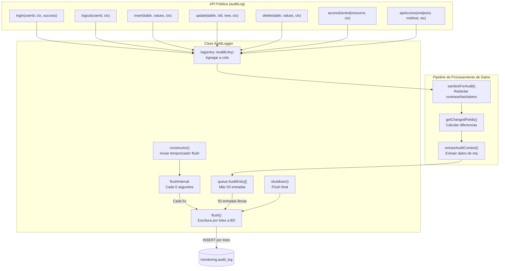

import { Code } from "@astrojs/starlight/components";

El sistema de auditoría proporciona un registro completo de eventos de seguridad y mutaciones de datos. Sanitiza automáticamente datos sensibles, calcula diferencias a nivel de campo para actualizaciones y agrupa escrituras por lotes para mejorar el rendimiento.

## Tipos de Eventos y Operaciones

El sistema soporta múltiples tipos de operación definidos por el tipo `AuditOperation`:

| Operación       | Descripción                          | Caso de Uso                                 |
| :-------------- | :----------------------------------- | :------------------------------------------ |
| `LOGIN`         | Autenticación exitosa                | Inicio de sesión de usuario                 |
| `LOGOUT`        | Cierre de sesión de usuario          | Terminación de sesión                       |
| `LOGIN_FAILED`  | Autenticación fallida                | Detección de fuerza bruta                   |
| `ACCESS_DENIED` | Fallo de autorización                | Rastreo de violación de permisos            |
| `INSERT`        | Nuevo registro creado                | Auditoría de creación de datos              |
| `UPDATE`        | Registro modificado                  | Rastreo de cambios de datos con diferencias |
| `DELETE`        | Registro eliminado                   | Auditoría de eliminación de datos           |
| `API_ACCESS`    | Endpoint accedido                    | Rastreo de uso de API                       |
| `EXPORT`        | Operación de exportación de datos    | Monitoreo de exfiltración de datos          |
| `CONFIG_CHANGE` | Configuración del sistema modificada | Rastreo de acciones de administrador        |
| `RATE_LIMITED`  | Límite de tasa excedido              | Detección de abuso                          |

## Arquitectura de la Clase AuditLogger

## Sanitización de Datos

El sistema redacta automáticamente campos sensibles antes del registro para prevenir filtración de credenciales:

<Code
  code={`// Patrones de campos sensibles redactados
const sensitiveFields = ['password', 'token', 'secret', 'apiKey', 'api_key', 'clave'];`}
  lang="typescript"
  title="sensitiveFields.ts"
/>

Todos los campos coincidentes son reemplazados con `[REDACTED]` en ambas columnas JSON `old_values` y `new_values`.

## Detección de Campos Modificados

Para operaciones `UPDATE`, el sistema calcula automáticamente qué campos cambiaron comparando `oldValues` y `newValues` usando serialización JSON:

<Code
  code={`// Calcular diferencias entre oldValues y newValues
// Compara JSON.stringify() de cada campo
if (JSON.stringify(oldValues[key]) !== JSON.stringify(newValues[key])) {
  changed.push(key);
}`}
  lang="typescript"
  title="diffCalculation.ts"
/>

El array resultante se almacena en la columna `changed_fields` para consultas eficientes de cambios de campos específicos.

## Extracción de Contexto de Auditoría

El helper `extractAuditContext()` extrae metadatos estándar de las peticiones Express:

| Campo       | Fuente                                | Descripción                               |
| :---------- | :------------------------------------ | :---------------------------------------- |
| `tenantId`  | `req.user.tenantId`                   | Contexto multi-tenant                     |
| `userId`    | `req.user.userId`                     | ID de usuario autenticado                 |
| `ipAddress` | `headers x-forwarded-for o x-real-ip` | IP real del cliente (consciente de proxy) |
| `userAgent` | `header user-agent`                   | Navegador/herramienta del cliente         |
| `requestId` | `req.id`                              | ID de correlación de petición             |

## Integración del Middleware de Auditoría

El `auditMiddleware` registra automáticamente acceso a la API para operaciones mutantes (POST/PUT/PATCH/DELETE) y respuestas de error (4xx/5xx):

<Code
  code={`// Solo registra operaciones mutantes o errores
if (['POST', 'PUT', 'PATCH', 'DELETE'].includes(req.method) || res.statusCode >= 400) {
  auditLog.apiAccess(req.originalUrl, req.method, ctx, res.statusCode);
}`}
  lang="typescript"
  title="auditMiddleware.ts"
/>

### Opciones de configuración

- `excludePaths`: Array de prefijos de ruta a omitir (por defecto: `/health`, `/api/auth/login`, `/api/auth/logout`)
- `onlyAuthenticated`: Solo registrar peticiones autenticadas (por defecto: `true`)

## Registro de Eventos de Autenticación

Los eventos de login y logout se registran explícitamente en las rutas de autenticación:

### Flujo de Login

1. Validación de usuario/contraseña
2. Verificación con `bcrypt.compare()`
3. En éxito: `auditLog.login(userId, ctx, true)`
4. En fallo: `auditLog.login(userId, ctx, false)`

### Flujo de Logout

1. Extracción de token JWT
2. `auditLog.logout(userId, ctx)`
3. Cookie eliminada

## Esquema de Base de Datos

El sistema de auditoría escribe a la tabla `monitoring.audit_log` en la base de datos `nostromo_command`:

| Columna          | Tipo        | Descripción                              |
| :--------------- | :---------- | :--------------------------------------- |
| `id`             | UUID        | Llave primaria (auto-generada)           |
| `tenant_id`      | UUID        | Contexto del tenant (nullable)           |
| `user_id`        | UUID        | Usuario que realizó la acción (nullable) |
| `table_name`     | TEXT        | Nombre de entidad/recurso                |
| `operation`      | TEXT        | Tipo de operación (LOGIN, UPDATE, etc.)  |
| `old_values`     | JSONB       | Estado pre-cambio (nullable)             |
| `new_values`     | JSONB       | Estado post-cambio (nullable)            |
| `changed_fields` | TEXT[]      | Array de nombres de campos modificados   |
| `ip_address`     | INET        | Dirección IP del cliente                 |
| `user_agent`     | TEXT        | Cadena user agent del cliente            |
| `created_at`     | TIMESTAMPTZ | Timestamp del evento (por defecto NOW()) |
