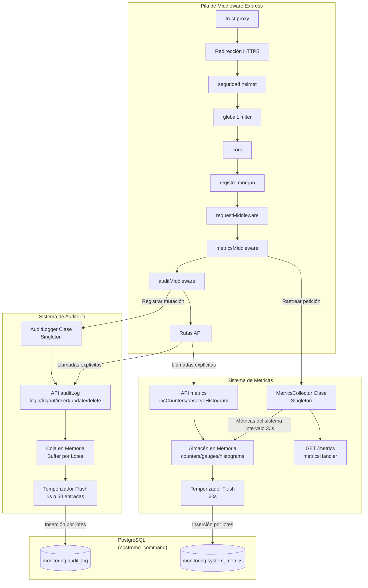

import { LinkCard, CardGrid, Code } from "@astrojs/starlight/components";

## Propósito y Alcance

Este documento describe los sistemas de monitoreo y observabilidad del backend Orchestrator. El sistema implementa dos subsistemas complementarios:

<CardGrid>
  <LinkCard
    title="Sistema de Auditoría"
    description="Rastrea eventos de seguridad, acciones de usuario y mutaciones de datos para análisis forense."
    href="/orchestrator/monitoring/audit/"
  />
  <LinkCard
    title="Métricas de Rendimiento"
    description="Recolecta datos de rendimiento de la aplicación utilizando instrumentación estilo Prometheus."
    href="/orchestrator/monitoring/metrics/"
  />
</CardGrid>

Ambos sistemas están diseñados para entornos de alto rendimiento con escrituras por lotes para minimizar la sobrecarga de I/O.

---

## Arquitectura del Sistema

La infraestructura de monitoreo consiste en dos servicios singleton que se integran en la pila de middleware de Express. Ambos servicios almacenan datos en memoria temporalmente y periódicamente los escriben a tablas PostgreSQL en la base de datos `nostromo_command` bajo el esquema `monitoring`.

### Visión General

## Puntos de Integración

### Posición en la Pila de Middleware

El middleware de monitoreo está posicionado estratégicamente en la pila de Express:

1. **Antes de Autenticación**: Para capturar todos los intentos, incluidos fallos de login.
2. **Después de Request ID**: Para asegurar trazabilidad.
3. **Métricas Antes de Auditoría**: Para medir rendimiento "puro".

### Apagado Elegante

Ambos sistemas implementan apagado elegante para asegurar que los datos en buffer se persistan:

<Code code={`// Registrado al cargar el módulo
process.on('beforeExit', async () => {
  await auditLogger.shutdown();  // Flush entradas de auditoría pendientes
  await metrics.shutdown();       // Flush métricas pendientes
});`} lang="typescript" title="shutdown.ts" />

## Patrones de Uso

### Registro Explícito de Auditoría

<Code code={`import { auditLog, extractAuditContext } from '@/lib/audit';

// Ejemplo: Registrar creación de empleado
const ctx = extractAuditContext(req);
await centralPool.query('INSERT INTO employees ...');
auditLog.insert('remuneraciones.employees', newEmployee, ctx);`} lang="typescript" title="auditExample.ts" />

### Métricas Personalizadas

<Code code={`// Ejemplo: Rastrear cálculos de nómina
const timer = createTimer();
const result = await payrollEngine.calculate(input);
timer.observe('payroll_calculation_duration_ms', { 
  employee_count: input.employees.length 
});`} lang="typescript" title="metricsExample.ts" />