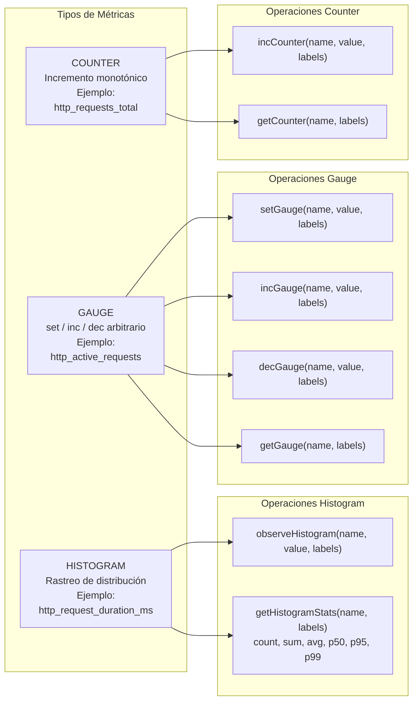
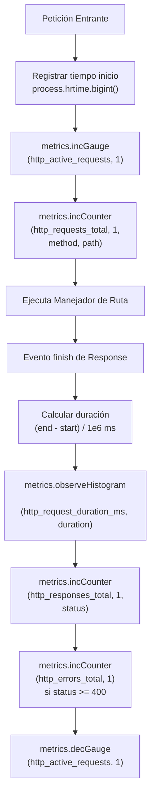

import { Code } from "@astrojs/starlight/components";

El sistema de métricas implementa instrumentación estilo Prometheus con tres tipos de métricas: **Counters** (incremento monotónico), **Gauges** (valores arbitrarios), e **Histograms** (rastreo de distribución).

## Tipos de Métricas

## Clase MetricsCollector

El singleton `MetricsCollector` mantiene almacenamiento en memoria para todos los tipos de métricas:

| Almacén      | Tipo                    | Propósito                     |
| :----------- | :---------------------- | :---------------------------- |
| `counters`   | `Map<string, number>`   | Acumular conteos              |
| `gauges`     | `Map<string, number>`   | Valores actuales              |
| `histograms` | `Map<string, number[]>` | Arrays de muestras (máx 1000) |

Las claves se construyen a partir del nombre de métrica y etiquetas: `metric_name{label1="value1",label2="value2"}` para etiquetado consistente estilo Prometheus.

## Instrumentación de Peticiones HTTP

### Métricas Rastreadas

| Nombre de Métrica          | Tipo      | Etiquetas            | Descripción                                                |
| :------------------------- | :-------- | :------------------- | :--------------------------------------------------------- |
| `http_requests_total`      | COUNTER   | method, path         | Conteo total de peticiones                                 |
| `http_responses_total`     | COUNTER   | method, path, status | Conteo de respuestas por bucket de estado (2xx, 3xx, etc.) |
| `http_errors_total`        | COUNTER   | method, path, status | Conteo de respuestas de error                              |
| `http_active_requests`     | GAUGE     | ninguna              | Peticiones actualmente en proceso                          |
| `http_request_duration_ms` | HISTOGRAM | method, path         | Distribución de duración de peticiones                     |

**Normalización de Rutas**: UUIDs e IDs numéricos en rutas se reemplazan con `:id` para etiquetado consistente (ej., `/api/employees/123 → /api/employees/:id`).

## Recolección de Métricas del Sistema

El `MetricsCollector` recolecta automáticamente métricas de Node.js y pools de base de datos cada 30 segundos:

### Métricas de Node.js

| Métrica                    | Fuente                            | Unidad       |
| :------------------------- | :-------------------------------- | :----------- |
| `nodejs_heap_used_bytes`   | `process.memoryUsage().heapUsed`  | bytes        |
| `nodejs_heap_total_bytes`  | `process.memoryUsage().heapTotal` | bytes        |
| `nodejs_external_bytes`    | `process.memoryUsage().external`  | bytes        |
| `nodejs_rss_bytes`         | `process.memoryUsage().rss`       | bytes        |
| `nodejs_event_loop_lag_ms` | latencia de `setImmediate()`      | milisegundos |

### Métricas de Pool de Base de Datos

| Métrica                     | Fuente             | Etiquetas | Unidad |
| :-------------------------- | :----------------- | :-------- | :----- |
| `db_pool_total_connections` | `getPoolMetrics()` | pool      | conteo |
| `db_pool_idle_connections`  | `getPoolMetrics()` | pool      | conteo |
| `db_pool_waiting_clients`   | `getPoolMetrics()` | pool      | conteo |

Etiquetas de pool: `central`, `common`, `tenant_NNNNNN` (pools por tenant).

## Estadísticas de Histogramas

Los histogramas rastrean datos de distribución con buckets predefinidos para percentiles de latencia:

Buckets (milisegundos): `[5, 10, 25, 50, 100, 250, 500, 1000, 2500, 5000, 10000]`

### Estadísticas Calculadas

- `count`: Total de observaciones
- `sum`: Suma de todos los valores
- `avg`: Valor medio
- `p50`: Percentil 50 (mediana)
- `p95`: Percentil 95
- `p99`: Percentil 99
- `buckets`: Conteos acumulativos por bucket

**Gestión de Memoria**: Los histogramas mantienen solo las últimas 1000 observaciones por métrica para prevenir crecimiento ilimitado de memoria.

## Endpoint de Métricas

El endpoint `/metrics` expone métricas en tiempo real para dashboards de monitoreo:

<Code code={`GET /metrics`} lang="http" title="Metrics Endpoint" />

### Estructura de Respuesta

<Code
  code={`{
  "timestamp": "2024-01-15T10:30:00.000Z",
  "uptime": 86400,
  "memory": {
    "heapUsed": 123456789,
    "heapTotal": 234567890,
    "rss": 345678901
  },
  "requests": {
    "active": 12,
    "total": 50000,
    "errors": 42,
    "responseTime": {
      "avg": 45.23,
      "p50": 38,
      "p95": 120,
      "p99": 250
    }
  },
  "pools": {
    "central": { "totalConnections": 10, "idleConnections": 7, "waitingClients": 0 },
    "common": { "totalConnections": 10, "idleConnections": 9, "waitingClients": 0 }
  },
  "raw": { /* todos los counters, gauges, histograms */ }
}`}
  lang="json"
  title="Metrics Response"
/>

**Excluido del middleware**: El endpoint `/metrics` mismo está excluido de la recolección de métricas para evitar instrumentación recursiva.

## Persistencia en Base de Datos

Las métricas se agrupan por lotes y se escriben a `monitoring.system_metrics` cada 60 segundos:

### Estrategia de Flush

1. Recolectar todos los counters → `{ name, value, type: 'COUNTER', labels }`
2. Recolectar todos los gauges → `{ name, value, type: 'GAUGE', labels }`
3. Calcular estadísticas de histogramas → Almacenar `_count`, `_sum`, `_avg`, `_p95` como entradas separadas
4. Insertar por lotes todas las entradas con una sola sentencia SQL

### Esquema

Tabla `monitoring.system_metrics`:

| Columna        | Tipo             | Descripción                   |
| :------------- | :--------------- | :---------------------------- |
| `id`           | UUID             | Llave primaria                |
| `metric_name`  | TEXT             | Identificador de métrica      |
| `metric_value` | DOUBLE PRECISION | Valor numérico                |
| `metric_type`  | TEXT             | COUNTER, GAUGE, o HISTOGRAM   |
| `labels`       | JSONB            | Etiquetas estilo Prometheus   |
| `recorded_at`  | TIMESTAMPTZ      | Timestamp (por defecto NOW()) |

## Utilidad Timer

El helper `createTimer()` proporciona medición conveniente de duración para operaciones arbitrarias:

<Code
  code={`const timer = createTimer();
// ... realizar operación ...
const durationMs = timer.observe('database_query_duration_ms', { query: 'select_employees' });`}
  lang="typescript"
  title="createTimer Example"
/>

Usa `process.hrtime.bigint()` para temporización de alta resolución (precisión de nanosegundos).
