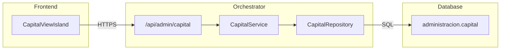

import { Code, FileTree, Tabs, TabItem, Steps } from '@astrojs/starlight/components';

## Descripción General

El **CapitalService** gestiona los movimientos de capital social de la empresa, incluyendo aportes iniciales, aumentos, reducciones, capitalizaciones y revalorizaciones.

## Arquitectura



## Endpoints

### `GET /api/admin/capital`

Lista los movimientos de capital con filtros opcionales.

**Query Parameters:**

| Parámetro | Tipo | Descripción |
|-----------|------|-------------|
| `estado` | `string` | Filtrar por estado (`ACTIVO`, `ANULADO`, `PENDIENTE_APROBACION`) |
| `tipo_capital` | `string` | Tipo de movimiento |
| `fecha_desde` | `string` | Fecha inicio (YYYY-MM-DD) |
| `fecha_hasta` | `string` | Fecha fin (YYYY-MM-DD) |
| `limit` | `number` | Límite de resultados |
| `offset` | `number` | Offset para paginación |

**Respuesta exitosa (200):**

```json
[
  {
    "id": "uuid",
    "tipo_capital": "APORTE_INICIAL",
    "monto": 10000000,
    "moneda": "CLP",
    "porcentaje": 100.00,
    "fecha_movimiento": "2025-01-15",
    "estado": "ACTIVO",
    "descripcion": "Capital inicial de la empresa",
    "created_at": "2025-01-15T10:00:00Z"
  }
]
```

### `GET /api/admin/capital/:id`

Obtiene un movimiento de capital por ID.

### `POST /api/admin/capital`

Crea un nuevo movimiento de capital.

**Request Body:**

```json
{
  "tipo_capital": "APORTE_INICIAL",
  "monto": 10000000,
  "moneda": "CLP",
  "porcentaje": 100.00,
  "fecha_movimiento": "2025-01-15",
  "descripcion": "Capital inicial",
  "documento_respaldo": "ESC-2025-001"
}
```

### `PUT /api/admin/capital/:id`

Actualiza un movimiento de capital existente.

### `DELETE /api/admin/capital/:id`

Elimina un movimiento de capital.

## Tipos de Capital

| Código | Descripción |
|--------|-------------|
| `APORTE_INICIAL` | Capital fundacional de la empresa |
| `AUMENTO_CAPITAL` | Incremento de capital social |
| `REDUCCION_CAPITAL` | Disminución de capital |
| `CAPITALIZACION_UTILIDADES` | Utilidades reinvertidas |
| `REVALORIZACION` | Ajuste por corrección monetaria |
| `AJUSTE_CAPITAL` | Otros ajustes contables |

## Estados

| Estado | Color | Descripción |
|--------|-------|-------------|
| `ACTIVO` | 🟢 Verde | Movimiento vigente y aprobado |
| `PENDIENTE_APROBACION` | 🟡 Amarillo | Esperando aprobación |
| `ANULADO` | 🔴 Rojo | Movimiento cancelado |

## Ubicación del Código

<FileTree>
- orchestrator/src/
  - routes/admin/
    - capital.ts
  - domain/capital/
    - CapitalService.ts
    - CapitalRepository.ts
    - types.ts
</FileTree>

## Ver También

- [ChartOfAccountsService](/orchestrator/services/ChartOfAccountsService/) - Plan de cuentas
- [CompanyService](/orchestrator/services/CompanyService/) - Datos de empresa
