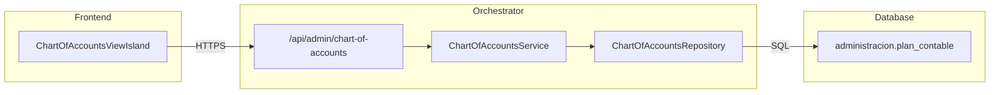
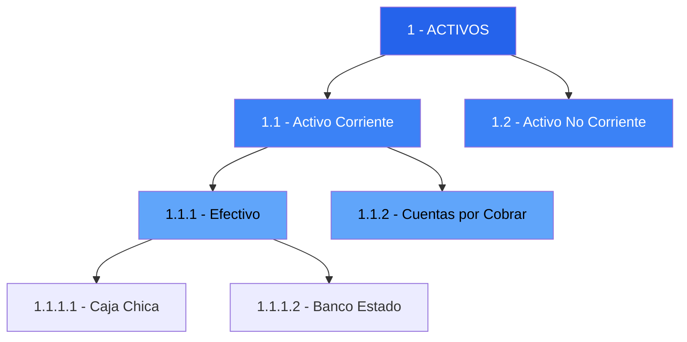

import { Code, FileTree, Tabs, TabItem, Steps } from '@astrojs/starlight/components';

## Descripción General

El **ChartOfAccountsService** gestiona el plan de cuentas contable de la empresa, permitiendo crear, actualizar y organizar la estructura de cuentas según normas IFRS y locales chilenas.

## Arquitectura



## Endpoints

### `GET /api/admin/chart-of-accounts`

Lista todas las cuentas del plan contable ordenadas jerárquicamente.

**Respuesta exitosa (200):**

```json
[
  {
    "codigo": "1",
    "nombre": "ACTIVOS",
    "tipo": "ACTIVO",
    "naturaleza": "D",
    "nivel": 1,
    "imputable": false,
    "cuenta_padre": null,
    "codigo_ifrs": "1000",
    "activo": true
  },
  {
    "codigo": "1.1",
    "nombre": "Activo Corriente",
    "tipo": "ACTIVO",
    "naturaleza": "D",
    "nivel": 2,
    "imputable": false,
    "cuenta_padre": "1",
    "codigo_ifrs": "1100",
    "activo": true
  }
]
```

### `GET /api/admin/chart-of-accounts/tree`

Retorna el plan de cuentas en formato árbol (alias de `/`).

### `GET /api/admin/chart-of-accounts/:codigo`

Obtiene una cuenta específica por su código.

### `POST /api/admin/chart-of-accounts`

Crea una nueva cuenta contable.

**Request Body:**

```json
{
  "codigo": "1.1.1",
  "nombre": "Caja",
  "tipo": "ACTIVO",
  "naturaleza": "D",
  "nivel": 3,
  "imputable": true,
  "cuenta_padre": "1.1",
  "codigo_ifrs": "1110"
}
```

### `PUT /api/admin/chart-of-accounts/:codigo`

Actualiza una cuenta existente.

### `DELETE /api/admin/chart-of-accounts/:codigo`

Elimina una cuenta (solo si no tiene movimientos).

## Tipos de Cuenta

| Tipo | Naturaleza | Descripción |
|------|------------|-------------|
| `ACTIVO` | Deudora (D) | Bienes y derechos |
| `PASIVO` | Acreedora (C) | Obligaciones con terceros |
| `PATRIMONIO` | Acreedora (C) | Capital de propietarios |
| `INGRESO` | Acreedora (C) | Entradas de recursos |
| `GASTO` | Deudora (D) | Salidas de recursos |

## Estructura Jerárquica



## Reglas de Negocio

1. **Código único**: Cada cuenta debe tener un código único en el plan
2. **Niveles**: Máximo 6 niveles de profundidad
3. **Imputabilidad**: Solo cuentas de último nivel pueden recibir movimientos
4. **IFRS**: Código IFRS opcional para reportes internacionales
5. **Cuenta padre**: Debe existir antes de crear hijos

## Ubicación del Código

<FileTree>
- orchestrator/src/
  - routes/admin/
    - chart-of-accounts.ts
  - domain/chart-of-accounts/
    - ChartOfAccountsService.ts
    - ChartOfAccountsRepository.ts
    - types.ts
</FileTree>

## Ver También

- [CapitalService](/orchestrator/services/CapitalService/) - Movimientos de capital
- [CompanyService](/orchestrator/services/CompanyService/) - Datos de empresa
