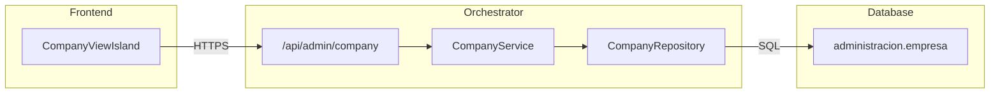

import { Code, FileTree } from '@astrojs/starlight/components';

## Descripción General

El **CompanyService** gestiona la información corporativa de la empresa, incluyendo razón social, RUT, giro, dirección y datos de contacto.

## Arquitectura



## Endpoints

### `GET /api/admin/company`

Obtiene la configuración de la empresa.

**Respuesta exitosa (200):**

```json
{
  "id": "uuid",
  "rut": "76.XXX.XXX-X",
  "razon_social": "Mi Empresa SpA",
  "nombre_fantasia": "Mi Empresa",
  "giro": "Servicios de consultoría",
  "direccion": "Av. Principal 123",
  "comuna": "Santiago",
  "region": "RM",
  "telefono": "+56 2 1234 5678",
  "email": "contacto@miempresa.cl",
  "sitio_web": "https://miempresa.cl",
  "logo_url": "/assets/logo.png",
  "regimen_tributario": "PROPYME",
  "inicio_actividades": "2020-01-15",
  "created_at": "2020-01-15T10:00:00Z",
  "updated_at": "2025-12-01T15:30:00Z"
}
```

### `PUT /api/admin/company`

Actualiza la configuración de la empresa.

**Request Body:**

```json
{
  "nombre_fantasia": "Nuevo Nombre",
  "telefono": "+56 9 8765 4321",
  "email": "nuevo@email.cl"
}
```

**Campos actualizables:**

| Campo | Tipo | Descripción |
|-------|------|-------------|
| `nombre_fantasia` | `string` | Nombre comercial |
| `giro` | `string` | Actividad económica |
| `direccion` | `string` | Dirección física |
| `comuna` | `string` | Comuna |
| `region` | `string` | Región (código) |
| `telefono` | `string` | Teléfono de contacto |
| `email` | `string` | Email corporativo |
| `sitio_web` | `string` | URL del sitio web |
| `logo_url` | `string` | URL del logo |

:::caution[Campos inmutables]
El RUT, razón social e inicio de actividades no pueden modificarse desde la API. Requieren cambio legal en el SII.
:::

## Regímenes Tributarios

| Código | Nombre | Descripción |
|--------|--------|-------------|
| `PROPYME` | Pro Pyme General | Régimen simplificado para PyMEs |
| `PROPYME_TRANSPARENTE` | Pro Pyme Transparente | Tributación en base a retiros |
| `SEMI_INTEGRADO` | Semi Integrado | Empresas con tributación parcial |
| `RENTA_PRESUNTA` | Renta Presunta | Tributación sobre base estimada |

## Ubicación del Código

<FileTree>
- orchestrator/src/
  - routes/admin/
    - company.ts
  - domain/company/
    - CompanyService.ts
    - CompanyRepository.ts
    - types.ts
</FileTree>

## Ver También

- [LegalRepService](/orchestrator/services/LegalRepService/) - Representantes legales
- [SystemConfigService](/orchestrator/services/SystemConfigService/) - Configuración del sistema
