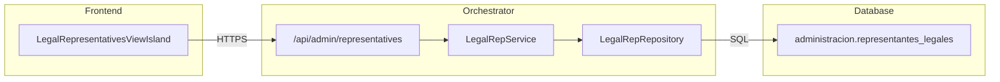

import { Code, FileTree } from '@astrojs/starlight/components';

## Descripción General

El **LegalRepService** gestiona los representantes legales de la empresa, permitiendo registrar apoderados con sus facultades y estados.

## Arquitectura



## Endpoints

### `GET /api/admin/representatives`

Lista representantes legales.

**Query Parameters:**

| Parámetro | Tipo | Descripción |
|-----------|------|-------------|
| `activeOnly` | `boolean` | Solo representantes activos |

**Respuesta exitosa (200):**

```json
[
  {
    "id": "uuid",
    "rut": "12.345.678-9",
    "nombres": "Juan Alberto",
    "apellido_paterno": "Pérez",
    "apellido_materno": "González",
    "email": "juan.perez@empresa.cl",
    "telefono": "+56 9 1234 5678",
    "tipo_representacion": "APODERADO_GENERAL",
    "facultades": ["FIRMAR_CONTRATOS", "REPRESENTAR_JUICIO", "ABRIR_CUENTAS"],
    "fecha_inicio": "2020-01-15",
    "fecha_termino": null,
    "activo": true,
    "es_principal": true
  }
]
```

### `GET /api/admin/representatives/:id`

Obtiene un representante por ID.

### `POST /api/admin/representatives`

Crea un nuevo representante.

**Request Body:**

```json
{
  "rut": "12.345.678-9",
  "nombres": "Juan Alberto",
  "apellido_paterno": "Pérez",
  "apellido_materno": "González",
  "email": "juan.perez@empresa.cl",
  "telefono": "+56 9 1234 5678",
  "tipo_representacion": "APODERADO_GENERAL",
  "facultades": ["FIRMAR_CONTRATOS", "REPRESENTAR_JUICIO"],
  "fecha_inicio": "2025-01-01"
}
```

### `PUT /api/admin/representatives/:id`

Actualiza un representante existente.

### `DELETE /api/admin/representatives/:id`

Elimina un representante.

### `POST /api/admin/representatives/:id/set-active`

Establece un representante como principal (ADMIN requerido).

**Comportamiento:**
- Desactiva el representante principal anterior
- Activa el representante indicado como principal

## Tipos de Representación

| Tipo | Descripción |
|------|-------------|
| `APODERADO_GENERAL` | Poderes amplios para todo tipo de actos |
| `APODERADO_ESPECIAL` | Poderes limitados a actos específicos |
| `DIRECTOR` | Miembro del directorio |
| `GERENTE_GENERAL` | Gerente con poderes de representación |
| `SOCIO_ADMINISTRADOR` | Socio con facultades de administración |

## Facultades Disponibles

| Código | Descripción |
|--------|-------------|
| `FIRMAR_CONTRATOS` | Suscribir contratos comerciales |
| `REPRESENTAR_JUICIO` | Actuar en procedimientos judiciales |
| `ABRIR_CUENTAS` | Abrir cuentas bancarias |
| `FIRMAR_ESCRITURAS` | Suscribir escrituras públicas |
| `CONTRATAR_PERSONAL` | Contratar y despedir trabajadores |
| `OPERAR_BANCARIO` | Realizar operaciones bancarias |

## Ubicación del Código

<FileTree>
- orchestrator/src/
  - routes/admin/
    - representatives.ts
  - domain/legal-representatives/
    - LegalRepService.ts
    - LegalRepRepository.ts
    - types.ts
</FileTree>

## Ver También

- [CompanyService](/orchestrator/services/CompanyService/) - Datos de empresa
- [CapitalService](/orchestrator/services/CapitalService/) - Movimientos de capital
