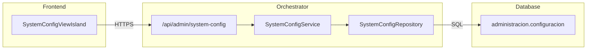

import { Code, FileTree, Tabs, TabItem } from '@astrojs/starlight/components';

## Descripción General

El **SystemConfigService** gestiona las configuraciones dinámicas del sistema, permitiendo ajustar parámetros sin necesidad de redesplegar la aplicación.

## Arquitectura



## Endpoints

### `GET /api/admin/system-config`

Lista todas las configuraciones del sistema.

**Respuesta exitosa (200):**

```json
[
  {
    "clave": "EMPRESA_LOGO_URL",
    "valor": "/assets/logo.png",
    "descripcion": "URL del logo de la empresa",
    "tipo": "STRING",
    "categoria": "BRANDING",
    "editable": true
  },
  {
    "clave": "MAX_LIQUIDACIONES_BATCH",
    "valor": "100",
    "descripcion": "Máximo de liquidaciones a procesar en lote",
    "tipo": "NUMBER",
    "categoria": "PAYROLL",
    "editable": true
  }
]
```

### `GET /api/admin/system-config/:clave`

Obtiene una configuración específica por clave.

### `PUT /api/admin/system-config/:clave`

Actualiza una configuración.

**Request Body:**

```json
{
  "valor": "nuevo_valor"
}
```

## Categorías de Configuración

| Categoría | Descripción |
|-----------|-------------|
| `BRANDING` | Logo, colores, nombre visible |
| `PAYROLL` | Parámetros de liquidaciones |
| `SECURITY` | Timeouts, intentos de login |
| `NOTIFICATIONS` | Emails, alertas |
| `INTEGRATIONS` | APIs externas (SII, Previred) |
| `REPORTS` | Formatos de reportes |

## Tipos de Valor

| Tipo | Ejemplo | Descripción |
|------|---------|-------------|
| `STRING` | `"valor"` | Texto libre |
| `NUMBER` | `"100"` | Número entero o decimal |
| `BOOLEAN` | `"true"` | Verdadero o falso |
| `JSON` | `"{...}"` | Objeto JSON serializado |

## Configuraciones Comunes

<Tabs>
<TabItem label="Nómina">

| Clave | Default | Descripción |
|-------|---------|-------------|
| `MAX_LIQUIDACIONES_BATCH` | 100 | Lotes de procesamiento |
| `DIAS_ANTICIPO_PAGO` | 5 | Días antes del pago |
| `FORMATO_PDF_LIQUIDACION` | `A4` | Tamaño de página |

</TabItem>
<TabItem label="Seguridad">

| Clave | Default | Descripción |
|-------|---------|-------------|
| `SESSION_TIMEOUT_MINUTES` | 30 | Tiempo de sesión |
| `MAX_LOGIN_ATTEMPTS` | 5 | Intentos antes de bloqueo |
| `PASSWORD_MIN_LENGTH` | 8 | Largo mínimo contraseña |

</TabItem>
<TabItem label="Integraciones">

| Clave | Default | Descripción |
|-------|---------|-------------|
| `SII_AMBIENTE` | `PRODUCCION` | Ambiente del SII |
| `PREVIRED_ENABLED` | `true` | Integración Previred |
| `BANCO_CENTRAL_API_URL` | `https://...` | URL API BC |

</TabItem>
</Tabs>

## Ubicación del Código

<FileTree>
- orchestrator/src/
  - routes/admin/
    - system-config.ts
  - domain/system-config/
    - SystemConfigService.ts
    - SystemConfigRepository.ts
    - types.ts
</FileTree>

## Ver También

- [CompanyService](/orchestrator/services/CompanyService/) - Datos de empresa
- [MonitoringService](/orchestrator/services/MonitoringService/) - Métricas del sistema
