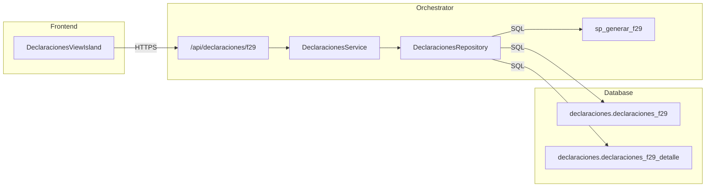

import { Code, FileTree, Tabs, TabItem, Steps } from '@astrojs/starlight/components';

## Descripción General

El **DeclaracionesService** gestiona el ciclo de vida de las declaraciones de impuestos mensuales (F29), permitiendo la generación de borradores, consulta, y transición de estados (Borrador -> Validada -> Declarada / Anulada).

## Arquitectura



## Endpoints

### `POST /api/declaraciones/f29/generate`

Genera un nuevo borrador de declaración F29 para un periodo específico. Si existe un borrador previo, lo sobrescribe. No permite sobrescribir declaraciones validadas o declaradas.

**Body Parameters:**

| Parámetro | Tipo | Descripción |
|-----------|------|-------------|
| `periodo` | `string` | Periodo en formato YYYY-MM (e.g., "2025-01") |
| `rut_contribuyente` | `string` | RUT del contribuyente asociado |

**Respuesta exitosa (201):**

```json
{
  "success": true,
  "data": {
    "id": "uuid",
    "periodo": "2025-01",
    "estado": "BORRADOR",
    "detalles": [...]
  }
}
```

### `GET /api/declaraciones/f29`

Lista declaraciones existentes aplicando filtros opcionales.

**Query Parameters:**

| Parámetro | Tipo | Descripción |
|-----------|------|-------------|
| `periodo` | `string` | Filtrar por periodo (YYYY-MM) |
| `rut` | `string` | Filtrar por RUT contribuyente |
| `estado` | `string` | Filtrar por estado (BORRADOR, VALIDADO, etc.) |
| `limit` | `number` | Límite de resultados (default 20) |
| `offset` | `number` | Desplazamiento (default 0) |

### `GET /api/declaraciones/f29/:id`

Obtiene el detalle completo de una declaración, incluyendo todos sus códigos y montos.

### `PATCH /api/declaraciones/f29/:id/status`

Actualiza el estado de una declaración.

**Body Parameters:**

| Parámetro | Tipo | Descripción |
|-----------|------|-------------|
| `estado` | `string` | Nuevo estado. Valores permitidos: 'BORRADOR', 'VALIDADO', 'DECLARADO', 'ANULADA', 'VALIDADA', 'ANULADO', 'RECTIFICADO' |

## Lógica de Negocio

### Generación de Borradores
La generación delega la lógica compleja al procedimiento almacenado `declaraciones.sp_generar_f29` en PostgreSQL. Este procedimiento:
1. Elimina cualquier borrador existente para el mismo periodo y usuario.
2. Calcula los códigos del F29 basándose en la información contable vigente.
3. Inserta la cabecera y el detalle de la nueva declaración.

**Restricciones:**
- No se puede generar un borrador si ya existe una declaración con estado `VALIDADO` o `DECLARADO` para el mismo periodo.

## Modelos de Datos

### F29Header
Representa la cabecera de la declaración.

| Campo | Tipo | Descripción |
|-------|------|-------------|
| `id` | `uuid` | Identificador único |
| `periodo` | `string` | Año y mes (YYYY-MM) |
| `estado` | `enum` | Estado actual de la declaración |
| `total_a_pagar` | `number` | Monto final a pagar |
| `created_at` | `date` | Fecha de creación |

### F29Detail
Representa cada línea o código del formulario 29.

| Campo | Tipo | Descripción |
|-------|------|-------------|
| `codigo_linea` | `string` | Código del formulario (e.g., "538") |
| `descripcion_linea` | `string` | Descripción del concepto |
| `monto` | `number` | Valor calculado |

## Ubicación del Código

<FileTree>
- orchestrator/src/
  - routes/declaraciones/
    - f29.ts
  - domain/declaraciones/
    - DeclaracionesService.ts
    - DeclaracionesRepository.ts
    - types.ts
</FileTree>
