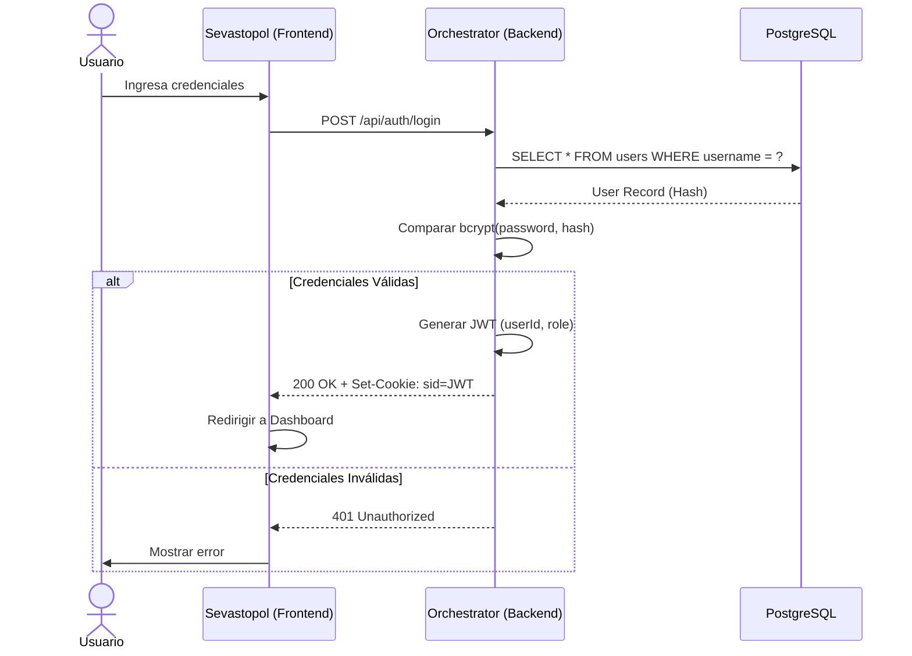

El sistema Nostromo utiliza **JSON Web Tokens (JWT)** almacenados en cookies para manejar la autenticación de usuarios y **Role-Based Access Control (RBAC)** para la autorización.

## Visión General

La autenticación es manejada principalmente por el servicio **Orchestrator**. Al iniciar sesión exitosamente, se emite un token JWT firmado que contiene la identidad del usuario y su rol. Este token se almacena en una cookie llamada `sid`.

:::note
La cookie `sid` está configurada actualmente con `httpOnly: false` para permitir que el cliente (Sevastopol) acceda a ella si es necesario, aunque la validación principal ocurre en el backend.
:::

## Flujo de Autenticación

El siguiente diagrama de secuencia ilustra el proceso de inicio de sesión y validación de sesión:



## Endpoints de Autenticación

Ver implementación en [Orchestrator](../../Accounting/orchestrator/src/routes/command/auth.ts).

### Login

**POST** `/api/auth/login`

Autentica a un usuario y establece la cookie de sesión.

**Body:**

```json
{
  "username": "usuario",
  "password": "password123",
  "rememberMe": true // Opcional, extiende la sesión a 30 días
}
```

**Respuesta Exitosa:**
Establece la cookie `sid` y retorna:

```json
{
  "success": true,
  "user": {
    "id": 1,
    "username": "usuario",
    "role": "ADMIN"
  },
  "message": "Login exitoso"
}
```

### Logout

**POST** `/api/auth/logout`

Cierra la sesión actual eliminando la cookie `sid`.

### Validar Sesión

**POST** `/api/auth/validate`

Verifica si la sesión actual es válida decodificando el token JWT. Utilizado por el frontend para persistencia de sesión al recargar.

## Autorización (RBAC)

El control de acceso se realiza mediante middleware en el backend que intercepta las peticiones, verifica el token y comprueba los permisos del rol.

:::tip
Los roles definidos son `SUPER_ADMIN`, `ADMIN`, y `USER`.
:::

### Middleware

El middleware `authenticateToken` se encarga de:

1. Leer la cookie `sid` o el header `Cookie`.
2. Verificar la firma del JWT usando `JWT_SECRET`.
3. Inyectar el objeto `user` en el request (`req.user`).

```typescript
// Ejemplo de uso en rutas
router.get('/protected-route', authenticateToken, (req, res) => {
    // req.user está disponible aquí
    const role = req.user.role;
});
```
