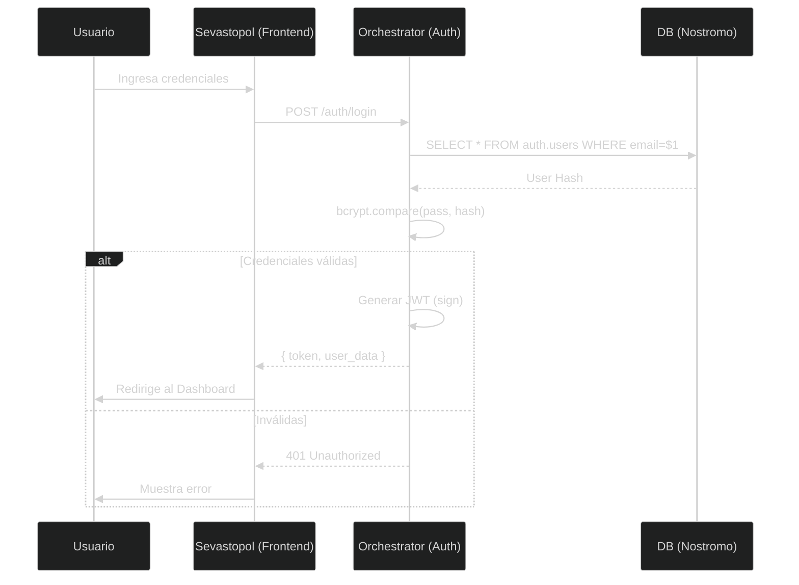

El sistema Nostromo utiliza **JSON Web Tokens (JWT)** para la autenticación stateless y **Role-Based Access Control (RBAC)** para la autorización granular.

## Mecanismo de Autenticación

A diferencia de sistemas tradicionales basados en sesión, Nostromo utiliza un enfoque **Token-Based**:

1. **Frontend** envía credenciales (`email`, `password`) al endpoint `/auth/login`.
2. **Backend** valida y retorna un `token` JWT firmado.
3. **Frontend** almacena este token (ej. en `localStorage` o memoria) y lo adjunta en el header `Authorization` de cada request subsiguiente.

:::caution[Importante]
El token debe enviarse con el prefijo `Bearer`:
`Authorization: Bearer <TOKEN_JWT>`
:::

## Flujo de Secuencia

El siguiente diagrama detalla el ciclo de vida de una autenticación exitosa:



## Estructura del Token (Payload)

El JWT emitido contiene información crítica para el contexto de la solicitud, pero **no contiene secretos**.

```json
{
  "userId": "uuid-v4-del-usuario",
  "email": "usuario@empresa.com",
  "role": "ADMIN",  // Rol global del usuario
  "iat": 1703698000, // Issued At
  "exp": 1703784400  // Expiration (24h default)
}
```

## Middleware de Protección

El backend utiliza un middleware `authenticateToken` que intercepta todas las rutas protegidas:

```typescript
// Middleware simplificado
export const authenticateToken = (req, res, next) => {
  const authHeader = req.headers['authorization'];
  const token = authHeader && authHeader.split(' ')[1]; // Bearer TOKEN

  if (!token) return res.sendStatus(401); // Unauthorized

  jwt.verify(token, process.env.JWT_SECRET, (err, user) => {
    if (err) return res.sendStatus(403); // Forbidden
    req.user = user; // Inyecta usuario en el request
    next();
  });
};
```

## Roles y Permisos (RBAC)

Aunque el JWT valida la **identidad**, los permisos específicos se validan en el código de negocio o mediante middlewares de autorización adicionales.

| Rol | Alcance | Descripción |
| :--- | :--- | :--- |
| **SUPER_ADMIN** | Global | Acceso total a todos los tenants y configuración de sistema. |
| **ADMIN** | Tenant | Acceso total dentro de su organización (crear usuarios, configurar parámetros). |
| **USER** | Tenant | Acceso estándar para operar módulos (ingresar facturas, ver liquidaciones). |
| **RO** (Read-Only) | Tenant | Solo lectura para auditores o visualización. |
