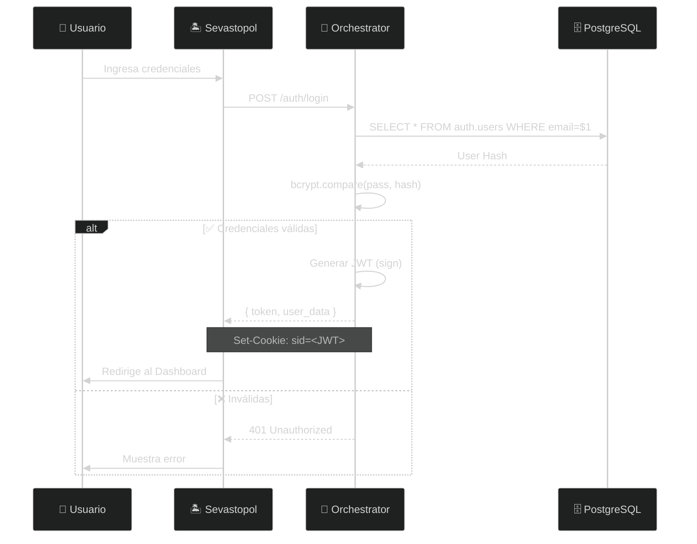

import { Tabs, TabItem, Aside, Steps, Code } from '@astrojs/starlight/components';

El sistema Nostromo utiliza **JSON Web Tokens (JWT)** para la autenticación stateless y **Role-Based Access Control (RBAC)** para la autorización granular.

---

## Mecanismo de Autenticación

A diferencia de sistemas tradicionales basados en sesión, Nostromo utiliza un enfoque **Token-Based**:

<Steps>
1. **Frontend** envía credenciales (`email`, `password`) al endpoint `/auth/login`
2. **Backend** valida contra hash en BD usando `bcrypt`
3. **Backend** retorna un JWT firmado con `JWT_SECRET`
4. **Frontend** almacena token en cookie `sid` (httpOnly)
5. **Requests subsiguientes** incluyen token automáticamente
</Steps>

<Aside type="caution" title="Formato del Header">
  El token debe enviarse con el prefijo `Bearer`:
  ```
  Authorization: Bearer <TOKEN_JWT>
  ```
  O via cookie `sid` (preferido para seguridad).
</Aside>

---

## Flujo de Secuencia



---

## Estructura del Token

<Tabs>
  <TabItem label="Payload JWT">
    El JWT contiene información para el contexto de la solicitud, pero **no contiene secretos**:

    ```json title="JWT Payload"
    {
      "userId": "uuid-v4-del-usuario",
      "email": "usuario@empresa.com",
      "role": "ADMIN",
      "iat": 1703698000,
      "exp": 1703784400
    }
    ```

    | Campo | Descripción |
    | :--- | :--- |
    | `userId` | UUID único del usuario |
    | `email` | Email para logging/audit |
    | `role` | Rol global (SUPER_ADMIN, ADMIN, USER, RO) |
    | `iat` | Timestamp de emisión |
    | `exp` | Expiración (24h por defecto) |
  </TabItem>

  <TabItem label="Cookie sid">
    En producción, el token se almacena en una cookie segura:

    ```http title="Set-Cookie Header"
    Set-Cookie: sid=eyJhbGciOiJIUzI1NiIsInR5cCI6IkpXVCJ9...;
      Path=/;
      HttpOnly;
      Secure;
      SameSite=Strict;
      Max-Age=86400
    ```

    <Aside type="tip" title="Seguridad">
      - `HttpOnly` previene acceso desde JavaScript (XSS)
      - `Secure` solo permite HTTPS
      - `SameSite=Strict` previene CSRF
    </Aside>
  </TabItem>
</Tabs>

---

## Middleware de Protección

El backend utiliza un middleware `authenticateToken` que intercepta todas las rutas protegidas:

```typescript title="middleware/auth.ts"
import jwt from 'jsonwebtoken';
import cookie from 'cookie';

export const authenticateToken = (req, res, next) => {
  // 1. Intentar obtener token del header Authorization
  const authHeader = req.headers['authorization'];
  let token = authHeader?.split(' ')[1]; // Bearer TOKEN

  // 2. Fallback: buscar en cookie sid
  if (!token && req.headers.cookie) {
    const parsed = cookie.parse(req.headers.cookie);
    token = parsed.sid;
  }

  if (!token) {
    return res.status(401).json({ success: false, error: 'No authorization token' });
  }

  try {
    const decoded = jwt.verify(token, process.env.JWT_SECRET!);
    req.user = decoded; // Inyecta usuario en el request
    next();
  } catch {
    return res.status(403).json({ success: false, error: 'Invalid or expired token' });
  }
};
```

---

## Roles y Permisos (RBAC)

Aunque el JWT valida la **identidad**, los permisos específicos se validan mediante el sistema RBAC:

| Rol | Alcance | Descripción |
| :--- | :--- | :--- |
| **SUPER_ADMIN** | 🌍 Global | Acceso total a todos los tenants y configuración de sistema |
| **ADMIN** | 🏢 Tenant | Acceso total dentro de su organización |
| **USER** | 🏢 Tenant | Acceso estándar para operar módulos |
| **RO** | 🏢 Tenant | Solo lectura para auditores |

<Tabs>
  <TabItem label="Middleware RBAC">
    ```typescript title="lib/rbac.ts"
    export const authorizeRoute = (req, res, next) => {
      const { role } = req.user;
      const route = req.originalUrl.split('?')[0];

      if (!rbac.canAccess(role, route)) {
        return res.status(403).json({ 
          success: false, 
          error: `Access denied for role '${role}'` 
        });
      }
      next();
    };
    ```
  </TabItem>

  <TabItem label="Uso en Rutas">
    ```typescript title="routes/command/tenant.ts"
    import { authenticateToken, authorizeRoute } from '@/middleware/auth';

    // Solo SUPER_ADMIN puede eliminar tenants
    router.delete('/', 
      authenticateToken, 
      authorizeRoute, 
      async (req, res) => {
        // ... lógica de eliminación
      }
    );
    ```
  </TabItem>
</Tabs>

<Aside type="note" title="Configuración de Rutas">
  Las rutas permitidas por rol se configuran en [lib/rbac.ts](../../Accounting/orchestrator/src/lib/rbac.ts).
</Aside>
