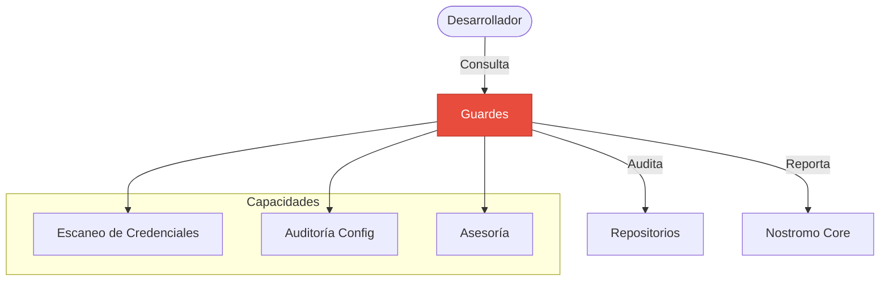

import {
  Card,
  CardGrid,
  LinkCard,
  Aside,
  Steps,
  TabItem,
  Tabs,
} from "@astrojs/starlight/components";

**Guardes** es el agente especializado en **Seguridad Defensiva y Auditoría** dentro del ecosistema técnico. A diferencia de Nostromo (Gestión) o Jean d'Arc (Documentación), Guardes opera como un centinela activo, enfocado en la protección de activos, la higiene de credenciales y el cumplimiento de políticas de seguridad.

---

## 🛡️ Misión y Responsabilidades

> _"Vigilancia activa, defensa proactiva."_

El objetivo de Guardes no es solo reaccionar ante incidentes, sino prevenirlos mediante la auditoría continua y la reducción de la superficie de ataque.

<CardGrid>
  <Card title="🔐 Escaneo de Credenciales" icon="lock">
    Barrido automático de repositorios para detectar secretos, claves API o
    tokens expuestos accidentalmente antes de que lleguen a producción.
  </Card>
  <Card title="📜 Auditoría de Repositorios" icon="document">
    Verificación del cumplimiento de estándares: archivos `.gitignore`
    correctos, ausencia de binarios innecesarios y estructura limpia.
  </Card>
  <Card title="🧠 Consultoría de Seguridad" icon="magnifier">
    Asesoramiento sobre mejores prácticas de hardening, rotación de claves y
    configuración segura de infraestructura (Docker, Postgres).
  </Card>
</CardGrid>

---

## 🛠️ Capacidades Técnicas

Guardes dispone de un set de herramientas ("Skills") específicas para su labor:

### 1. Detección de Secretos (`credential_scanner`)

Herramienta de análisis estático que recorre el código fuente buscando patrones de entropía alta o formatos conocidos de claves.

```powershell
# Ejemplo de ejecución manual
./scripts/security/credential_scanner.ps1 -Path "./src" -Report "audit_log.json"
```

### 2. Auditoría de Entorno

Verificación de configuraciones de seguridad en tiempo de desarrollo.

- **Docker**: Escaneo de imágenes base y permisos de contenedores.
- **Git**: Validación de historial y ramas protegidas.

---

## Workflow de Seguridad

<Steps>
  1. **Desarrollo**: El desarrollador trabaja en su feature branch. 2.
  **Pre-Commit (Guardes)**: Guardes puede ser invocado para escanear cambios
  *staged* en busca de secretos. 3. **CI/CD**: En el pipeline, Guardes verifica:
  - Análisis estático de seguridad (SAST). - Integridad de dependencias (`npm
  audit`). 4. **Despliegue**: Solo si Guardes aprueba ("Green Shield"), el
  código avanza.
</Steps>

<Aside type="tip">
  Guardes reporta sus hallazgos directamente en el **Sistema de Tareas de
  Nostromo**, creando tickets de alta prioridad si detecta vulnerabilidades
  críticas.
</Aside>

---

## 🔗 Integración con el Ecosistema


