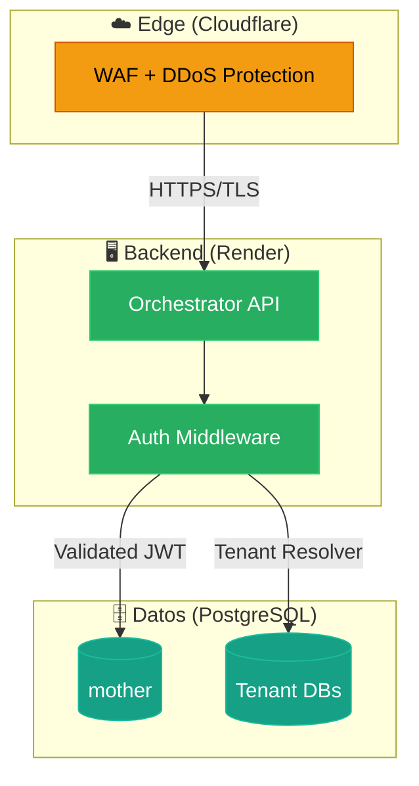

import {
  Card,
  CardGrid,
  LinkCard,
  Aside,
  Steps,
} from "@astrojs/starlight/components";

La seguridad en el ecosistema Nostromo/Jean d'Arc se basa en el principio de **Defensa en Profundidad**, implementando controles en cada capa de la arquitectura, desde la infraestructura hasta la interfaz de usuario.

---

## Pilares de Seguridad

<CardGrid>
  <Card title="🔐 Autenticación Robusta" icon="star">
    Acceso protegido por **JWT (JSON Web Tokens)**. Ninguna ruta API crítica es
    accesible sin credenciales válidas.
  </Card>
  <Card title="🏢 Aislamiento Multi-Tenant" icon="seti:db">
    Cada cliente opera en un **esquema de BD aislado**. Prevención de filtración
    de datos a nivel estructural.
  </Card>
  <Card title="🔑 Protección de Secretos" icon="setting">
    Credenciales manejadas exclusivamente via **Variables de Entorno**. Sin
    hardcoding en código fuente.
  </Card>
  <Card title="🔍 Auditoría Continua" icon="magnifier">
    Revisión regular de dependencias y análisis estático. `npm audit` +
    revisiones manuales.
  </Card>
</CardGrid>

---

## Modelo de Defensa en Profundidad

---

## Mapa de Riesgos y Mitigaciones

| Amenaza                        | Mitigación Implementada                                           | Estado |
| :----------------------------- | :---------------------------------------------------------------- | :----: |
| **SQL Injection**              | Uso estricto de `pg-pool` con consultas parametrizadas (`$1, $2`) |   ✅   |
| **XSS (Cross-Site Scripting)** | React/Astro escapan output por defecto. Headers de seguridad.     |   ✅   |
| **Brute Force**                | Rate Limiting en endpoints de login                               |   ⚠️   |
| **Data Leakage**               | Logs sanitizados y esquemas segregados                            |   ✅   |
| **CSRF**                       | Cookies `SameSite=Strict`, tokens CSRF en forms críticos          |   ✅   |

<Aside type="caution" title="Pendiente">
  Rate Limiting requiere configuración adicional en Nginx/Gateway para
  producción.
</Aside>

---

## Auditoría y Compliance

<Steps>
  1. **Revisión de Dependencias** - `npm audit` ejecutado en CI/CD 2. **Análisis
  Estático** - ESLint + reglas de seguridad 3. **Revisión Manual** - Commits
  sensibles revisados por peer 4. **Penetration Testing** - Planificado
  trimestralmente
</Steps>

---

## Navegación

<CardGrid>
  <LinkCard
    title="Autenticación JWT"
    description="Sistema de tokens y RBAC"
    href="/seguridad/autenticacion/"
  />
  <LinkCard
    title="Buenas Prácticas"
    description="Guías para desarrolladores"
    href="/seguridad/practicas/"
  />
  <LinkCard
    title="Protección de Datos"
    description="Cifrado y manejo de PII"
    href="/seguridad/practicas/datos/"
  />
  <LinkCard
    title="Infraestructura"
    description="Seguridad de red y servidores"
    href="/seguridad/practicas/infraestructura/"
  />
  <LinkCard
    title="Agente Guardes"
    description="Seguridad Defensiva y Auditoría"
    href="/seguridad/guardes/"
  />
</CardGrid>

<Aside type="tip" title="Principio Rector">
  "La seguridad no es un producto, es un proceso." — Bruce Schneier
</Aside>
