import { Tabs, TabItem, Aside, Steps } from '@astrojs/starlight/components';

La seguridad de infraestructura sigue el modelo de **responsabilidad compartida**, aprovechando las capacidades de nuestros proveedores Cloud (Cloudflare, Render, Neon).

---

## Arquitectura de Capas

```mermaid
graph TD
    subgraph Internet["🌐 Internet"]
        USER[👤 Usuario]
    end
    
    subgraph Edge["☁️ Capa 1: Edge (Cloudflare)"]
        WAF[WAF + DDoS]
        SSL[SSL/TLS Termination]
    end
    
    subgraph Backend["🖥️ Capa 2: API (Render)"]
        CORS[CORS Middleware]
        RATE[Rate Limiting]
        API[Orchestrator]
    end
    
    subgraph Data["🗄️ Capa 3: Datos (Neon)"]
        POOL[Connection Pool]
        DB[(PostgreSQL)]
    end
    
    USER -->|HTTPS| WAF
    WAF --> SSL
    SSL --> CORS
    CORS --> RATE
    RATE --> API
    API -->|SSL/TLS| POOL
    POOL --> DB
    
    classDef edge fill:#f39c12,stroke:#d35400,color:#000;
    classDef backend fill:#27ae60,stroke:#2ecc71,color:#fff;
    classDef data fill:#16a085,stroke:#1abc9c,color:#fff;
    
    class WAF,SSL edge;
    class CORS,RATE,API backend;
    class POOL,DB data;
```



---

## Capa 1: Edge (Cloudflare)

El tráfico entrante pasa primero por la red global de Cloudflare:

| Control | Descripción |
| :--- | :--- |
| **DDoS Protection** | Mitigación automática de ataques L3/L4 |
| **WAF** | Reglas OWASP Top 10 activadas |
| **SSL/TLS Offloading** | Terminación segura de HTTPS |
| **HSTS** | Forzar HTTPS por 1 año |
| **Bot Management** | Detección y bloqueo de bots maliciosos |

<Aside type="tip" title="Modo Under Attack">
  Cloudflare puede activar desafíos adicionales (JS Challenge, CAPTCHA) durante ataques activos.
</Aside>

---

## Capa 2: API Gateway (Render)

El servicio `Orchestrator` corre en un entorno contenerizado aislado.

<Tabs>
  <TabItem label="CORS Configuration">
    Cross-Origin Resource Sharing debe configurarse correctamente:

    ```typescript title="app.ts"
    import cors from 'cors';

    const whitelist = [
      'https://jean-d-arc.pages.dev', // Producción
      'http://localhost:4321'         // Desarrollo local
    ];

    const corsOptions: cors.CorsOptions = {
      origin: (origin, callback) => {
        // Permitir requests sin 'origin' (curl, Postman)
        if (!origin || whitelist.includes(origin)) {
          callback(null, true);
        } else {
          callback(new Error('Bloqueado por CORS policy'));
        }
      },
      credentials: true, // Permitir cookies
      methods: ['GET', 'POST', 'PUT', 'PATCH', 'DELETE', 'OPTIONS'],
      allowedHeaders: ['Content-Type', 'Authorization', 'X-Requested-With'],
      maxAge: 86400 // Cachear preflight por 24h
    };

    app.use(cors(corsOptions));
    ```

    <Aside type="caution" title="Producción">
      **NUNCA** usar wildcard (`*`) si manejas credenciales o cookies.
    </Aside>
  </TabItem>

  <TabItem label="Rate Limiting">
    Protección contra abuso de endpoints críticos:

    ```typescript title="middleware/rateLimit.ts"
    import rateLimit from 'express-rate-limit';

    export const loginLimiter = rateLimit({
      windowMs: 15 * 60 * 1000, // 15 minutos
      max: 5, // 5 intentos por IP
      message: { 
        success: false, 
        error: 'Too many login attempts, try again later' 
      },
      standardHeaders: true,
      legacyHeaders: false,
    });

    // Uso
    router.post('/login', loginLimiter, authController.login);
    ```
  </TabItem>

  <TabItem label="Headers de Seguridad">
    Headers configurados via Helmet:

    ```typescript title="app.ts"
    import helmet from 'helmet';

    app.use(helmet({
      contentSecurityPolicy: {
        directives: {
          defaultSrc: ["'self'"],
          scriptSrc: ["'self'"],
          styleSrc: ["'self'", "'unsafe-inline'"],
          imgSrc: ["'self'", "data:", "https:"],
        }
      },
      hsts: { maxAge: 31536000, includeSubDomains: true },
      frameguard: { action: 'deny' },
      noSniff: true,
      xssFilter: true,
    }));
    ```
  </TabItem>
</Tabs>

---

## Capa 3: Base de Datos (Neon/PostgreSQL)

| Control | Implementación |
| :--- | :--- |
| **Conexiones SSL** | Solo permitidas via TLS |
| **Connection Pooling** | `pg-pool` con límites configurados |
| **Aislamiento Multi-Tenant** | Cada tenant en database separada |
| **Queries Parametrizadas** | Prevención de SQL Injection |

```typescript title="lib/db.ts"
import { Pool } from 'pg';

// Pool con configuración optimizada
const poolConfig = {
  max: 20,                    // Máximo de conexiones
  idleTimeoutMillis: 30000,   // Cerrar idle después de 30s
  connectionTimeoutMillis: 2000, // Fail fast
  ssl: process.env.PG_SSL === '1' 
    ? { rejectUnauthorized: false } 
    : undefined,
};

export const centralPool = new Pool({
  ...poolConfig,
  database: 'nostromo_command',
});
```

<Aside type="danger" title="Regla Crítica">
  **NUNCA** crear `new Pool()` fuera de `db.ts`. Siempre reutilizar pools cacheados.
</Aside>

---

## Troubleshooting CORS

<Steps>
1. Revisa la pestaña **Network** del navegador
2. Analiza la petición **OPTIONS** (Preflight)
3. Si Preflight falla (403/404) → servidor rechazó el origen
4. Si Preflight pasa pero request falla → header `Authorization` no permitido
5. Verifica que el origen exacto esté en whitelist
</Steps>

---

## Monitoreo y Alertas

Se recomienda configurar alertas para:

| Métrica | Umbral | Acción |
| :--- | :--- | :--- |
| Tráfico inusual | +500% baseline | Revisar posible DDoS |
| Errores 401/403 | >100/hora | Posible brute force |
| Latencia DB | >500ms p95 | Revisar queries lentas |
| CPU/Memory | >80% | Escalar recursos |
