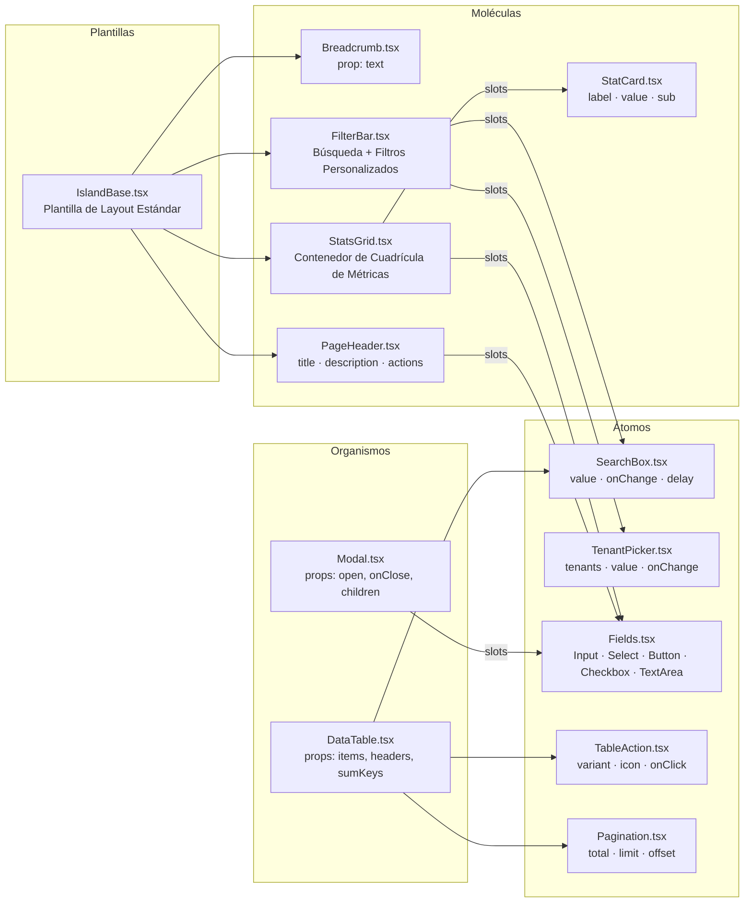
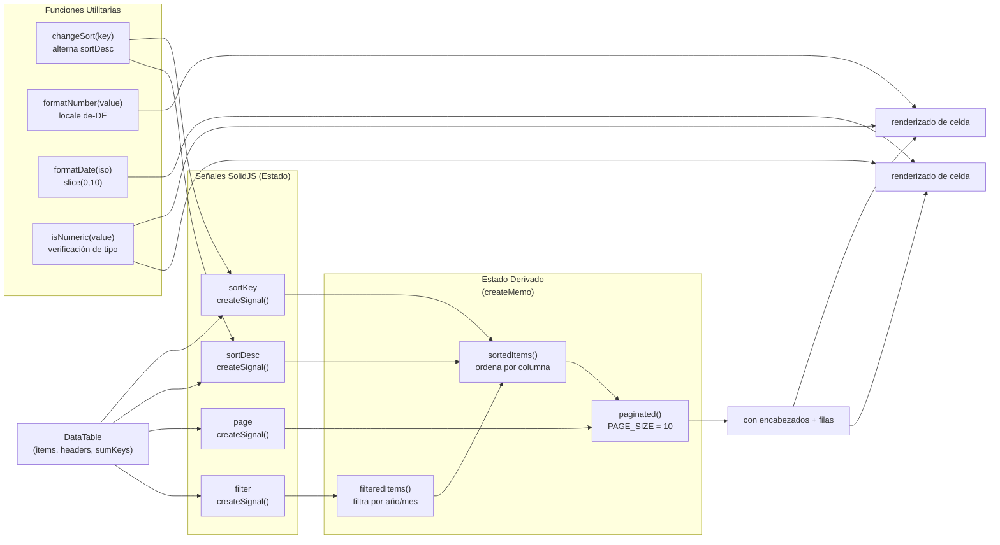
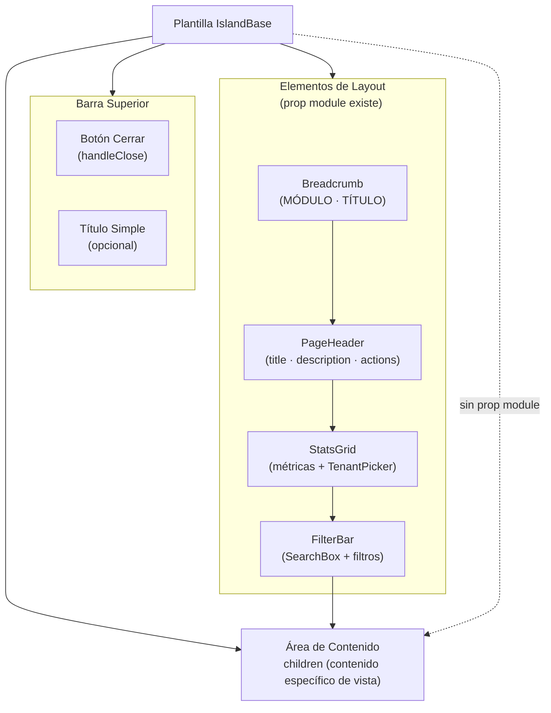
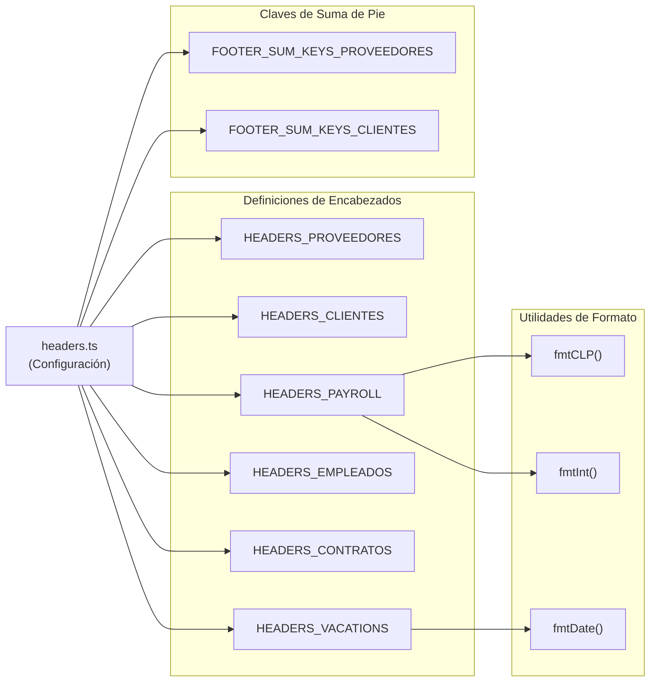

import { Code } from "@astrojs/starlight/components";

## Propósito y Alcance

La Biblioteca de Componentes UI proporciona un conjunto completo de componentes SolidJS reutilizables organizados siguiendo los principios de Diseño Atómico. Esta biblioteca sirve como la base para todos los elementos de interfaz de usuario en la aplicación frontend Sevastopol, asegurando consistencia, mantenibilidad y seguridad de tipos en todas las vistas de negocio.

La jerarquía de componentes consiste en cuatro capas:

- **Átomos**: Campos de formulario primitivos, botones y elementos UI básicos (`Input`, `Select`, `Button`, `SearchBox`, etc.)
- **Moléculas**: Patrones UI compuestos (`PageHeader`, `StatsGrid`, `FilterBar`, `StatCard`)
- **Organismos**: Componentes interactivos complejos (`DataTable`, `Sidebar`, `Modal`)
- **Plantillas**: Layouts a nivel de página (`IslandBase`)

Todos los componentes soportan modo oscuro mediante propiedades CSS personalizadas y siguen patrones de estilos consistentes definidos en sevastopol/src/lib/ui.ts.

---

## Visión General de la Arquitectura de Componentes

### Jerarquía de Diseño Atómico



Diagrama: Jerarquía de Componentes con Ubicaciones de Archivos

Esta arquitectura habilita máxima reutilización. Por ejemplo, `DataTable` se usa en PayrollViewIsland, EmployeesViewIsland, ContractsViewIsland, TenantsViewIsland y PlanContableViewIsland, cada uno configurado con diferentes definiciones de encabezado desde
sevastopol/src/config/headers.ts

---

## Componentes Atómicos (Átomos)

Los átomos son los bloques de construcción fundamentales de la UI - componentes primitivos que no pueden descomponerse más. Todos los átomos siguen patrones de diseño consistentes con soporte para modo oscuro y accesibilidad de teclado.

### Componente Input

El componente `Input` envuelve campos de entrada HTML nativos con estilos estandarizados y gestión de etiquetas.

API del Componente:

| Prop    | Tipo                    | Requerido | Descripción                                                 |
| ------- | ----------------------- | --------- | ----------------------------------------------------------- |
| label   | string                  | Sí        | Texto de etiqueta mostrado sobre el input                   |
| name    | string                  | Sí        | Nombre del campo de formulario                              |
| ...rest | JSX.InputHTMLAttributes | No        | Atributos nativos de input (type, placeholder, value, etc.) |

Ejemplo de Uso:

<Code
  code={`<Input
  label="RUT"
  name="rut"
  required
  placeholder="12345678-9"
  value={editing()?.rut ?? ""}
/>`}
  lang="tsx"
/>

### Componente Select

El componente `Select` proporciona un menú desplegable con manejo de opciones con seguridad de tipos. Normaliza valores a strings para prevenir problemas de coerción de tipos.

API del Componente:

| Prop          | Tipo                       | Requerido | Descripción                                      |
| ------------- | -------------------------- | --------- | ------------------------------------------------ |
| `label`       | `string`                   | No        | Texto de etiqueta mostrado sobre el select       |
| `name`        | `string`                   | Sí        | Nombre del campo de formulario                   |
| `options`     | `Option[]`                 | Sí        | Array de objetos `{id, nombre}`                  |
| `value`       | `string \| number \| null` | No        | Valor seleccionado actual (normalizado a string) |
| `placeholder` | `string`                   | No        | Texto placeholder (predeterminado: "—")          |
| `density`     | `"normal" \| "compact"`    | No        | Variante de densidad visual                      |

Definición de Tipo:

<Code
  code={`type Option = {
  id: string;
  nombre: string;
  [key: string]: any;
};`}
  lang="typescript"
/>

Característica Clave - Normalización de Valores: El componente normaliza explícitamente tanto el valor actual como los IDs de las opciones a strings para prevenir desajustes de tipo React `value={0}` vs `value="0"`

### Componente Button

El componente `Button` proporciona tres variantes visuales con soporte para iconos.

API del Componente:

| Prop      | Tipo                                   | Requerido | Descripción                               |
| --------- | -------------------------------------- | --------- | ----------------------------------------- |
| `label`   | `string`                               | Sí        | Texto del botón                           |
| `icon`    | `string \| JSX.Element`                | No        | Icono (emoji o componente SVG)            |
| `variant` | `"primary" \| "secondary" \| "danger"` | No        | Estilo visual (predeterminado: "primary") |
| `...rest` | `JSX.ButtonHTMLAttributes`             | No        | Atributos nativos de botón                |

Estilos de Variantes:

| Variante  | Estilo                                       |
| --------- | -------------------------------------------- |
| primary   | Fondo negro (oscuro: blanco), alto contraste |
| secondary | Fondo blanco con borde, sutil                |
| danger    | Fondo Rose-600, para acciones destructivas   |

### Componente Checkbox

Checkbox estilizado con etiqueta opcional y mensaje personalizado.

API del Componente:

| Prop      | Tipo                      | Requerido | Descripción                                                  |
| --------- | ------------------------- | --------- | ------------------------------------------------------------ |
| `label`   | `string`                  | No        | Texto de etiqueta sobre el checkbox                          |
| `name`    | `string`                  | Sí        | Nombre del campo de formulario                               |
| `message` | `string`                  | No        | Texto mostrado junto al checkbox (predeterminado: "Activar") |
| `...rest` | `JSX.InputHTMLAttributes` | No        | Atributos nativos de checkbox                                |

### Componente TextArea

Entrada de texto multi-línea con estilos consistentes.

API del Componente:

| Prop      | Tipo                         | Requerido | Descripción                                  |
| --------- | ---------------------------- | --------- | -------------------------------------------- |
| `label`   | `string`                     | Sí        | Texto de etiqueta mostrado sobre el textarea |
| `name`    | `string`                     | Sí        | Nombre del campo de formulario               |
| `...rest` | `JSX.TextareaHTMLAttributes` | No        | Atributos nativos de textarea                |

### Componente SearchBox

Componente de entrada de búsqueda con debounce que retrasa las llamadas `onChange` para reducir peticiones API durante la escritura.

API del Componente:

| Prop          | Tipo                  | Requerido | Descripción                                       |
| ------------- | --------------------- | --------- | ------------------------------------------------- |
| `placeholder` | `string`              | No        | Texto placeholder                                 |
| `value`       | `string`              | Sí        | Valor de búsqueda actual                          |
| `delay`       | `number`              | No        | Retraso de debounce en ms (predeterminado: 300)   |
| `onChange`    | `(v: string) => void` | Sí        | Manejador de cambio (llamado después del retraso) |
| `class`       | `string`              | No        | Clases CSS adicionales                            |

El componente usa `createEffect` con `setTimeout` para implementar el debouncing.

Ejemplo de Uso:

<Code
  code={`<SearchBox
  placeholder="Buscar por nombre, rut o email..."
  value={q()}
  onChange={setQ}
/>`}
  lang="tsx"
/>

### Componente Pagination

Controles de paginación simples para navegar datos paginados.

API del Componente:

| Prop     | Tipo         | Requerido | Descripción                   |
| -------- | ------------ | --------- | ----------------------------- |
| `total`  | `number`     | Sí        | Número total de registros     |
| `limit`  | `number`     | Sí        | Registros por página          |
| `offset` | `number`     | Sí        | Offset actual                 |
| `onPrev` | `() => void` | Sí        | Manejador de página anterior  |
| `onNext` | `() => void` | Sí        | Manejador de página siguiente |

El componente calcula automáticamente estados deshabilitados basándose en offset y total

### Componente Modal

Componente de overlay de diálogo para formularios y confirmaciones.

API del Componente:

| Prop         | Tipo          | Requerido | Descripción                                                        |
| ------------ | ------------- | --------- | ------------------------------------------------------------------ |
| `open`       | `boolean`     | Sí        | Controla la visibilidad del modal                                  |
| `title`      | `string`      | No        | Título del modal                                                   |
| `onClose`    | `() => void`  | Sí        | Manejador de cierre                                                |
| `children`   | `JSX.Element` | Sí        | Contenido del modal                                                |
| `widthClass` | `string`      | No        | Ancho personalizado (predeterminado: "w-[min(100vw-2rem,1400px)]") |
| `titleClass` | `string`      | No        | Estilos personalizados del título                                  |

El modal usa un backdrop con comportamiento de click-para-cerrar

<Code
  code={`<div class="absolute inset-0 bg-black/60 dark:bg-black/80 backdrop-blur-sm"
     onClick={props.onClose}/>`}
  lang="tsx"
/>

### Componente TenantPicker

Menú desplegable para seleccionar organizaciones tenant, típicamente usado dentro del `StatsGrid` de `IslandBase`.

API del Componente:

| Prop       | Tipo         | Requerido | Descripción                |
| ---------- | ------------ | --------- | -------------------------- |
| `tenants`  | `Tenant[]`   | Sí        | Tenants disponibles        |
| `value`    | `string`     | Sí        | ID del tenant seleccionado |
| `onChange` | `() => void` | Sí        | Manejador de selección     |

Tipo Tenant:

<Code
  code={`type Tenant = {
  id: string;
  rut: string;
  business_name: string;
  // ... campos adicionales
};`}
  lang="typescript"
/>

El componente usa la clase utilitaria estandarizada `selectCls` de sevastopol/src/lib/ui.ts para estilos consistentes en todos los elementos select.

### Componente TableAction

Botón de acción basado en iconos optimizado para filas de tablas de datos. Proporciona estados hover sutiles con coloración basada en variante.

API del Componente:

Prop Tipo Requerido Descripción
| Prop | Tipo | Requerido | Descripción |
| ---------- | ------------ | --------- | -------------------------- |
| `onClick` | `() => void` | Sí | Manejador de click |
| `icon` | `any` | No | Componente de icono o emoji |
| `label` | `string` | No | Texto de tooltip/aria-label |
| `variant` | `string` | No | Variante de estilo visual |
| `class` | `string` | No | Clases CSS adicionales |
| `disabled` | `boolean` | No | Estado deshabilitado |

Iconos Integrados:

El componente exporta un conjunto de iconos SVG pre-construidos a través del objeto `Icons`:

- `Icons.Edit` - Icono de lápiz
- `Icons.Delete` - Icono de papelera
- `Icons.Eye` - Icono de vista/previsualización
- `Icons.Database` - Icono de base de datos
- `Icons.Download` - Icono de flecha de descarga

Ejemplo de Uso:

<Code
  code={`<TableAction
  label="Editar"
  variant="edit"
  icon={ActionIcons.Edit}
  onClick={() => startEdit(row)}
/>`}
  lang="tsx"
/>

---

## Componentes Moléculares

Las moléculas son componentes compuestos construidos a partir de átomos. Estos se importan desde `@/components/molecules` y se usan principalmente dentro de la plantilla `IslandBase`.

### PageHeader

Muestra título de página, descripción y botones de acción.

Props: `title` (string), `description` (string), `actions` (slot JSX.Element)

### StatsGrid

Contenedor para mostrar tarjetas de métricas en una cuadrícula responsive.

Uso: Acepta prop `children` conteniendo componentes `StatCard` y opcionalmente `TenantPicker`

### StatCard

Tarjeta de visualización de métrica única con etiqueta, valor y subtítulo.

Props: `label` (string), `value` (string | number), `sub` (string), `highlight` (boolean), `color` (string)

### FilterBar

Contenedor para cuadro de búsqueda y controles de filtro personalizados.

Uso: Acepta prop `children`, típicamente conteniendo `SearchBox` y componentes `Select` de filtro.

### Breadcrumb

Muestra ruta de navegación jerárquica.

Props: `text` (string) - se muestra en formato "MÓDULO · TÍTULO"

---

## Componente DataTable (Organismo)

El `DataTable` es el componente más complejo y ampliamente utilizado en el sistema, proporcionando una tabla rica en características con filtrado, ordenamiento, paginación y renderizado personalizable.

### Arquitectura DataTable



Diagrama: Arquitectura Interna de DataTable - Señales y Memos

### Props de DataTable

| Prop               | Tipo                     | Requerido | Descripción                                                |
| ------------------ | ------------------------ | --------- | ---------------------------------------------------------- |
| `items`            | `any[]`                  | Sí        | Array de objetos de datos a mostrar                        |
| `headers`          | `HeaderConfig[]`         | Sí        | Array de configuración de columnas                         |
| `sumKeys`          | `string[]`               | No        | Claves a sumar en fila de pie                              |
| `charts`           | `boolean`                | No        | Habilitar visualización de gráficos (predeterminado: true) |
| `variant`          | `"default" \| "island"`  | No        | Variante visual                                            |
| `manualPagination` | `boolean`                | No        | Deshabilitar paginación interna                            |
| `actions`          | `{ onEdit?, onDelete? }` | No        | Manejadores de acción de fila                              |

### Tipo HeaderConfig

El tipo `HeaderConfig` define el comportamiento y renderizado de columnas:

```typescript
type HeaderConfig = {
  key: string; // Clave de propiedad de datos
  label: string; // Texto de encabezado de columna
  sortable?: boolean; // Habilitar ordenamiento (predeterminado: true)
  align?: "left" | "center" | "right";
  render?: (value: any, row: any) => any; // Renderizador personalizado
};
```

### Características de DataTable

#### 1. Filtrado Automático

El componente auto-detecta columnas `año`, `mes`, `year`, `month` y genera menús desplegables de filtro

<Code
  code={`const filterFields = headers.filter((h) =>
  ["año", "mes", "year", "month"].includes(h.key)
);`}
  lang="typescript"
/>

#### 2. Ordenamiento Multi-Columna

Hacer clic en encabezados de columna alterna la dirección de ordenamiento. El estado de ordenamiento se preserva vía señales.

<Code
  code={`const [sortKey, setSortKey] = createSignal(headers[0]?.key ?? "");
const [sortDesc, setSortDesc] = createSignal(true);`}
  lang="typescript"
/>

#### 3. Formato de Números

Los valores numéricos se formatean automáticamente con separadores de miles usando locale alemán (`de-DE`).

<Code
  code={`function formatNumber(value: any): string {
  const num = typeof value === "string" ? parseFloat(value) : Number(value);
  if (isNaN(num)) return "0";
  return num.toLocaleString("de-DE", {
    minimumFractionDigits: 0,
    maximumFractionDigits: 0,
  });
}`}
  lang="typescript"
/>

#### 4. Formato de Fechas

Las fechas se detectan automáticamente por nombre de columna (`fecha`) y se formatean a `YYYY-MM-DD`

#### 5. Pie de Resumen

Cuando se proporciona `sumKeys`, la tabla muestra una fila de pie con totales o promedios de columnas

<Code
  code={`{sumKeys.length > 0 && (
  <tfoot class="sticky bottom-0 bg-emerald-50 dark:bg-emerald-900/20">
    <tr class="font-bold">
      {/* Calcula sumas/promedios para claves especificadas */}
    </tr>
  </tfoot>
)}`}
  lang="tsx"
/>

#### 6. Acciones de Fila

Acciones opcionales de editar/eliminar aparecen en una columna dedicada

#### 7. Paginación

Paginación integrada con tamaño de página configurable (predeterminado: 10 filas)

### Variantes de DataTable

| Variante  | Descripción                                                      | Caso de Uso                   |
| --------- | ---------------------------------------------------------------- | ----------------------------- |
| `default` | Tabla estándar con contenedor externo                            | Tablas independientes         |
| `island`  | Contenedor flex-1 con min-height para layouts de página completa | Tablas dentro de `IslandBase` |

---

## Plantilla IslandBase

El componente `IslandBase` es una plantilla estandarizada que proporciona estructura de layout consistente para todas las vistas de negocio. Opera en dos modos: **Modo Simple** (contenedor básico) y **Modo Estándar** (layout completo con selección de tenant, estadísticas, filtros).

### Arquitectura IslandBase



Diagrama: Flujo de Layout de Plantilla IslandBase

### Props de IslandBase

El componente acepta un conjunto completo de props organizadas por funcionalidad:

#### Props de Contenedor Básico

| Prop              | Tipo          | Requerido | Descripción                                                                   |
| ----------------- | ------------- | --------- | ----------------------------------------------------------------------------- |
| `title`           | `string`      | No        | Título de página (usado en ambos modos)                                       |
| `subtitle`        | `string`      | No        | Subtítulo (solo Modo Simple)                                                  |
| `children`        | `JSX.Element` | Sí        | Contenido específico de vista                                                 |
| `onClose`         | `() => void`  | No        | Manejador de cierre personalizado (predeterminado: dispatch sidebar:navigate) |
| `isLoading`       | `boolean`     | No        | Mostrar overlay de carga                                                      |
| `hideCloseButton` | `boolean`     | No        | Ocultar el botón de cierre                                                    |

#### Props de Layout Estándar (Activadas por `module`)

| Prop          | Tipo          | Requerido | Descripción                                                         |
| ------------- | ------------- | --------- | ------------------------------------------------------------------- |
| `module`      | `string`      | No        | Nombre de módulo (ej: "REMUNERACIONES") - activa Modo Estándar      |
| `description` | `string`      | No        | Texto de descripción bajo el título                                 |
| `onNew`       | `() => void`  | No        | Manejador para botón "Nuevo"                                        |
| `newLabel`    | `string`      | No        | Etiqueta personalizada para botón nuevo (predeterminado: "+ Nuevo") |
| `actions`     | `JSX.Element` | No        | Slot de botones de acción personalizados                            |

#### Gestión de Tenant

| Prop               | Tipo                   | Requerido | Descripción                            |
| ------------------ | ---------------------- | --------- | -------------------------------------- |
| `tenants`          | `Tenant[]`             | No        | Lista de tenants disponibles           |
| `selectedTenantId` | `string`               | No        | ID del tenant actualmente seleccionado |
| `onTenantChange`   | `(id: string) => void` | No        | Manejador de selección de tenant       |

#### Estadísticas y Filtrado

| Prop                | Tipo                    | Requerido | Descripción                                     |
| ------------------- | ----------------------- | --------- | ----------------------------------------------- |
| `stats`             | `JSX.Element`           | No        | Slot de tarjetas de estadísticas personalizadas |
| `searchPlaceholder` | `string`                | No        | Placeholder del cuadro de búsqueda              |
| `searchValue`       | `string`                | No        | Valor de búsqueda actual                        |
| `onSearchChange`    | `(val: string) => void` | No        | Manejador de cambio de búsqueda                 |
| `filters`           | `JSX.Element`           | No        | Slot de filtros personalizados                  |

### Detección de Modo

El componente cambia automáticamente a Modo Estándar cuando se proporciona la prop `module`.

<Code
  code={`<Show when={props.module} fallback={props.children}>
  {/* Renderizado de Layout Estándar */}
</Show>`}
  lang="tsx"
/>

## Estructura de Layout Estándar

En Modo Estándar, el componente renderiza una estructura consistente

1. Breadcrumb - Muestra `MÓDULO · TÍTULO` en mayúsculas
2. PageHeader - Título, descripción y botones de acción
3. StatsGrid - Tarjetas de métricas con `TenantPicker` integrado
4. FilterBar - Cuadro de búsqueda y filtros personalizados
5. Área de Contenido - Children específicos de vista con manejo de scroll

### TenantPicker Integrado

Cuando se proporciona la prop `tenants`, el componente renderiza automáticamente un `TenantPicker` dentro del `StatsGrid`.

<Code
  code={`<Show when={props.tenants && props.onTenantChange}>
  <div class="bg-white dark:bg-zinc-800 rounded-xl shadow p-4">
    <div class="text-xs font-medium text-zinc-500 dark:text-zinc-400 mb-1">
      Organización
    </div>
    <TenantPicker
      tenants={props.tenants!}
      value={props.selectedTenantId || ""}
      onChange={props.onTenantChange!}
    />
  </div>
</Show>`}
  lang="tsx"
/>

### Overlay de Carga

El componente proporciona un overlay de carga integrado con spinner

<Code
  code={`<Show when={props.isLoading}>
  <div class="absolute inset-0 z-50 flex items-center justify-center
              bg-white/50 dark:bg-zinc-900/50 backdrop-blur-sm">
    <div class="w-8 h-8 border-4 border-indigo-500 border-t-transparent
                rounded-full animate-spin" />
  </div>
</Show>`}
  lang="tsx"
/>

---

## Patrón de Configuración: Sistema de Encabezados

El sistema usa un enfoque de configuración de encabezados centralizado donde las definiciones de columnas se almacenan en `config/headers.ts` y se reutilizan a través de vistas. Este patrón asegura consistencia y habilita lógica de renderizado compleja.

### Estructura de Configuración de Encabezados



Diagrama: Arquitectura del Sistema de Configuración de Encabezados

### Ejemplos de Configuraciones de Encabezados

#### Encabezados Simples (Columnas Básicas)

<Code
  code={`export const HEADERS_PROVEEDORES = [
  { key: "rut_proveedor", label: "RUT" },
  { key: "razon_social", label: "Razón Social" },
  { key: "año", label: "Año" },
  { key: "mes", label: "Mes" },
  { key: "total_documentos", label: "# Docs" },
  // ... más columnas
];`}
  lang="typescript"
/>

#### Encabezados con Renderizadores Personalizados

Los renderizadores personalizados habilitan formato complejo y renderizado JSX:

<Code
  code={`export const HEADERS_PAYROLL = [
  { key: "periodo", label: "Periodo" },
  { key: "empleado_nombre", label: "Empleado" },
  {
    key: "total_haberes",
    label: "Haberes",
    render: (v: any) => fmtCLP(num(v)),
  },
  {
    key: "total_descuentos",
    label: "Descuentos",
    render: (v: any) => fmtCLP(num(v)),
  },
  // ...
];`}
  lang="typescript"
/>

#### Encabezados con Renderizadores Conscientes de Fila

Los renderizadores pueden acceder tanto al valor de celda como al objeto de fila completo:

<Code
  code={`export const HEADERS_CONTRATOS = [
  { key: "id", label: "Trabajador" }, // Renderizado complejo en componente
  { key: "numero_contrato", label: "N°", render: (v: any) => v ?? "—" },
  { key: "tipo_contrato", label: "Tipo" },
  { key: "fecha_inicio", label: "Inicio", render: (v: any) => fmtDate(v) },
  {
    key: "semaforo",
    label: "Estado",
    render: (v: any, row: Contrato) => v ?? row.estado ?? "—",
  },
  // ...
];`}
  lang="typescript"
/>

### Claves de Suma de Pie

Correspondiendo a cada conjunto de encabezados, las claves de suma definen qué columnas agregar en el pie:

<Code
  code={`export const FOOTER_SUM_KEYS_PROVEEDORES = [
  "total_documentos",
  "total_neto",
  "total_iva_recuperable",
  "total_iva_no_recuperable",
  "total_compras",
  "total_exento",
  "total_activo_fijo",
  "total_iva_activo_fijo",
  "total_facturas",
  "total_notas_credito",
  "total_notas_debito",
  "promedio_monto_documentos",
];`}
  lang="typescript"
/>

### Uso en Componentes Island

Los componentes island importan configuraciones de encabezados y las pasan a `DataTable`:

<Code code={`import { HEADERS_PAYROLL } from "@/config/headers";

<DataTable
  items={filteredPayrolls()}
  headers={HEADERS_PAYROLL}
  sumKeys={["total_haberes", "total_descuentos", "total_liquido"]}
  actions={{
    onEdit: (row) => handleEdit(row),
    onDelete: (row) => handleDelete(row),
  }}
/>
`} lang="tsx" />

---

## Sistema de Tipos

La biblioteca de componentes UI usa un sistema de tipos completo definido en `types/ui.ts` para asegurar seguridad de tipos a través de todos los componentes.

### Tipos UI Centrales

Tipo Option

Tipo de opción genérico usado por componentes `Select`:

<Code
  code={`export type Option = {
  id: string;
  nombre: string;
  [key: string]: any;
};`}
  lang="typescript"
/>

Tipo HeaderConfig

Define configuración de columna de tabla:

<Code
  code={`export type HeaderConfig = {
  key: string; // Clave de propiedad en objeto de datos
  label: string; // Etiqueta de visualización
  sortable?: boolean; // Habilitar ordenamiento (predeterminado: true)
  align?: "left" | "center" | "right";
  render?: (value: any, row: any) => any; // Función de renderizado personalizado
};`}
  lang="typescript"
/>

Tipos de Estado y Badge

<Code
  code={`export type StatusType =
  | "ACTIVO"
  | "INACTIVO"
  | "PENDIENTE"
  | "APROBADO"
  | "RECHAZADO";
export type Semaforo = "VENCIDO" | "POR_VENCER" | "VIGENTE" | null;
export type ToastKind = "ok" | "error" | "info" | "warning";`}
  lang="typescript"
/>

Metadatos de Paginación

<Code
  code={`export type PaginationMeta = {
  page: number;
  pageSize: number;
  totalPages: number;
  totalRecords: number;
};`}
  lang="typescript"
/>

Props de Stat Card

<Code
  code={`export type StatCardProps = {
  label: string;
  value: string | number;
  sub: string;
  highlight?: boolean;
  color?: string;
};`}
  lang="typescript"
/>

---

## Patrones de Composición de Componentes

### Patrón 1: Modal de Formulario con Componentes de Campo

Patrón estándar para modales de crear/editar usado a través de la aplicación:

<Code
  code={`<Modal
  open={showFormModal()}
  onClose={() => setShowFormModal(false)}
  title={editing() ? "Editar" : "Nuevo"}
>
  <form onSubmit={handleSave}>
    <div class="grid grid-cols-2 gap-x-4 gap-y-3">
      <Input label="RUT" name="rut" required value={editing()?.rut ?? ""} />
      <Input label="Nombre" name="nombre" required value={editing()?.nombre ?? ""} />
      <Select
        label="Tipo"
        name="tipo"
        options={tipoOptions}
        value={editing()?.tipo ?? ""}
      />
      <Checkbox label="Activo" name="activo" checked={editing()?.activo ?? true} />
    </div>
    <div class="flex gap-3 mt-6 justify-end">
      <Button label="Cancelar" variant="secondary" onClick={handleCancel} />
      <Button label="Guardar" variant="primary" type="submit" />
    </div>
  </form>
</Modal>`}
  lang="tsx"
/>

### Patrón 2: IslandBase con DataTable

Patrón estándar para vistas de lista con filtrado y acciones:

<Code
  code={`<IslandBase
  module="REMUNERACIONES"
  title="Liquidaciones"
  description="Gestión de liquidaciones de sueldo"
  onNew={handleNew}
  searchValue={q()}
  onSearchChange={setQ}
  stats={<><StatCard label="Total" value={total} sub="Liquidaciones" /></>}
  tenants={tenants()}
  selectedTenantId={selectedTenantId()}
  onTenantChange={handleTenantChange}
>
  <DataTable
    items={filteredItems()}
    headers={HEADERS_PAYROLL}
    sumKeys={["total_haberes", "total_descuentos", "total_liquido"]}
    actions={{
      onEdit: handleEdit,
      onDelete: handleDelete
    }}
  />
</IslandBase>`}
  lang="tsx"
/>

### Patrón 3: Renderizadores Personalizados de Tabla

Usando componentes `TableAction` para acciones de fila:

<Code
  code={`const tableHeaders: HeaderConfig[] = [
  { key: "rut", label: "RUT" },
  { key: "nombre", label: "Nombre" },
  {
    key: "actions",
    label: "",
    render: (_: any, row: any) => (
      <div class="flex items-center justify-end gap-1">
        <TableAction
          label="Editar"
          variant="edit"
          icon={ActionIcons.Edit}
          onClick={() => handleEdit(row)}
        />
        <TableAction
          label="Borrar"
          variant="delete"
          icon={ActionIcons.Delete}
          onClick={() => handleDelete(row)}
        />
      </div>
    )
  }
];`}
  lang="typescript"
/>

---

## Sistema de Exportación de Componentes

Todos los componentes atómicos se exportan centralmente desde `components/atoms/index.ts` para importación conveniente:

<Code
  code={`// src/components/atoms/index.ts
export { TenantPicker, type Tenant } from "./TenantPicker";
export { ToastProvider, useToast } from "./ToastProvider";
export { Input, Select, TextArea, Checkbox, Button } from "./Fields";
export { Modal } from "./Modal";
export { SearchBox } from "./SearchBox";
export { Pagination } from "./Pagination";
export { TableAction, Icons as ActionIcons } from "./TableAction";
export { DataTable } from "./DataTable";`}
  lang="typescript"
/>

Esto habilita importaciones limpias en componentes island:

<Code
  code={`import {
  Input,
  Select,
  Button,
  Modal,
  DataTable,
  TableAction,
  ActionIcons,
} from "@/components/atoms";`}
  lang="typescript"
/>

---

## Utilidades de Estilos

La biblioteca de componentes usa constantes de estilos centralizadas desde

<Code
  code={`export const inputCls =
  "w-full bg-white dark:bg-zinc-800 text-black dark:text-white ...";
export const selectCls =
  "w-full bg-white dark:bg-zinc-800 ... bg-[url('data:image/svg+xml;...')]";
export const chipCls = "px-2 py-0.5 rounded text-[11px]";`}
  lang="typescript"
/>

Estas clases aseguran estilos consistentes a través de todos los componentes de formulario con soporte integrado de modo oscuro. El `selectCls` incluye una flecha desplegable SVG personalizada vía URL de datos

**Configuración de Tailwind**: El modo oscuro está habilitado vía estrategia de clase en

<Code code={`darkMode: ["class", '[data-theme="dark"]'];`} lang="typescript" />

---

## Tabla Resumen: Referencia de Componentes

| Componente   | Tipo      | Ubicación                                        | Props Clave                          |
| ------------ | --------- | ------------------------------------------------ | ------------------------------------ |
| Input        | Átomo     | Fields.tsx                                       | label, name, value                   |
| Select       | Átomo     | Fields.tsx                                       | options, value, onChange             |
| Button       | Átomo     | Fields.tsx                                       | label, variant, icon, onClick        |
| Checkbox     | Átomo     | Fields.tsx                                       | name, checked, message               |
| TextArea     | Átomo     | Fields.tsx                                       | label, name                          |
| SearchBox    | Átomo     | SearchBox.tsx                                    | value, onChange, delay               |
| Pagination   | Átomo     | Pagination.tsx                                   | total, limit, offset, onPrev, onNext |
| TableAction  | Átomo     | TableAction.tsx                                  | variant, icon, onClick               |
| TenantPicker | Átomo     | TenantPicker.tsx                                 | tenants, value, onChange             |
| Modal        | Organismo | Modal.tsx                                        | open, onClose, children              |
| DataTable    | Organismo | DataTable.tsx                                    | items, headers, sumKeys, actions     |
| PageHeader   | Molécula  | molecules/PageHeader title, description, actions |
| StatsGrid    | Molécula  | molecules/StatsGrid children (StatCards)         |
| FilterBar    | Molécula  | molecules/FilterBar children (filtros)           |
| StatCard     | Molécula  | molecules/StatCard label, value, sub             |
| IslandBase   | Plantilla | IslandBase.tsx                                   | module, title, stats, children       |
